# Fundamentals of Metadata Management — Notizen

Durchgearbeitete Notizen zum Buch. Fachbegriffe bleiben englisch, damit sie im
Buch wiederauffindbar sind.

## Inhalt

- [Kapitel 2 — Metadata Repositories for the IT Landscape](#kapitel-2--metadata-repositories-for-the-it-landscape)
  - [2.0 Überblick über das Kapitel](#20-überblick-über-das-kapitel)
  - [2.1 What Is Metadata?](#21-what-is-metadata)
  - [2.2 Types of Metadata in IT Landscapes](#22-types-of-metadata-in-it-landscapes)
  - [2.3 What Is a Metadata Repository?](#23-what-is-a-metadata-repository)
  - [2.4 Driver: The Many Waves of Metadata Repositories](#24-driver-the-many-waves-of-metadata-repositories)
  - [2.5 Purpose: Core Capability](#25-purpose-core-capability)
  - [2.6 Place: Metadata Repositories at Various Levels](#26-place-metadata-repositories-at-various-levels)
  - [2.7 Structure: The Metamodel in Metadata Repositories](#27-structure-the-metamodel-in-metadata-repositories)
  - [2.8 Summary](#28-summary)
- [Kapitel 3 — IT Management](#kapitel-3--it-management)
  - [3.0 Überblick über das Kapitel](#30-überblick-über-das-kapitel)
  - [3.1 Endpoint Management System (EMS)](#31-endpoint-management-system-ems)
  - [3.2 Integration Repository (IR)](#32-integration-repository-ir)
  - [3.3 Asset Management System (AMS)](#33-asset-management-system-ams)
  - [3.4 Configuration Management Database (CMDB)](#34-configuration-management-database-cmdb)
  - [3.5 IT Service Management System (ITSM)](#35-it-service-management-system-itsm)
  - [3.6 Enterprise Architecture Management Tool (EAM)](#36-enterprise-architecture-management-tool-eam)
  - [3.7 Metadata Repositories for IT Management](#37-metadata-repositories-for-it-management)
  - [3.8 Summary](#38-summary)
- [Kapitel 4 — Data Management](#kapitel-4--data-management)
  - [4.0 Überblick über das Kapitel](#40-überblick-über-das-kapitel)
  - [4.1 Data Catalog (DC)](#41-data-catalog-dc)
  - [4.2 Database Model Management (DBM)](#42-database-model-management-dbm)
  - [4.3 Other Metadata Repositories for Data Management](#43-other-metadata-repositories-for-data-management)
  - [4.4 Rebundling of Data Management Technologies](#44-rebundling-of-data-management-technologies)
  - [4.5 Metadata Repositories for Data Management](#45-metadata-repositories-for-data-management)
  - [4.6 Summary](#46-summary)
- [Kapitel 5 — Information Management](#kapitel-5--information-management)
  - [5.0 Überblick über das Kapitel](#50-überblick-über-das-kapitel)
  - [5.1 Records and Information Management System (RIMS)](#51-records-and-information-management-system-rims)
  - [5.2 Information Security Management System (ISMS)](#52-information-security-management-system-isms)
  - [5.3 Data Protection Repository (DPR)](#53-data-protection-repository-dpr)
  - [5.4 Business Process Management System (BPMS)](#54-business-process-management-system-bpms)
  - [5.5 Metadata Repositories for Information Management](#55-metadata-repositories-for-information-management)
  - [5.6 Summary](#56-summary)
- [Fussnoten](#fussnoten)

---

# Kapitel 2 — Metadata Repositories for the IT Landscape

## 2.0 Überblick über das Kapitel

### Kern

Ein **Metadata Repository** ist ein System, das Daten *über* die IT-Landschaft
hält statt Geschäftsdaten. Das Kapitel führt vier Merkmale ein, mit denen sich
jedes solche Repository beschreiben lässt: **driver** (warum es existiert),
**purpose** (was es leistet), **structure** (wie es intern modelliert ist) und
**place** (in welcher Form es vorliegt). Die zentrale Aussage: Repositories sind
kein Sonderfall und keine Einzelstücke — sie folgen einem wiederkehrenden Muster,
und wer das Muster kennt, kann sie steuern statt sie zu erleiden.

### Metadata und das Repository

Metadata sind Daten über andere Daten oder über Systeme. Der Unterschied ist
nicht technischer Natur, sondern liegt im Bezug: Der Kontostand eines Kunden ist
ein Geschäftsdatum. Die Information, in welcher Applikation dieser Kontostand
geführt wird, wer fachlich dafür verantwortlich ist, aus welcher Quelle er
gespeist wird und nach welcher Frist er archiviert werden muss — das sind
Metadata.

Ein **Metadata Repository** ist der Ort, an dem diese Metadata bewusst und
strukturiert gehalten werden. Das entscheidende Wort ist *bewusst*: Metadata
existieren in jeder Organisation ohnehin, verteilt über Excel-Listen,
Confluence-Seiten, Ticketsysteme und die Köpfe einzelner Personen. Ein
Repository macht daraus einen gepflegten Bestand mit definierter Struktur und
verantwortlicher Pflege.

Der Zusatz **for the IT landscape** grenzt ein: Es geht nicht um Metadata über
einzelne Datenfelder in einer Datenbank (das wäre der klassische Fokus eines
Data Catalog), sondern um die Beschreibung der IT-Landschaft als Ganzes —
Applikationen, Schnittstellen, Technologien, Verantwortlichkeiten,
Geschäftsbezüge.

> **Fürs Repository:** Genau hier sitzt ein EAM-Repository. Es ist ein Metadata
> Repository mit dem Bezugsobjekt „IT-Landschaft" — kein Sondertyp, sondern eine
> Ausprägung des allgemeinen Musters, das dieses Kapitel beschreibt.

### Die vier Merkmale

Das Kapitel nutzt vier Achsen, um Repositories zu beschreiben. Sie sind
unabhängig voneinander — zwei Repositories können denselben driver haben und
sich in place und structure vollständig unterscheiden.

Reihenfolge nach Figure 2-2 (siehe [2.3](#23-what-is-a-metadata-repository)):

| Merkmal | Frage | Ausprägungen laut Kapitel |
|---|---|---|
| **Driver** | Warum existiert es? | regulation, innovation, operations — überlappend |
| **Purpose** | Was leistet es? | core → peripheral → external capabilities |
| **Place** | In welcher Form liegt es vor? | Datei, Applikation, Teil einer Applikation, Teil einer Plattform |
| **Structure** | Wie ist es modelliert? | das Metamodel |

### Driver — die drei Antriebe

Ein driver ist der Grund, aus dem ein Repository überhaupt aufgebaut und
finanziert wird.

- **Operation** — der laufende Betrieb braucht die Information. Beispiel: Bei
  einem Störfall muss binnen Minuten klar sein, welche Applikation betroffen
  ist, wer sie verantwortet und was von ihr abhängt.
- **Regulation** — eine Aufsicht, ein Gesetz oder eine interne Revision verlangt
  Nachweise. Beispiel: der Nachweis, wo personenbezogene Daten verarbeitet
  werden, oder ein Verzeichnis kritischer Systeme.
- **Innovation** — Veränderung soll geplant werden. Beispiel: Bevor eine
  Cloud-Migration entschieden werden kann, muss der Bestand bekannt sein.

Wichtig und in der Praxis oft übersehen: Ein Repository adressiert in aller
Regel **mehrere Driver gleichzeitig**. Das ist kein Mangel, sondern der
Normalfall. Es hat aber eine Konsequenz — die Driver stellen unterschiedliche
Anforderungen an dieselben Daten. Regulation verlangt Vollständigkeit und
Nachweisbarkeit, Innovation verlangt Aktualität, Operation verlangt
Verfügbarkeit im Störfall. Wer sich über den dominierenden Driver nicht im
Klaren ist, kann Zielkonflikte in der Datenpflege nicht auflösen.

### Purpose — core und peripheral capabilities

Der purpose zerfällt in drei ineinanderliegende Schichten (Figure 2-2 zeichnet
sie als konzentrische Kreise):

- **Core capabilities** sind das, wofür das Repository gebaut wurde und woran
  es gemessen wird. Ohne sie ist es zwecklos.
- **Peripheral capabilities** sind Zusatzfunktionen, die sich am Rand ansiedeln.
- **External capabilities** sind der äusserste Ring — Funktionen, die
  eigentlich ein anderes System erfüllt, in die ein Repository aber
  hineinwächst.

Diese Unterscheidung ist praktisch relevant, weil peripheral capabilities der
übliche Weg sind, auf dem Repositories ihren Zuschnitt verlieren. Ein Werkzeug
kann *auch* Verträge verwalten, *auch* Kosten tracken, *auch* Projektportfolios
abbilden. Jede dieser Erweiterungen ist einzeln plausibel und schafft in Summe
Überschneidung mit Systemen, die das besser können.

### Structure — das Metamodel

Die interne Struktur eines Repositories heisst **Metamodel**. Es legt fest,
welche Objekttypen es gibt (z.B. Applikation, Schnittstelle, Technologie,
Organisationseinheit), welche Attribute daran hängen und welche Beziehungstypen
zwischen ihnen zulässig sind.

Das Metamodel ist damit die eigentliche Substanz des Repositories: Es
entscheidet, welche Fragen überhaupt beantwortbar sind. Was nicht als Objekt-
oder Beziehungstyp existiert, lässt sich später nicht auswerten, egal wie viele
Daten gepflegt werden.

Der Punkt, den das Kapitel hervorhebt: Metamodelle **überlappen sich zwischen
Repositories**. Dieselbe Applikation ist als Objekt im EAM-Repository, als
Configuration Item in der CMDB, als Asset im Lizenzmanagement und als
Datenquelle im Data Catalog vorhanden. Diese Überlappung ist unvermeidbar und
kein Fehler im Design.

> **Fürs Repository:** Aus der Überlappung folgt die praktisch wichtigste
> Entscheidung — je Objekttyp und je Attribut festlegen, welches Repository
> führend ist und welches nur eine Kopie hält. Ohne diese Festlegung entsteht
> nicht Redundanz, sondern Widerspruch, und jede Auswertung wird angreifbar.

### Place — die Erscheinungsform

Repositories reichen von der einfachen Tabellenkalkulation bis zur ausgebauten
Plattform. Das Kapitel behandelt beides ausdrücklich als gültige Formen. Ein
Spreadsheet ist ein Metadata Repository, wenn es bewusst gepflegt wird und eine
Struktur hat — es ist nur eines mit anderen Grenzen.

Was sich mit der Erscheinungsform ändert, ist nicht der Zweck, sondern die
erreichbare Reife: Mehrbenutzerfähigkeit, Historisierung, Validierung von
Beziehungen, Schnittstellen zu anderen Systemen, Rechtekonzept. Die Wahl der
Form ist deshalb eine Frage danach, welche dieser Eigenschaften der eigene
driver tatsächlich verlangt — nicht eine Frage der Ambition.

### Begriffe

**Metadata** — Daten über Daten oder über Systeme. Bestimmt sich über den
Bezug, nicht über Format oder Technik.

**Metadata Repository** — bewusst geführter, strukturierter Bestand von
Metadata mit definierter Pflege.

**IT Landscape** — die Gesamtheit der Applikationen, Schnittstellen und
Technologien einer Organisation samt ihren Beziehungen. Der Bezugsgegenstand
der hier behandelten Repositories.

**Driver** — der Grund, aus dem ein Repository existiert und finanziert wird.
Drei Ausprägungen: operation, regulation, innovation. Mehrfachzuordnung ist
Normalfall.

**Core capability** — die konstituierende Fähigkeit eines Repositories, ohne
die es seinen Zweck verfehlt.

**Peripheral capability** — Randfunktion, die über den Kernzweck hinausgeht und
in die Zuständigkeit anderer Systeme hineinreichen kann.

**Metamodel** — das Datenmodell des Repositories selbst: Objekttypen, Attribute,
zulässige Beziehungstypen. Nicht zu verwechseln mit den *Inhalten*, die darin
gepflegt werden. Abgrenzung zum **Modell**: Das Metamodel definiert, *was
modelliert werden kann*; das Modell ist der konkret gepflegte Bestand.

---

## 2.1 What Is Metadata?

### Kern

Die gängige Literatur erklärt Metadata, indem sie Untertypen aufzählt —
operational, technical, analytical und so weiter. Das beschreibt nur
*Erscheinungsformen*, nicht das Wesen. Die Definition des Buchs lautet:

> **Metadata is a description that is both attached to what is described and
> placed somewhere else in order to make what is described discoverable and
> manageable.**

Daraus folgt die tragende Idee des ganzen Kapitels: **Metadata sind an zwei
Orten gleichzeitig.** Und die Auswahl von Metadata ist die Aufgabe, die
Auffindbarkeit von etwas zu maximieren, das anderswo liegt.

### Die Definition auseinandergenommen

Die Definition hat drei Teile, die einzeln unspektakulär und zusammen präzise
sind.

**1. „attached to what is described"** — Metadata hängen am beschriebenen
Gegenstand selbst. Beim Buch ist das die Titelei: die ersten Seiten, auf denen
Verlag, ISBN, autoritativer Titel, Herausgeber, Seitenzahl und Verlagsadresse
stehen. Diese Seiten sind nicht das Buch, sondern Information über das Buch —
und sie reisen mit dem Buch mit, wohin es auch geht.

**2. „placed somewhere else"** — dieselbe Beschreibung liegt zusätzlich an einem
anderen Ort. Suchst du das Buch bei einem Online-Händler, findest du dort exakt
dieselben Angaben: Titel, Autor, Verlag, ISBN. Die Doppelung ist keine
Redundanz aus Versehen, sondern der Zweck der Sache.

**3. „to make what is described discoverable and manageable"** — der Grund für
die Doppelung. Auffindbarkeit ist der offensichtliche Teil. Der zweite Teil,
*manageable*, ist der leicht zu übersehende: Wer beschreiben kann, wo etwas
liegt und was es ist, kann es auch steuern. Findbarkeit ist die Vorbedingung
von Verwaltbarkeit, nicht ein davon getrennter Nutzen.

### Warum zwei Orte notwendig sind

Der Punkt, auf dem alles ruht: Metadata verbinden das Ding, das man finden
will, mit dem Ort, an dem man sucht. Ein Buch im Regal ist nur auffindbar, wenn
seine Beschreibung dort ist, wo gesucht wird — im Katalog, im Online-Shop, in
der Datenbank. Läge die Beschreibung ausschliesslich im Buch selbst, müsste man
das Buch bereits gefunden haben, um es finden zu können.

Genau deshalb ist Metadata-Doppelung kein Modellierungsfehler. Sie ist die
Funktionsweise.

> **Fürs Repository:** Das beantwortet den Dauereinwand „warum pflegen wir Daten
> doppelt, die schon in der CMDB stehen". Ein EAM-Repository *ist* der „somewhere
> else"-Teil der Definition. Der „attached"-Teil sind die Metadata am System
> selbst — Namensgebung, Konfiguration, Tags, Deployment-Deskriptoren. Beide
> Orte sind konstitutiv. Die berechtigte Frage ist nicht *ob* doppelt gehalten
> wird, sondern welcher der beiden Orte je Attribut führend ist.

### Die Auswahl ist die eigentliche Arbeit

Aus der Definition folgt eine Aufgabenbeschreibung, die das Buch ausdrücklich
als *metadata management* bezeichnet:

> Zu verstehen, was genau Menschen hilft, Dinge auf dem glattesten und
> schnellsten Weg zu finden.

Das ist bewusst nicht technisch formuliert. Welche Attribute ein Repository
führt, ist keine Frage dessen, was sich erfassen *lässt*, sondern dessen, was
jemand zum Finden tatsächlich *braucht*. Jedes Attribut, das niemandes Suche
verkürzt, kostet Pflegeaufwand ohne Gegenwert — und jedes fehlende Attribut, das
jemand zum Suchen bräuchte, macht den Bestand für diesen Zweck unbrauchbar.

Der Nachsatz des Buchs ist die Brücke zurück zu *manageable*: Wer das gut kann,
ist damit automatisch in der Position, das Beschriebene auch zu verwalten.

### Übertragung auf die IT-Landschaft

Die Titelei eines Buchs hat in der IT direkte Entsprechungen. Das Buch nennt:

| Buch | IT-Entsprechung |
|---|---|
| Titelei, ISBN, Verlag | Spalten von Datenbanktabellen |
| — | Ordner und Dateinamen in Data Lakes |
| — | Dokumente in SharePoint-Sites |

Diese Strukturen *sind* Metadata, sobald man sie als solche identifiziert. Sie
werden dann sichtbar gemacht in:

- **Data Catalogs** — machen Datenbestände auffindbar und beschreiben sie
- **Data Lineage Tools** — zeigen Herkunft und Weiterverarbeitung von Daten
- **Records- und Information-Management-Systeme** — wenn stärker verdichtet
  wird, entstehen „records within records", also Beschreibungen von
  Beschreibungen

### Figure 2-1

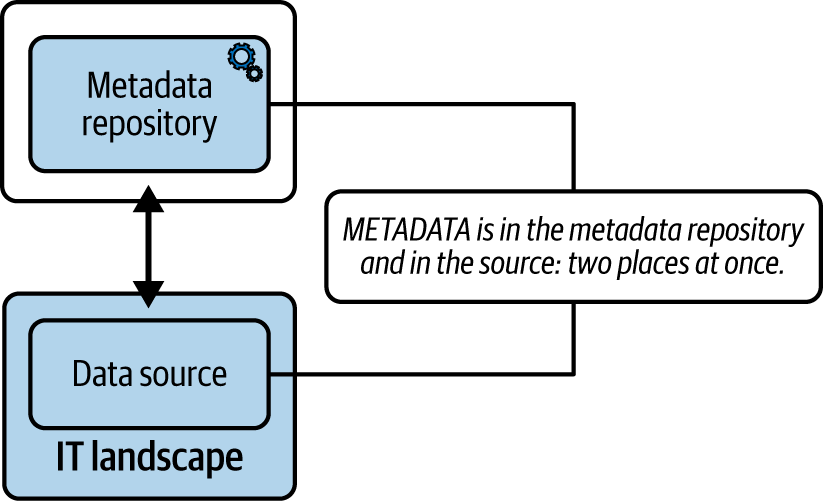

Die Abbildung zeigt die Definition als Bild. Unten die **IT landscape**, darin
eine **Data source** — das beschriebene Objekt. Oben das **Metadata
repository**. Der Doppelpfeil dazwischen bezeichnet keine Einbahnrichtung: Die
Metadata sind in beiden Kästen zugleich vorhanden, nicht vom einen ins andere
kopiert. Die Beschriftung sagt es direkt:

> METADATA is in the metadata repository and in the source: two places at once.

Bemerkenswert an der Darstellung ist, was *nicht* gezeichnet ist: kein Pfeil
„Quelle → Repository" im Sinne einer Beladung. Die Abbildung behauptet
Gleichzeitigkeit, nicht Ableitung. Das ist die bildliche Fassung des Punkts aus
der Definition — Doppelung ist die Funktionsweise, nicht ihr Nebeneffekt.

### Herkunft der Denkweise

Der Autor ist in **LIS** ausgebildet (Library and Information Science, im
Deutschen Bibliotheks- und Informationswissenschaft) mit BA, MA und PhD in
diesem Fach. Das erklärt die Grundanlage des ganzen Buchs: Es überträgt ein
Katalogisierungsdenken, das in Bibliotheken seit über hundert Jahren erprobt
ist, auf die IT-Landschaft. LIS ist deutlich technischer, als gemeinhin
angenommen wird.

Als Vertiefung nennt das Buch drei Klassiker:

1. Elaine Svenonius, *The Intellectual Foundations of Information Organization*
   (MIT Press) — [Fn. 1](#fussnoten)
2. Henriette Avram, „Machine-Readable Cataloguing (MARC) Program" —
   [Fn. 2](#fussnoten)
3. Suzanne Briet, „What Is Documentation?" (Scarecrow Press) —
   [Fn. 3](#fussnoten)

Die drei Fussnoten dazu sind keine blossen Belegangaben, sondern tragen eigene
Inhalte — insbesondere die Unterscheidung **derived vs. assigned metadata** aus
Fussnote 1. Sie stehen vollständig im Abschnitt [Fussnoten](#fussnoten).

### Begriffe

**Metadata** (Definition des Buchs) — eine Beschreibung, die sowohl am
beschriebenen Gegenstand hängt als auch an einem anderen Ort abgelegt ist, mit
dem Zweck, den Gegenstand auffindbar und verwaltbar zu machen.

**Discoverability** — Auffindbarkeit. Der primäre Zweck von Metadata und
Vorbedingung für alles Weitere.

**Manageability** — Verwaltbarkeit. Ergibt sich aus Auffindbarkeit; was man
nicht finden kann, kann man nicht steuern.

**Metadata Management** — laut Buch nicht primär eine technische Disziplin,
sondern die Fähigkeit zu bestimmen, was Menschen das Finden am schnellsten
ermöglicht.

**Front matter / Titelei** — die ersten Seiten eines Buchs mit den normierten
Angaben zum Buch. Das Standardbeispiel für am Objekt hängende Metadata.

**ISBN** — International Standard Book Number, weltweit eindeutige Kennung je
Buch. Das Musterbeispiel eines eindeutigen Identifikators, der Auffindbarkeit
über Systemgrenzen hinweg erst möglich macht.

**LIS** — Library and Information Science. Die Herkunftsdisziplin des Autors und
begriffliche Grundlage des Buchs.

**MARC** — Machine-Readable Cataloguing, von Henriette Avram entwickeltes
Format zur maschinenlesbaren Katalogisierung. Historisch der Übergang von
Zettelkatalog zu maschinell verarbeitbaren Metadata.

**Data Catalog** — Werkzeug, das Datenbestände auffindbar und beschreibbar
macht. Abgrenzung zum EAM-Repository: gleicher Mechanismus, anderes
Bezugsobjekt (Datenbestände statt IT-Landschaft).

**Data Lineage** — Nachverfolgung von Datenherkunft und -weiterverarbeitung über
Systemgrenzen hinweg.

**Derived vs. assigned metadata** (aus [Fn. 1](#fussnoten), nach Svenonius) —
*derived* metadata werden aus dem Gegenstand selbst gewonnen und liefern die
Mittel, um Information zu **finden**; *assigned* metadata werden vergeben und
liefern die Normalisierung, um sie zu **ordnen**. Laut Autor eine Unterscheidung,
die in der Metadata-Arbeit immer im Spiel ist: die ständige Symbiose aus Suchen
und Ordnen — und deren fortlaufende Verfeinerung ist der Schlüssel zum Erfolg.

---

## 2.2 Types of Metadata in IT Landscapes

### Kern

Nachdem 2.1 geklärt hat, *was* Metadata sind, listet dieser Abschnitt auf, in
welchen Ausprägungen sie in einer IT-Landschaft vorkommen. Neun Typen werden
benannt, und die Liste ist ausdrücklich offen („and more").

Der eigentliche Punkt des Abschnitts steckt in seiner Länge: Die klassische
Dreiteilung business / technical / operational, die die Fachliteratur meist als
vollständig behandelt, ist hier nur der innerste Kreis. Sechs weitere Typen
reichen über die Datenwelt hinaus in Hardware, Gebäude, Menschen und die
Organisation selbst.

### Die neun Typen im Überblick

| Typ | Bezugsobjekt | Beispiele aus dem Buch |
|---|---|---|
| **Business metadata** | menschlich definierte Bedeutung | Business Terms, Definitionen, Listen |
| **Technical metadata** | Technik zur *Design Time* | Schemastrukturen, Dateiformate, IAM-Modelle |
| **Operational metadata** | Technik zur *Runtime* | ETL-Batch-Job-Logs, Schema-Anomalien, Backups, Retention Policies |
| **Reference metadata** | andere Daten (zum Auszeichnen) | autoritative Produktnamenlisten, geografische Namensstandards nach ISO |
| **Social metadata** | Nutzerverhalten | Suchverkehr von Personen oder Gruppen, Verhaltensmuster, Präferenzbewertungen |
| **Hardware metadata** | physische IT | Endpoint-Management, Listen von Laptops und Servern |
| **Asset metadata** | physische Dinge jenseits der IT | Produktionsmaschinen mit eingebauter IT, Gebäude mit Sensorik, Zutrittskontrolle |
| **Document and records metadata** | Personen und Entitäten | Kunden, Wettbewerber, exponierte Mitarbeitende |
| **Company metadata** | die Organisation selbst | Arbeitsanweisungen, Firmenhistorie, Aussendarstellung, Studien, Memos, Strategien |

### Die klassische Dreiteilung

Die ersten drei Typen bilden eine zusammenhängende Reihe mit zunehmendem
Detailgrad und abnehmender menschlicher Deutung:

- **Business metadata** sind der von Menschen definierte Typ. Sie halten fest,
  was ein Begriff im Unternehmen *bedeutet* — was ein „aktiver Kunde" ist, was
  als „Vertrag" zählt. Diese Metadata entstehen nicht aus Systemen, sondern aus
  Vereinbarungen.
- **Technical metadata** sind detaillierter und technologienah, mit Schwerpunkt
  auf Architektur und Entwicklung. Das entscheidende Wort in der Definition ist
  **design time** — es geht um das, was zur Bauzeit festgelegt wird:
  Datenbankschemata, Dateiformate, IAM-Modelle.
- **Operational metadata** sind noch detaillierter und liegen der laufenden
  Landschaft am nächsten, mit Schwerpunkt Betrieb. Hier lautet das Stichwort
  **runtime**: Was ist tatsächlich gelaufen, was ist dabei aufgefallen, was
  liegt wo im Backup, wie lange wird aufbewahrt.

Die Achse design time gegen runtime ist die brauchbarste Trennlinie zwischen
technical und operational. Ein Datenbankschema ist technical; die Meldung, dass
dieses Schema gestern von der Erwartung abwich, ist operational.

Das Buch weist ausdrücklich darauf hin, dass genau diese drei Typen die in der
Fachliteratur üblicherweise diskutierten sind, allen voran im **DAMA-DMBOK**.
Das ist als Einordnung gemeint: Wer nur diese drei kennt, hat den in der
Disziplin etablierten Stand — aber eben nicht den Umfang, den dieses Buch
beansprucht.

### Die sechs weiteren Typen

**Reference metadata** unterscheiden sich von den anderen durch ihre Funktion
statt durch ihren Gegenstand: Sie dienen dazu, *andere Daten auszuzeichnen*.
Eine autoritative Liste von Produktnamen oder die ISO-Standards für
geografische Bezeichnungen sind nicht um ihrer selbst willen interessant,
sondern weil andere Datensätze gegen sie referenziert werden. Autoritativ heisst
hier: Es gibt genau eine gültige Fassung, an der sich alles andere ausrichtet.

**Social metadata** sind die ungewöhnlichste Kategorie in der Liste, weil sie
nicht das System beschreiben, sondern seine Nutzung — wer wonach sucht, wie sich
Nutzer verhalten, wie sie Dinge bewerten. Der Bezug zu 2.1 ist direkt: Wenn
Metadata Auffindbarkeit maximieren sollen, dann ist die Information darüber, wie
tatsächlich gesucht wird, das Rohmaterial für diese Optimierung.

**Hardware metadata** beziehen sich auf die physische Realität der
IT-Landschaft. Das ist die Erinnerung daran, dass eine Landschaft nicht nur aus
Applikationen besteht, sondern aus Geräten, die jemandem gehören, irgendwo
stehen und ersetzt werden müssen.

**Asset metadata** gehen einen Schritt weiter: physische Gegenstände jenseits
klassischer Hardware, die dennoch mit der IT-Landschaft verbunden sind.
Produktionsmaschinen mit eingebauter Steuerung, Gebäude mit Sensorik, Ebenen der
Zutrittskontrolle. Die Grenze zwischen hardware und asset verläuft dort, wo ein
Gegenstand primär etwas anderes ist als IT und trotzdem an ihr hängt.

**Document and records metadata** liefern detaillierte Information über
Personen und Entitäten, mit denen ein Unternehmen zu tun hat — Kunden,
Wettbewerber, exponierte Mitarbeitende. Das Buch hebt hervor, dass dieser Typ
für **Risiko- und Datenschutzmanagement** entscheidend ist, und genau darin
liegt seine Sonderstellung: Hier ist die Metadata-Haltung selbst
regulierungsrelevant.

**Company metadata** umfassen das Wissen über das Unternehmen als Ganzes:
Arbeitsanweisungen, Firmenhistorie, Aussendarstellung, Studien, Memos,
Strategien. Das ist der äusserste Kreis, und der am wenigsten technische.

### Wie die Liste zu lesen ist

Die neun Typen sind keine gleichrangige Aufzählung, sondern lassen sich als
weiter werdende Kreise um die Daten herum lesen:

1. **Daten und ihre Technik** — business, technical, operational, reference
2. **Menschen und Dinge** — social, hardware, asset
3. **Die Organisation** — documents and records, company

Diese Lesart macht den Sprung nachvollziehbar, den das Buch gegenüber der
üblichen Literatur vollzieht, und sie erklärt, warum der folgende Abschnitt über
das Verhältnis zu „data about data" nötig ist.

### Wo die Typen je Repository stehen

Ein Hinweis fürs spätere Nachschlagen: Welche Metadata-Typen für ein *bestimmtes*
Repository charakteristisch sind, steht laut Buch nicht in einer eigenen Liste,
sondern lässt sich aus den **Metamodel-Abbildungen** der Kapitel 3 bis 6
ablesen. Konkrete Metamodelle behandelt der spätere Abschnitt „Structure: The
Metamodel in Metadata Repositories".

> **Fürs Repository:** Die Typenliste taugt als Abdeckungsprüfung. Ein
> EAM-Repository deckt business, technical und hardware meist gut ab, reference
> teilweise, operational fast nie — und social praktisch nirgends, obwohl gerade
> das die Frage beantworten würde, wonach im Repository tatsächlich gesucht wird
> und welche Attribute niemand je aufruft.

### Exkurs: Sind Metadata „Data About Data"?

Das Buch beantwortet die Frage mit einem eingeschränkten Ja: **Technisch
zutreffend, aber irreführend.**

Im digitalen Kontext — im Unterschied zum analogen — sind Metadata tatsächlich
Daten über Daten. Das Problem ist nicht die Richtigkeit der Formel, sondern die
Perspektive, zu der sie verleitet: eine **data-centric** Sicht, die den
Gegenstand auf Datenbestände verengt. Metadata wären dann Information über die
Datentypen in Data Warehouses, Data Lakes und Lakehouses.

Genau das ist der traditionelle Fokus von Data Management und Data Catalogs —
und er ist laut Buch nur ein *Teil* dessen, was Metadata Management ausmacht.
Die hier vertretene Perspektive ist breiter, weil Metadata auch **ausserhalb der
üblichen Data-Management-Werkzeuge** existieren, nämlich im IT-Management, im
Information Management und im Knowledge Management.

Das ist die Begründung für die vorangegangene Typenliste: Hardware, Assets,
Dokumente und Unternehmenswissen fallen aus „data about data" heraus, gehören
aber sehr wohl zum Gegenstand.

### Begriffe

**Business metadata** — von Menschen definierte, bedeutungstragende Metadata.
Entstehen aus Vereinbarung, nicht aus Systemen.

**Technical metadata** — technologienahe Metadata mit Fokus Architektur und
Entwicklung, festgelegt zur **design time**.

**Operational metadata** — Metadata der laufenden Landschaft, Fokus Betrieb,
entstehen zur **runtime**.

**Design time vs. Runtime** — die Trennlinie zwischen technical und
operational. Was festgelegt wurde gegen das, was tatsächlich passiert ist.

**Reference metadata** — Metadata zum Auszeichnen anderer Daten. Definieren sich
über ihre Funktion, nicht über ihren Gegenstand. Setzen Autoritativität voraus:
genau eine gültige Fassung.

**Social metadata** — Metadata über Nutzung und Nutzerverhalten statt über das
System. Rohmaterial für die Optimierung von Auffindbarkeit.

**Hardware metadata** — Metadata über die physische IT.

**Asset metadata** — Metadata über physische Gegenstände jenseits der IT, die
mit ihr verbunden sind. Abgrenzung zu hardware: der Gegenstand ist primär etwas
anderes als IT.

**Document and records metadata** — im Buch weiter gefasst als der Begriff
sonst nahelegt: gemeint sind detaillierte Angaben zu Personen und Entitäten
(Kunden, Wettbewerber, exponierte Mitarbeitende), nicht Dokumenteigenschaften
wie Autor oder Erstelldatum. Träger von Risiko- und Datenschutzrelevanz.

**Company metadata** — Wissen über das Unternehmen als Ganzes: Arbeitsanweisungen,
Historie, Aussendarstellung, Strategien.

**DAMA-DMBOK** — Data Management Body of Knowledge der DAMA International, das
Standardwerk des Datenmanagements. Referenzpunkt für die klassische Dreiteilung
business / technical / operational.

**Data-centric** — die Perspektive, die Metadata auf Daten über Datenbestände
verengt. Technisch nicht falsch, aber zu eng für das Gebiet, das dieses Buch
behandelt.

---

## 2.3 What Is a Metadata Repository?

### Kern

Der Abschnitt liefert die Definition und räumt vorher mit einer Erwartung auf,
die fast jedes Metadata-Vorhaben begleitet: dass am Ende *ein* System alle
Metadata hält. Das wird es nie geben, und das Ziel anzustreben ist laut Buch der
falsche Weg. Die Definition:

> **A metadata repository is a list/collection of things of interest to your
> company. The metadata repository mirrors a certain part of your IT landscape
> within the list/collection to perform a selected set of actions.**

### Der Ausgangsbefund: Metadata sind ohnehin überall

Das Buch zitiert dafür Piethein Strengholt, *Data Management at Scale*
(O'Reilly). Kern des Zitats: Metadata sind schwer zu verwalten, weil sie über
Werkzeuge, Applikationen, Plattformen und Umgebungen verstreut liegen. In einer
grossen Datenarchitektur koexistieren typischerweise viele geordnete Metadata
Repositories nebeneinander. Metadata finden sich heute in Applikationen,
Datenbanken, Integrationstechnologien, Master Data Management,
Cloud-Infrastruktur, analytischen Diensten und weiteren Orten — und sind
dadurch stärker versiegelt: Jede Plattform und jedes Werkzeug bringt
möglicherweise seine eigene Datenbank zur Verwaltung von Metadata mit.

Die Schlussfolgerung, die das Buch daraus zieht, ist unbequem und deutlich:

- Es wird **niemals eine einzige Technologie** geben, die die Metadata eines
  Unternehmens verwaltet.
- Danach zu streben heisst, auf dem falschen Gleis zu fahren.
- Stattdessen ist zu akzeptieren, dass komplexe Organisationen **immer mehrere**
  Repositories haben.
- Erfolgreich macht sie nicht Konsolidierung, sondern ihre **strategische
  Koordination**.

> **Fürs Repository:** Das ist die Antwort auf die wiederkehrende Frage, ob das
> EAM-Repository nicht auch CMDB, Data Catalog und Lizenzmanagement mit
> abdecken könnte. Laut Buch ist die Frage falsch gestellt. Die Arbeit liegt
> nicht im Zusammenlegen, sondern in der abgestimmten Aufgabenteilung — und
> damit genau bei der Frage aus 2.0, welches Repository je Objekttyp führend
> ist.

### Die Definition auseinandergenommen

**„a list/collection of things of interest to your company"** — bewusst
bescheiden formuliert. Ein Repository ist im Kern eine Liste. Nicht eine
Plattform, nicht ein Werkzeug, nicht eine Datenbank. Und die Auswahlgrenze ist
das Unternehmensinteresse: *things of interest*, nicht alles, was existiert.

**„mirrors a certain part of your IT landscape"** — zwei Einschränkungen in
einer Zeile. *Mirrors*: Das Repository ist eine Spiegelung, nicht die Sache
selbst — die Rückbindung an 2.1 und die zwei Orte. *A certain part*: Es bildet
nie die ganze Landschaft ab, sondern einen bestimmten Ausschnitt. Welchen,
ergibt sich aus dem letzten Satzteil.

**„to perform a selected set of actions"** — der zweckbindende Teil und der
schärfste Prüfstein der ganzen Definition. Ein Repository existiert für eine
*ausgewählte Menge von Handlungen*. Was der Ausschnitt umfasst, folgt daraus,
was man damit tun will, nicht umgekehrt.

### Was ein Repository konkret ausmacht

Das Buch benennt drei Bestandteile, die zusammen ein Repository ergeben:

1. **Entscheiden, was aus einer Data Source extrahiert wird** — die
   Auswahlentscheidung, die schon 2.1 als eigentliche Arbeit bezeichnet hat.
2. **Es auf einem Metadata Layer sichtbar machen** — die Metadata werden
   ausgestellt, nicht bloss gespeichert.
3. **Die technische Fähigkeit besitzen, diese Handlungen auszuführen** — ohne
   sie bleibt es Absicht.

Der erste Punkt ist eine Entscheidung, der zweite eine Darstellung, der dritte
eine Fähigkeit. Fehlt einer davon, ist es kein Repository.

### Wozu man hindurchschaut

Der Nutzen entsteht laut Buch dadurch, dass man einen bestimmten Aspekt der
IT-Landschaft **durch das Repository hindurch** betrachtet. Genannte Beispiele,
nach den beiden Disziplinen sortiert:

**Data Management**

- Integrationen zwischen Applikationen der IT-Landschaft
- Wissen darüber, welche Client-Applikationen auf welchen Smartphones und
  Laptops installiert sind

**Information Management**

- Informationssicherheit
- Datenschutz
- Aufbewahrung (Retention)
- Verwaltung des Wissens im Unternehmen

Die Aufteilung ist aufschlussreich: Data Management fragt, *was womit
verbunden ist und wo es liegt*; Information Management fragt, *wer darauf
zugreifen darf, wie lange es bleiben muss und was es bedeutet*.

### Figure 2-2 — die vier Merkmale

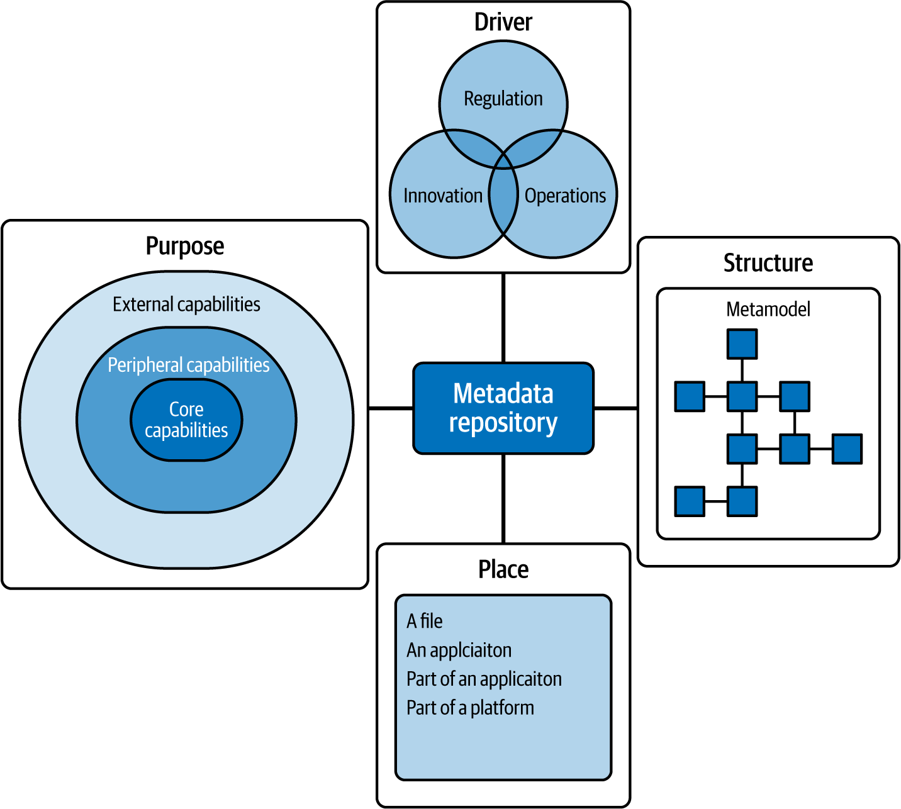

*Figure 2-2. The four main characteristics of metadata repositories*

Die Abbildung setzt das Metadata Repository in die Mitte und ordnet vier
Merkmale darum an. Sie enthält mehr Information als der Fliesstext:

**Driver** ist als **Venn-Diagramm** aus drei sich überschneidenden Kreisen
gezeichnet — Regulation, Innovation, Operations. Die Überschneidung ist
gezeichnet, nicht nur behauptet: Ein Repository liegt in der Regel in mehreren
Kreisen zugleich, und die Schnittmenge in der Mitte ist ein realer Ort.

**Purpose** ist als **drei konzentrische Kreise** gezeichnet, von innen nach
aussen:

1. Core capabilities
2. Peripheral capabilities
3. External capabilities

Der dritte Ring ist wichtig, weil er im Fliesstext von 2.0 nur angedeutet wird.
Die Abbildung macht die Reihenfolge zur Aussage: Es ist eine Bewegung nach
aussen, weg vom Kern.

**Place** ist als schlichte Liste mit vier Einträgen gezeichnet — konkreter als
die Formulierung „vom Spreadsheet bis zur Plattform" aus der Kapitelvorschau:

1. Eine Datei
2. Eine Applikation
3. Teil einer Applikation
4. Teil einer Plattform

Die Reihe steigt in der Eigenständigkeit: von einem Artefakt ohne eigene Technik
über ein eigenes System bis zu etwas, das nur als Bestandteil von etwas
Grösserem existiert. Die letzten beiden Fälle sind die praktisch heiklen — ein
Repository, das Teil einer Applikation oder Plattform ist, hat keinen eigenen
Lebenszyklus.

**Structure** ist als **Knoten-Kanten-Graph** gezeichnet und mit *Metamodel*
beschriftet. Kästchen, die durch Linien verbunden sind — also Objekttypen und
Beziehungstypen. Die Darstellung als Graph statt als Tabelle ist selbst eine
Aussage: Die Beziehungen sind konstitutiv, nicht Beiwerk der Objekte.

### Wo die Details stehen

Für jedes einzelne Repository liefern die Kapitel 3, 4 und 5 jeweils Abbildungen
zu **core capability** und **metamodel**. Wer also die konkrete Ausprägung eines
Repository-Typs sucht, findet sie dort und nicht in diesem Kapitel.

### Begriffe

**Metadata Repository** (Definition des Buchs) — eine Liste beziehungsweise
Sammlung von Dingen, die für das Unternehmen von Interesse sind; sie spiegelt
einen bestimmten Teil der IT-Landschaft, um eine ausgewählte Menge von
Handlungen zu ermöglichen.

**Metadata Layer** — die Ebene, auf der extrahierte Metadata sichtbar gemacht
werden. Speichern allein genügt nicht; Ausstellen gehört zur Definition.

**Data Source** — das beschriebene Objekt in der IT-Landschaft, aus dem Metadata
extrahiert werden. Entspricht dem unteren Kasten in Figure 2-1.

**Strategische Koordination** — die Alternative zur Konsolidierung. Da mehrere
Repositories unvermeidbar sind, entscheidet ihre abgestimmte Aufgabenteilung
über Erfolg oder Misserfolg.

**Core / Peripheral / External capabilities** — die drei Ringe des purpose, von
innen nach aussen. External capabilities sind Funktionen, die eigentlich zu
anderen Systemen gehören.

**Place** — die Erscheinungsform eines Repositories: Datei, Applikation, Teil
einer Applikation, Teil einer Plattform.

**Data Management vs. Information Management** — die beiden Disziplinen, denen
das Buch die Nutzungsbeispiele zuordnet. Data Management zielt auf Verbindungen
und Verortung, Information Management auf Sicherheit, Datenschutz, Aufbewahrung
und Wissen.

---

## 2.4 Driver: The Many Waves of Metadata Repositories

### Kern

**Metadata Repositories kommen in Wellen.** Jede Welle wird von einer Agenda
ausgelöst — einem Standard, einer Regulierung, einer Technologiemode — und
hinterlässt Repositories. Das Problem: Neue Wellen ignorieren die älteren oder
wissen gar nicht von ihnen. Weil sie in Wellen kommen, sind Repositories
üblicherweise **nicht aufeinander abgestimmt: Sie bilden nicht dieselbe Realität
ab.**

Daraus folgt der Satz, um den das ganze Buch kreist:

> **Niemand kennt die tatsächliche Realität der IT-Landschaft.**

Und die Frage, die daraus entsteht: *Welchem Metadata Repository sollst du
trauen?*

### Die Wellen, an denen man sich wiedererkennt

Das Buch führt den Gedanken über eine Reihe von Rückblenden ein — mit der
ausdrücklichen Bemerkung, dass es nicht darauf ankommt, wie viele davon man
selbst miterlebt hat:

| Welle | Zeitpunkt | Was daraus entstand |
|---|---|---|
| Aufstieg der Informationssicherheit | **ISO 27001**, Erstausgabe **2005** | Repositories zur Stützung von Information Security |
| **GDPR** | Entwurf ab ca. 2015, in Kraft **2018** | Repositories für Datenschutznachweise |
| **ESG-Reporting** | laufend | derzeit im Aufbau befindliche Überlegungen |
| IT-Frameworks | fortlaufend | Repositories, die **TOGAF**, **ITIL** oder **SAFe** operationalisieren |
| Innovative Datenarbeit | fortlaufend | Repositories, die Data Pipelines bauen und dokumentieren |

Über die letzten Jahrzehnte ist die Zahl der Repositories „atemberaubend"
gestiegen. Der Grund ist strukturell: Mit stetig wachsenden Datenmengen haben
Unternehmen und Gesellschaft entdeckt, dass Daten für alle möglichen Agenden
sorgfältig behandelt werden müssen. Jede dieser Agenden erzeugt eine Welle.

### Der Pessimismus und der Pragmatismus

Das Buch stellt zwei Lesarten desselben Sachverhalts nebeneinander:

**Pessimistisch:** Ein Metadata Repository ist ein *Parkplatz* für gut gemeinte
Initiativen — der Nachweis, dass man etwas tut, sei es beim Schutz sensibler
Informationen, bei der Steuerung von IT-Kosten oder beim Signalisieren von
Wettbewerbsfähigkeit.

**Optimistisch und zugleich pragmatisch:** *derselbe Befund* — du tust
tatsächlich etwas gegen diese Dinge, mithilfe vieler verschiedener Repositories.

Der Witz an dieser Gegenüberstellung ist, dass beide Lesarten auf dieselben
Tatsachen zeigen. Der Unterschied liegt nicht in der Analyse, sondern darin, ob
man daraus Handlungsfähigkeit ableitet. Das Buch empfiehlt ausdrücklich die
optimistische Haltung — mit dem Hinweis, dass gute Beherrschung von Repositories
Karriere befördert, beim Durchsetzen wichtiger Agenden hilft und dem Unternehmen
Wettbewerbsvorteile sowie eine kosten- und compliance-seitig saubere
IT-Landschaft verschafft.

### Die drei Driver-Kategorien

Trotz sehr unterschiedlicher Zwecke lassen sich alle Repositories in drei
Kategorien einteilen: **Innovation**, **IT operations**, **Regulations**.

#### Innovation

Die **komplexesten und vielversprechendsten** Repositories. Sie stehen im
Kontext dessen, was als **modern data stack** bekannt war — ein Begriff, dessen
Gebrauch seit **2022 rückläufig** ist.

Ihr Ziel: das Innovationspotenzial der Unternehmensdaten maximieren,
**einschliesslich externer Daten**. Der Mechanismus, mit dem sie das tun, ist
präzise beschrieben — sie machen auf einem Metadata Layer sichtbar, *wie
zusätzliche Werkzeuge des modern data stack Daten transformieren, transportieren
und verwerten, sobald diese zugänglich gemacht wurden*.

#### IT operations

Der **pragmatische** Grund: Man braucht sie schlicht, um eine IT-Landschaft zu
betreiben. Aus Betriebssicht werden sie überwiegend als Mittel zur
Effizienzsteigerung und Kostensenkung gedacht.

Sie ahmen viele Funktionen des modern data stack nach, gehen aber darüber
hinaus und blicken tiefer in **ökonomische, rationale und operative** Aspekte
der Landschaft.

Ihr Charakterbild ist unromantisch und wird vom Buch offen benannt:

| Nachteil | Vorteil |
|---|---|
| typischerweise **grösser, älter, schwerer handhabbar** | **verlässlichere** Metadata |
| weniger Aufsehen und Begeisterung um sie herum | mit sorgfältiger, gleichmässiger Solidität gepflegt |
| „cumbersome management tasks" ohne Innovationsversprechen | arbeiten auf **Enterprise-Massstab**, liefern weitere Überblicke |

Der Tipp des Buchs dazu ist deutlich: Man solle ihr Potenzial **nie
unterschätzen**. Sie gelten oft als klobig und altmodisch, sind aber
wahrscheinlich die verlässlichsten und bestgepflegten Repositories im
Unternehmen. Wörtlich: *Respect them. They will give a lot back.* Und der
eigentliche Rat — sie als **Grundlage für Innovation** zu nutzen, statt sie
gegen Innovation auszuspielen.

#### Regulations

Der dritte Grund. Regulierungen können branchenspezifisch oder allgemein sein.
Zwei branchenspezifische Beispiele nennt das Buch:

**HIPAA** (Health Insurance Portability and Accountability Act, **1996**) —
stellt sicher, dass Krankenhäuser und Life-Science-Unternehmen Patientendaten
nicht so behandeln, dass der Patient dadurch Schaden nimmt. Genanntes Beispiel:
der Verkauf von Patientendaten an eine Versicherung.

**BCBS 239** (Basel Committee on Banking Supervision, Standard Nr. 239) —
stellt sicher, dass Banken und Finanzinstitute den **Datenfluss nachverfolgen**
können, um ordnungsgemäss zu berichten und Risiken zu minimieren.

Der Mechanismus dahinter ist bemerkenswert: Die Dokumentation, dass
regulatorische Prozesse in der IT-Landschaft eingehalten werden, muss in einem
**menschenlesbaren Format ausserhalb** der eigentlichen Datenverarbeitung
abgebildet werden — eben damit ein verständlicher Überblick über die Landschaft
entsteht. Genau dafür werden Repositories eingesetzt.

**Der entscheidende Punkt:** Regulatorische Repositories müssen die
IT-Landschaft **interpretieren**. Sie spiegeln keine physische Realität wider,
sondern *reflektieren über* die Landschaft, um eine menschlich verstehbare
Erklärung dafür zu erzeugen, dass eine bestimmte regulatorische Anforderung
erfüllt ist. Deshalb liegt zwischen dem Repository und der gespiegelten
Landschaft ein **höherer Interpretationsgrad** als bei den anderen beiden
Kategorien.

Das ist ein wichtiger Zusatz zur Definition aus 2.3: *mirrors* bedeutet nicht
überall dasselbe. Bei operativen Repositories ist die Spiegelung nah an der
Sache, bei regulatorischen ist sie eine Deutung — und Deutungen können
auseinandergehen, ohne dass jemand einen Fehler gemacht hat.

> **Fürs Repository:** BCBS 239 ist der direkte Bezug zur Bank. Wichtig ist
> dabei der Interpretationsgedanke: Ein Nachweis nach BCBS 239 ist keine
> Ausleitung aus der Landschaft, sondern eine Deutung von ihr. Deshalb kann
> derselbe Datenfluss im EAM-Repository und im Meldewesen unterschiedlich
> aussehen, ohne dass eines von beiden falsch ist — sie beantworten
> verschiedene Fragen. Genau das muss man erklären können, wenn die Revision
> die Abweichung findet.

### Figure 2-3 — die Mischung der Driver

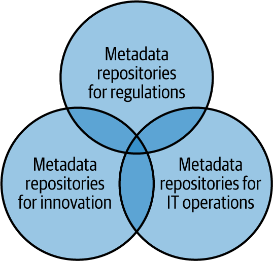

*Figure 2-3. Drivers of metadata repositories are often a blend of innovation,
operations, and regulations*

Repositories werden selten für nur einen einzigen Zweck definiert. Sie sind
meist eine Mischung aus Innovation, IT operations und Regulations — im
Venn-Diagramm die paarweisen Überschneidungen und die gemeinsame Mitte.

Die Abbildung ist die Detailansicht des Driver-Kreises aus Figure 2-2, hier mit
vollen Bezeichnungen der drei Repository-Arten.

### Der Kernpunkt des Buchs

An dieser Stelle formuliert das Buch seinen eigentlichen Ausgangspunkt:

- Es gibt drei Kategorien — Innovation, Operations, Regulations.
- Innerhalb jeder Kategorie gibt es **mehrere** Repositories.
- **Jedes** davon muss die IT-Landschaft beurteilen, jedes mit eigenem Zweck.
- In der Summe **repräsentieren sie gemeinsam** die IT-Landschaft.

*„And that is where all the complexity begins."*

Verschärft wird das durch die Eigentümerstruktur: **Verschiedene Teile der
Organisation besitzen verschiedene Repositories.** Da sie in Wellen entstanden
sind, sind sie nicht koordiniert. Man hat nicht *einen* Metadata-Überblick über
die IT-Landschaft, sondern **viele** — in der Vergangenheit angehäuft und zu
unterschiedlichen Zwecken.

Und das ist das Problem, weil es die Möglichkeit auflöst, die Realität der
eigenen IT-Landschaft zu kennen.

Der Übergang zum nächsten Abschnitt: Ein Repository *sollte* sich auf **eine
Core Capability** konzentrieren — kann sich aber leicht darüber hinaus
ausdehnen.

### Begriffe

**Wave (Welle)** — ein von einer Agenda ausgelöster Schub an
Repository-Gründungen. Neue Wellen kennen die älteren typischerweise nicht.

**Unaligned** — der Normalzustand mehrerer Repositories: Sie bilden nicht
dieselbe Realität ab. Nicht als Nachlässigkeit gemeint, sondern als Folge der
Wellenstruktur.

**ISO 27001** — Standard für Informationssicherheits-Managementsysteme,
Erstausgabe 2005. Auslöser einer frühen Repository-Welle.

**GDPR** — General Data Protection Regulation, in Kraft seit 2018. Im Deutschen
DSGVO.

**ESG** — Environmental, Social and Governance. Aktuelle Berichtswelle.

**TOGAF / ITIL / SAFe** — IT-Frameworks, die auf strukturiertes,
methodisch geplantes Arbeiten mit IT zielen. Ihre Operationalisierung erzeugt
jeweils eigene Repositories.

**Modern data stack** — Sammelbegriff für den Werkzeugverbund moderner
Datenverarbeitung. Laut Buch seit 2022 rückläufig im Gebrauch. Bezugsrahmen der
Innovation-Repositories.

**HIPAA** — US-Gesetz von 1996 zum Schutz von Patientendaten.

**BCBS 239** — Standard Nr. 239 des Basler Ausschusses für Bankenaufsicht.
Verlangt von Banken und Finanzinstituten die Nachverfolgbarkeit von
Datenflüssen für ordnungsgemässes Reporting und Risikominimierung.

**Interpretationsgrad** — das Ausmass an Deutung zwischen Repository und
gespiegelter Landschaft. Bei regulatorischen Repositories systematisch höher,
weil sie keine physische Realität abbilden, sondern eine menschenlesbare
Erklärung der Regelerfüllung erzeugen.

---

## 2.5 Purpose: Core Capability

### Kern

Jedes Repository beginnt mit **einer** Core Capability. Danach wächst es nach
aussen — erst in Peripheral Capabilities, dann womöglich in External
Capabilities, die mit dem ursprünglichen Zweck nichts mehr zu tun haben. Der
Treiber dieses Wachstums ist **nicht das Unternehmen, sondern der
Softwarehersteller**.

Die Ursache des Problems benennt das Buch in einem Satz, der der schärfste des
Kapitels ist:

> Der Fokusverlust entsteht aus einem **ungeprüften Glauben**, den viele
> entwickeln: dass Metadata Repositories eine **source of truth** aufbauen —
> und nicht eine **source in a context**, den sie womöglich gar nicht kennen.

### Wie die Ausdehnung abläuft

Das Buch beschreibt eine Abfolge in drei Stufen mit jeweils eigenem Auslöser:

| Stufe | Auslöser | Verhältnis zum ursprünglichen Zweck |
|---|---|---|
| **Core capabilities** | die Gründungsabsicht | *ist* der Zweck |
| **Peripheral capabilities** | Kundenfeedback und Technologietrends bewegen den Hersteller zur Erweiterung | **war nicht** der ursprüngliche Zweck |
| **External capabilities** | wenn der wirtschaftliche Erfolg es zulässt | **vollständig ausserhalb** des ursprünglichen Zuschnitts |

Zwei Beobachtungen dazu, die den Vorgang erklären:

**Der Hersteller expandiert, nicht der Anwender.** Auslöser sind Kundenfeedback
und Technologietrends — also Marktlogik. Die Ausdehnung ist eine
Produktstrategie, keine Antwort auf den Bedarf eines einzelnen Unternehmens.

**External Capabilities sind eine Erfolgsfolge.** Sie treten laut Buch auf,
„wenn der wirtschaftliche Erfolg es zulässt". Je erfolgreicher ein Werkzeug,
desto weiter wächst es über seinen Zweck hinaus.

### Figure 2-4 — Wachstum über die Zeit

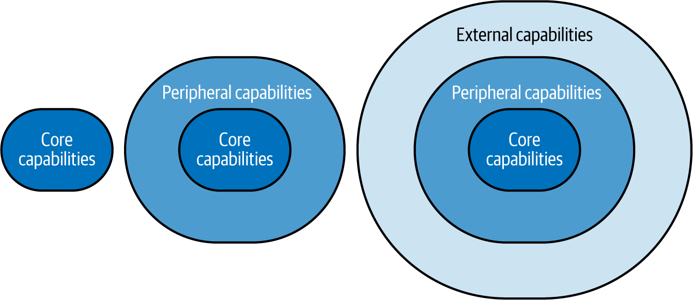

*Figure 2-4. Core, peripheral, and external capabilities of metadata
repositories expanding over time*

Drei Stadien von links nach rechts. Das aufschlussreiche Detail: **Der Kern
bleibt in allen drei Stadien gleich gross.** Es wächst nicht das Repository, es
wachsen die Ringe darum herum. Der Anteil des Kerns am Ganzen wird also mit
jeder Erweiterung kleiner, ohne dass die Kernleistung zunimmt — die bildliche
Fassung von „relative lack of focus on the core capability".

### Die Folge

Fehlender Fokus auf die Core Capability plus Ausdehnung in Peripheral und
External Capabilities führen zu **orientierungslosen und unkoordinierten**
Repositories.

Der Denkfehler dahinter ist der Glaube an die **source of truth**. Die
Gegenformel des Buchs lautet **source in a context** — und der Zusatz *„that
they may be unaware of"* ist der eigentliche Stachel: Ein Repository kennt den
Kontext, in dem es gilt, oft selbst nicht. Es weiss nicht, welchen Ausschnitt es
zeigt, mit welcher Deutung und für welchen Zweck. Wer es dennoch als Wahrheit
liest, verwendet eine Antwort, ohne die Frage zu kennen.

Das schliesst direkt an 2.4 an: Wenn jedes Repository eine kontextgebundene
Quelle ist, dann ist die Frage *„welchem Repository soll ich trauen"* falsch
gestellt. Die richtige Frage lautet, in welchem Kontext welches Repository gilt.

### Die Empfehlung des Buchs

> Ein Metadata Repository sollte sich auf seine **Core Metadata Domain**
> konzentrieren. Das **Data Discovery Team** muss die Metadata Domains
> koordinieren und ihnen helfen zu entscheiden, welche Repositories die
> Peripheral und External Capabilities übernehmen sollen.

Bemerkenswert daran ist die Rollenverteilung: Die Entscheidung liegt bei den
Metadata Domains, das Data Discovery Team **koordiniert und unterstützt** sie
dabei — es entscheidet nicht selbst. Die Peripheral und External Capabilities
werden also nicht abgeschafft; sie werden jemandem zugewiesen.

### Die zwei Fallstricke

Das Buch kündigt an, dass beide beim Durchgang durch die einzelnen Repositories
immer wieder auftauchen werden:

**1. Die Core Capability nicht verstehen oder ignorieren**

Erkennbar an: seltsam funktionierenden Workflows und **organisatorischem
Konflikt**. Das ist ein nützliches Symptom, weil es sich nicht als
Metadata-Problem zeigt, sondern als Zusammenarbeitsproblem — man streitet über
Zuständigkeiten, weil unklar ist, wofür das Werkzeug eigentlich da ist.

**2. Ausdehnung in Peripheral und External Capabilities**

Erkennbar an: **schwerwiegendem Mangel an Nutzerakzeptanz und Rückhalt**. Und
der entscheidende Nachsatz: Wird eine solche Ausdehnung von hochrangigen
Stakeholdern durchgedrückt, stirbt die Aktivität in aller Regel trotzdem. Ein
Repository, das für einen Zweck nicht taugt, lässt sich nicht per Weisung dazu
bringen, ihn zu erfüllen.

> **Fürs Repository:** Die praktische Prüffrage bei jedem neuen Modul, das der
> EAM-Toolhersteller anbietet — Kostenmanagement, Risikoregister,
> Projektportfolio, Umfragen: Dient es der Core Capability, oder ist es ein
> weiterer Ring? Wenn zweiteres, ist die Frage nicht „können wir das auch",
> sondern „wer soll diese Capability eigentlich halten". Und Fallstrick 2 sagt
> voraus, was passiert, wenn die Einführung von oben verordnet statt fachlich
> zugeordnet wird.

### Begriffe

**Core capability** — die Gründungsleistung eines Repositories. Bleibt bei
Ausdehnung unverändert gross.

**Peripheral capability** — durch Kundenfeedback und Technologietrends
hinzugekommene Funktion, die nicht ursprünglicher Zweck war.

**External capability** — Funktion vollständig ausserhalb des ursprünglichen
Zuschnitts. Tritt auf, wenn wirtschaftlicher Erfolg des Herstellers es zulässt.

**Source of truth** — der ungeprüfte Glaube, ein Repository liefere die
Wahrheit. Laut Buch die Wurzel des Fokusverlusts.

**Source in a context** — die Gegenformel: Ein Repository ist eine Quelle
innerhalb eines bestimmten Kontexts — den es möglicherweise selbst nicht kennt.

**Core metadata domain** — der fachliche Kernbereich, auf den sich ein
Repository konzentrieren soll.

**Data Discovery Team** — die koordinierende Instanz. Hilft den Metadata Domains
bei der Entscheidung, welches Repository welche Capability übernimmt, entscheidet
aber nicht an ihrer Stelle.

---

## 2.6 Place: Metadata Repositories at Various Levels

### Kern

Repositories lassen sich am leichtesten als **eigenständige technische Lösungen**
vorstellen — aber das ist häufig gerade nicht der Fall. Ein Repository kann auf
sehr verschiedenen Ebenen sitzen, und eine Tabellenkalkulation ist eine davon.

### Die vier Ebenen

1. **Eine Datei, ein Dokument oder eine Tabellenkalkulation**
2. **Eine Applikation**
3. **Teil einer Applikation**
4. **Teil eines Systems, einer Datenbank oder einer grösseren Plattform**

Die Reihe entspricht der Liste aus Figure 2-2, hier etwas breiter gefasst:
Punkt 1 nennt zusätzlich Dokument und Spreadsheet, Punkt 4 zusätzlich System und
Datenbank.

Die entscheidende Unterscheidung verläuft zwischen 2 und 3: Ein Repository, das
eine eigene Applikation *ist*, hat einen eigenen Lebenszyklus, eigene
Zuständigkeit und eigene Beschaffung. Ein Repository, das *Teil* von etwas
anderem ist, hat all das nicht — es erbt Lebenszyklus und Zuständigkeit von
seinem Wirt.

### Das Beispiel: Integration Repositories

Das Buch verweist auf Kapitel 3 und die **Integration Repositories (IRs)**. Die
Argumentation ist lehrreich, weil sie zeigt, warum Mehrfachhaltung nicht am
schlechten Willen liegt:

- Eine Organisation hat **sehr wahrscheinlich viele** Integration Repositories.
- In einem typischen Unternehmen gibt es **erheblich mehr Integrationen**, als
  ein einzelnes Repository beschreiben und ausführen kann.
- Die Gründe dafür sind **technischer, organisatorischer und sogar logischer**
  Natur — Kapitel 3 führt das aus.
- Folglich werden Integrationen typischerweise in einer **Kombination** gepflegt:
  teils in Spreadsheets, teils als Bestandteil von Applikationen, die Data
  Pipelines bauen.

Der Nachsatz ist wichtig, weil er die Erwartungshaltung setzt:

> **„And that's totally fine, at least in the beginning."**

Der Zustand ist also kein Missstand, den man beheben muss, sondern der
Ausgangspunkt. Der Einschub *at least in the beginning* deutet allerdings an,
dass er nicht dauerhaft tragfähig bleibt.

### Was zu tun ist

Nicht konsolidieren — das schliesst an 2.3 an. Sondern:

1. Einen **Überblick** über diese Repositories gewinnen.
2. Sie **sorgfältig koordinieren**.

Genau das ist laut Buch der Gegenstand der folgenden Kapitel.

> **Fürs Repository:** Die praktische Konsequenz aus Ebene 3 und 4 — bei einer
> Bestandsaufnahme der Repositories zählen die eingebetteten mit. Die
> Schnittstellenliste in der Middleware, das Datenmodell im ETL-Werkzeug, die
> Applikationsliste im Servicemanagement-Tool: Das sind Repositories nach der
> Definition aus 2.3, auch wenn niemand sie so nennt und niemand sie in einer
> Werkzeugübersicht führt.

### Begriffe

**Place** — die Ebene, auf der ein Repository existiert. Vier Ausprägungen von
der Datei bis zum Plattformbestandteil.

**Standalone technology solution** — die naheliegende, aber häufig unzutreffende
Vorstellung vom Repository als eigenständigem System.

**Integration Repository (IR)** — Repository für Integrationen zwischen
Systemen. Gegenstand von Kapitel 3. Kommt praktisch immer in Mehrzahl und in
gemischten Erscheinungsformen vor.

**Data Pipeline** — technischer Weg, auf dem Daten transformiert und
transportiert werden. Die Applikationen, die solche Pipelines bauen, enthalten
selbst Integration Repositories.

---

## 2.7 Structure: The Metamodel in Metadata Repositories

### Kern

Jedes Metadata Repository — und Software überhaupt — bringt ein **Metamodel**
mit. Definition des Buchs:

> Ein Metamodel ist eine **High-Level-Architektur, die die Inhalte des Metadata
> Repository abbildet.**

Der Abschnitt zeigt anhand zweier realer Metamodelle (EAM-Werkzeug und CMDB),
dass diese sich **überlappen** — teils offensichtlich, teils subtil. Und er
liefert die methodische Begründung dafür, warum ein einzelnes Team ein Metamodel
gar nicht allein festlegen *kann*: Metamodellierung ist **rekursiv**.

### Figure 2-5 — Metamodel eines EAM-Werkzeugs

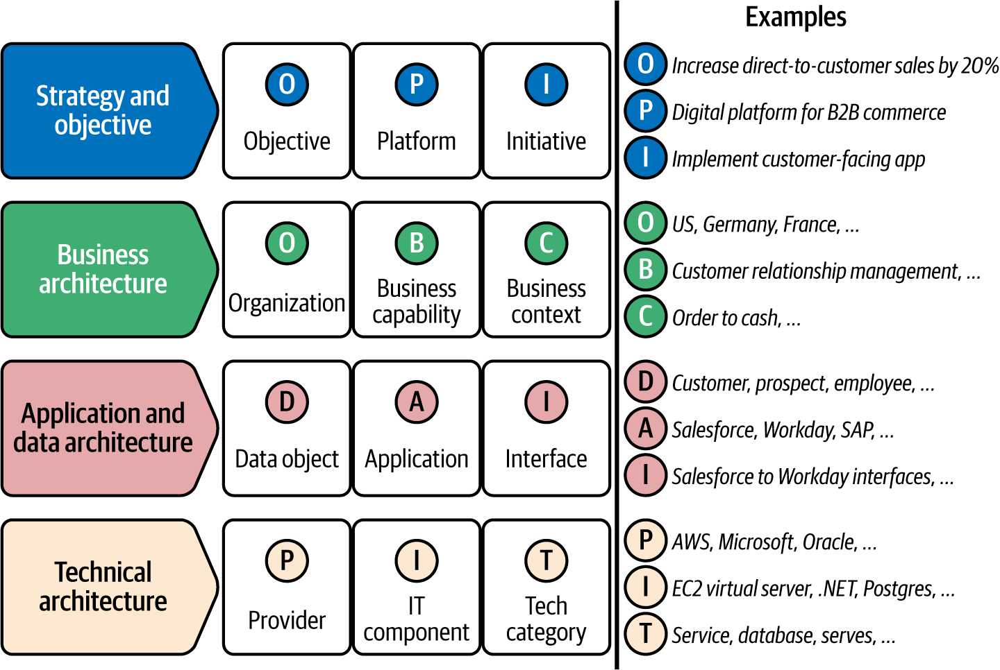

*Figure 2-5. The metamodel of an EAM tool* — angelehnt an das Metamodel von
**LeanIX** ([Fn. 7](#fussnoten)). Ausführlich in Kapitel 3.

Vier Ebenen mit je drei Objekttypen, im Original mit Beispielen:

| Ebene | Objekttypen | Beispiele aus der Abbildung |
|---|---|---|
| **Strategy and objective** | Objective, Platform, Initiative | „Increase direct-to-customer sales by 20%"; „Digital platform for B2B commerce"; „Implement customer-facing app" |
| **Business architecture** | Organization, Business capability, Business context | US, Germany, France; Customer relationship management; Order to cash |
| **Application and data architecture** | Data object, Application, Interface | Customer, prospect, employee; Salesforce, Workday, SAP; Salesforce-zu-Workday-Schnittstellen |
| **Technical architecture** | Provider, IT component, Tech category | AWS, Microsoft, Oracle; EC2 virtual server, .NET, Postgres; Service, database |

Die Ebenen sind als Pfeile gezeichnet, die von der Strategie nach unten in die
Technik zeigen — die klassische EAM-Schichtung von der Absicht bis zum Bauteil.

### Figure 2-6 — Metamodel einer CMDB

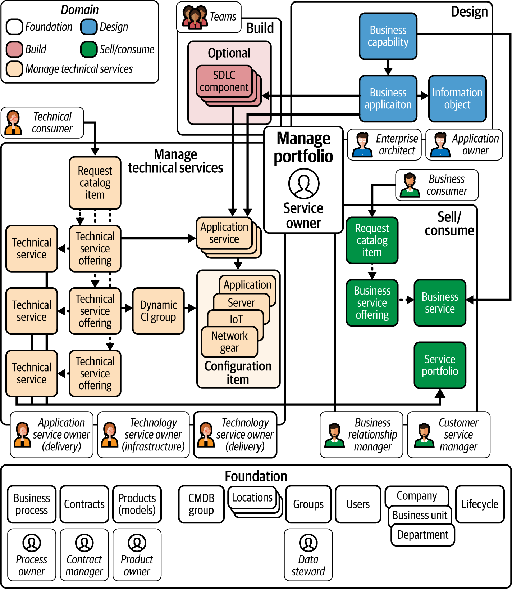

*Figure 2-6. The metamodel of a CMDB tool* — angelehnt an das Metamodel von
**ServiceNow** und das zugehörige E-Book ([Fn. 8](#fussnoten)). Ebenfalls
Kapitel 3.

Deutlich dichter als das EAM-Metamodel und nicht in Schichten, sondern in
**Domänen** organisiert, die farblich unterschieden sind:

| Domäne | Zentrale Objekttypen | Zugehörige Rollen |
|---|---|---|
| **Foundation** | Business process, Contracts, Products (models), CMDB group, Locations, Groups, Users, Company / Business unit / Department, Lifecycle | Process owner, Contract manager, Product owner, Data steward |
| **Design** | Business capability → Business application → Information object | Enterprise architect, Application owner |
| **Build** | SDLC component (als optional gekennzeichnet) | Teams |
| **Manage technical services** | Request catalog item → Technical service offering → Technical service, Dynamic CI group, Application service, **Configuration item** (Application, Server, IoT, Network gear) | Technical consumer, Application service owner, Technology service owner (infrastructure / delivery) |
| **Sell/consume** | Request catalog item → Business service offering → Business service, Service portfolio | Business consumer, Business relationship manager, Customer service manager |
| **Manage portfolio** | — | Service owner |

Ein Unterschied, der ins Auge fällt und im Text nicht erwähnt wird: Das
CMDB-Metamodel führt **Rollen als eigene Elemente**. Wer welchen Objekttyp
verantwortet, ist Teil des Metamodels — im EAM-Metamodel der Figure 2-5 kommt
das nicht vor.

### Die Überlappungen

Das ist der Punkt des Abschnitts. Beide Werkzeuge listen Applications und
Capabilities. Es gibt aber **weitere Überschneidungen, und einige davon sind
subtil**. Das Buch stellt sie ausdrücklich als offene Fragen:

| EAM-Werkzeug | CMDB | Frage des Buchs |
|---|---|---|
| Application | Business application / Configuration item „Application" | offensichtliche Dopplung |
| Business capability | Business capability | offensichtliche Dopplung |
| **Tech category** | **Technical service offering** | Sind die beiden ähnlich? |
| **Data object** | **Information object** | Sind die beiden ähnlich? |

Die Formulierung ist bewusst als Frage gehalten, nicht als Feststellung — es
gibt keine allgemeingültige Antwort, sie muss je Unternehmen getroffen werden.

Was daraus folgt, formuliert das Buch scharf: Diese Repositories dehnen ihre
Funktionalität potenziell über ihre Core Capabilities hinaus (Rückbezug auf 2.5)
und berühren dabei Metadata-Artefakte, die **möglicherweise in einer anderen
Domäne und einem anderen Repository verwaltet werden — oder eben nicht.**

Werden diese Fragen nicht gestellt und beantwortet, erzeugen Unternehmen
**mehrere Wahrheiten** über ihre IT-Landschaft (Vertiefung in Teil II). Und
daraus entsteht die Formulierung, die den Gedanken aus 2.5 zu Ende führt:

> **Conflicting single sources of truth** untergraben die Fähigkeit, die
> IT-Landschaft eines Unternehmens zu verstehen.

Der Ausdruck ist in sich widersprüchlich, und das ist Absicht: Mehrere Dinge,
die jeweils für sich beanspruchen, *die eine* Wahrheitsquelle zu sein.

Der Tipp dazu skaliert das Problem: Man stelle sich vor, das Unternehmen habe
nicht nur ein EAM-Werkzeug und eine CMDB, sondern **10 oder 20** Repositories,
die die IT-Landschaft abbilden. Ihre Koordination ist der Gegenstand des ganzen
Buchs.

> **Fürs Repository:** Die vier Zeilen der Überlappungstabelle sind als Vorlage
> brauchbar. Für jedes Objekt, das in EAM-Repository und CMDB vorkommt, drei
> Angaben festhalten: Bedeutet es dasselbe? Wenn nein, worin unterscheidet es
> sich? Und welches der beiden ist für welches Attribut führend? Fussnote 7 und 8
> verraten übrigens, dass die Abbildungen an LeanIX und ServiceNow angelehnt
> sind — falls das eure Werkzeuge sind, sind die Metamodelle direkt vergleichbar.

### Die acht meistabgebildeten Metadata-Typen

Am häufigsten werden in Metadata Repositories abgebildet:

1. Application
2. Integration (data lineage)
3. Data
4. Process
5. Capability
6. Person
7. Organization
8. Cost

Und dann kommt die vielleicht wichtigste Anweisung des Kapitels — sie richtet
sich ausdrücklich gegen den Reflex, Dopplungen beseitigen zu wollen:

> Man sollte **nicht** darauf abzielen, diese Elemente aus den verschiedenen
> Repositories des Unternehmens fernzuhalten. Sie werden **nicht in nur einem**
> Repository existieren. Das wäre nicht nur widersinnig — es wäre **unmöglich**.

Die Begründung, wörtlich die Essenz des Abschnitts:

> **Du betrachtest dieselbe Sache mit verschiedenen Metadata Repositories, aber
> du betrachtest sie unterschiedlich — jedes Repository mit einem eigenen,
> unverwechselbaren Fokus, um eine bestimmte Aufgabe zu erfüllen.**

Dopplung ist damit kein Fehler, sondern eine Notwendigkeit. Das ist konsistent
mit 2.1: Metadata sind ohnehin immer an mehreren Orten zugleich.

### Warum ein Team allein kein Metamodel festlegen kann

Zur Begründung greift das Buch auf *Metamodelling for Software Engineering* von
Gonzalez-Perez und Henderson-Sellers zurück ([Fn. 9](#fussnoten)):

> Der Gegenstand der Metamodellierung sind Modelle; anders gesagt, die
> Eingangs- und Ausgangsartefakte einer Metamodellierungsaufgabe sind „aus
> demselben Stoff gemacht", sie sind vom selben Typ. Das gibt der
> Metamodellierung eine **rekursive Natur**, die sie erheblich komplexer macht
> als andere Modellierungsbereiche, in denen der modellierte Gegenstand
> andersartig ist.

Die Konsequenz, die das Buch daraus zieht:

- Die rekursive Tätigkeit lässt sich **nicht isoliert** ausüben.
- Teams **quer durch die Organisation** brauchen ein fest abgestimmtes
  Verständnis der IT-Landschaft.
- Ein Team kann **nicht allein** ein Metamodel festlegen, indem es erklärt:
  *„Das sind unsere Unternehmensprozesse, das sind unsere Datentypen, das sind
  unsere Applikationen."*
- Grund: Die Tätigkeit verweist zurück auf eine Realität, die **gemeinsam
  geteilt und praktiziert** wird.
- Ein Metamodel in einem Repository durch ein Team festzulegen, wird diese
  Realität **niemals verändern** — es fügt nur **eine weitere Schicht
  Verwirrung** hinzu.

Das ist die schärfste praktische Aussage des ganzen Kapitels und richtet sich
gegen die verbreitetste Arbeitsweise überhaupt: dass ein Architekturteam sich
zurückzieht, ein Metamodel definiert und es anschliessend ausrollt.

### Warnung: universelle Metamodelle

> Bestimmte Softwarehersteller und Frameworks bewerben ihre Metamodelle als
> **universell**, als seien sie für alle Zwecke geeignet ([Fn. 10](#fussnoten)).
> **Das ist niemals der Fall.**

Die Fussnote dazu benennt konkret das **Content Core Metamodel des TOGAF
Standard** (10. Auflage, The Open Group). Der Vorwurf richtet sich also nicht
gegen einen beliebigen Anbieter, sondern gegen den verbreitetsten
EA-Rahmenwerksstandard.

### Begriffe

**Metamodel** — High-Level-Architektur, die die Inhalte eines Metadata
Repository abbildet. Bringt jede Software mit, ob benannt oder nicht.

**Conflicting single sources of truth** — mehrere Repositories, die jeweils
beanspruchen, *die* Wahrheitsquelle zu sein. Untergraben gemeinsam das
Verständnis der IT-Landschaft.

**Multiple truths** — das Ergebnis unbeantworteter Überlappungsfragen zwischen
Metamodellen.

**Rekursivität der Metamodellierung** — Ein- und Ausgabe der Metamodellierung
sind vom selben Typ (Modelle). Daraus folgt, dass sie nicht isoliert von einem
einzelnen Team ausgeübt werden kann.

**Business capability vs. Tech category vs. Technical service offering** — die
konkreten Überlappungskandidaten zwischen EAM-Werkzeug und CMDB. Ob sie
dasselbe bedeuten, ist je Unternehmen zu entscheiden.

**Data object vs. Information object** — die subtilere der beiden vom Buch
gestellten Überlappungsfragen.

---

## 2.8 Summary

Die Zusammenfassung des Buchs, geordnet nach den vier Merkmalen.

Vorbemerkung des Autors: Was auf den ersten Blick geradlinig wirkt, ist in
Wirklichkeit komplex — **besonders für Fachbereichsteams**, die solche
Repositories verwalten. Diese Teams erkennen häufig den Abstimmungsbedarf nicht.
Ergebnis sind Repositories, die **leicht eingeführt** sind, aber **kaum Einblick**
in die tatsächliche IT-Landschaft geben.

**Grundlage**

- Metadata über die IT-Landschaft liegen **sowohl in der beschriebenen Quelle
  als auch im Metadata Repository**.
- Metadata Repositories haben einen **Driver**, eine **Structure**, einen
  **Place** und einen **Purpose**.

**Driver** — Innovation, Operations oder Regulations, mit Überschneidungen:

- Die Wellen der **Innovation** sind als *modern data stack* bekannt; die
  zugehörigen Repositories dokumentieren Bewegung und Veränderung von Daten
  innerhalb dieses Stacks.
- Die Wellen der **Operations** richten sich auf die einzelnen Teile der
  IT-Landschaft — Server, Laptops, Integrationen — und betrachten diese Teile
  **isoliert**.
- Die Wellen der **Regulations** setzen eine **Interpretation** der
  IT-Landschaft voraus, um zu funktionieren.

**Structure** — das Metamodel:

- Mehrere Repositories, die dieselbe Information abbilden, sind **nicht
  zwangsläufig ein Problem**.
- Erkennen lässt sich das durch **Studium der Metamodelle**.

**Place** — schlicht der Ort des Repositories: eine Datei, eine Applikation,
Teil einer Applikation oder eine Plattform.

**Purpose** — die Core Capability:

- Alle Repositories haben **core**, **peripheral** und **external**
  capabilities.
- Die Core Capability **muss verstanden und genutzt** werden.
- Repositories **nur** für Peripheral und External Capabilities zu nutzen,
  **wird scheitern**.

**Schlussfolgerung:** Aus all diesen Gründen sind Metadata Repositories
**ganzheitlich zu betrachten und zu koordinieren.**

---

# Kapitel 3 — IT Management

## 3.0 Überblick über das Kapitel

### Kern

Das Kapitel geht die **klassischen Systeme** durch, mit denen eine IT-Abteilung
die IT-Landschaft eines Unternehmens verwaltet. Die zentrale Botschaft an alle,
die aus dem Data Management kommen: Einige dieser Systeme stehen dort nicht auf
dem Radar — **sollten es aber**, denn

> diese operativen Systeme sind wahre **Goldquellen**, wenn es um Metadata über
> die IT-Landschaft geht.

### Aufbau des Kapitels

Der Durchgang folgt einer klaren Steigerung: von den **grundlegendsten,
alltäglichsten** operativen Repositories hin zu den **abstrakteren,
strategischeren**.

| # | Repository | Ebene |
|---|---|---|
| 1 | **EMS** — Endpoint Management System | am nächsten am Gerät |
| 2 | **IR** — Integration Repository | ↓ |
| 3 | **AMS** — Asset Management System | ↓ |
| 4 | **CMDB** — Configuration Management Database | ↓ |
| 5 | **ITSM** — IT Service Management System | ↓ |
| 6 | **EAM** — Enterprise Architecture Management Tool | am abstraktesten, strategisch |

---

## 3.1 Endpoint Management System (EMS)

### Kern

Das EMS listet **jeden einzelnen** Server, Desktop und jedes mobile Gerät des
Unternehmens — und alle darauf installierten Applikationen. Der Zweck geht aber
über das Auflisten hinaus: Das EMS kann Applikationen auf dem vorgesehenen Gerät
**installieren**, wenn es dazu angewiesen wird.

Das Alltagsbeispiel des Buchs: der erste Arbeitstag. Man bekommt Laptop und
Telefon, und darauf sind neben den üblichen auch firmenspezifische Applikationen
— installiert vom EMS.

### Was das EMS abbildet

Ein *fairly simple and big* Repository mit **viel praktischer Pflege**. Der Zweck
ist ein **greifbarer Überblick** über zwei Dinge:

**1. Technische Infrastruktur**

- Server, samt Namensstandards und Standorten
- Desktops, samt Namen und Versionen
- Mobile Geräte, samt Namen und Versionen

**2. Applikationen auf dieser Infrastruktur**

- alle Applikationen auf allen Servern
- alle Applikationen auf allen Desktops

Der Anspruch daran ist absolut formuliert: Man **soll** jedes einzelne Gerät des
Unternehmens im EMS suchen und aufrufen können und dabei genau sehen, was auf
diesem Gerät installiert ist. Ebenso jeden einzelnen Server, ob On-Premises oder
Cloud.

### On-Premises und Cloud vermischen sich nicht

Ein praktisch wichtiger Punkt: Das EMS ist in **zwei Kategorien** zu denken —
On-Premises und Cloud. Es kommt typischerweise in diesen zwei Versionen vor, und
**sie vermischen sich nicht.**

Beispiel aus dem Buch für Microsoft Azure zum Zeitpunkt der Abfassung:

| Kategorie | Produkt |
|---|---|
| On-Premises | **MECM** — Microsoft Endpoint Configuration Manager ([Fn. 3-1](#kapitel-3)) |
| Cloud | **Intune** |

### Sicherheitswarnung

Je nach Sicherheitseinrichtung im Unternehmen kann man Applikationen auf Laptop
und Telefon möglicherweise **selbst** installieren. Aus Sicherheitssicht ist das
nicht ideal: Es hat **keine Bewertung durch ein zentrales Sicherheitsteam**
stattgefunden. Die Applikationen können Schadsoftware sein, ausgelegt auf
Spionage oder Schädigung des Unternehmens.

### Figure 3-1 — Core Capability des EMS

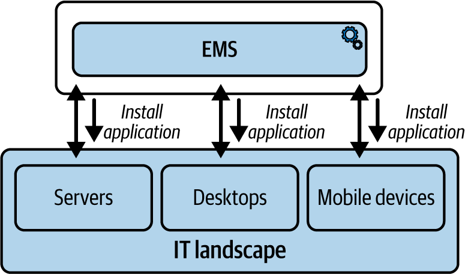

*Figure 3-1. Core capability of an EMS*

Das EMS sitzt über der IT-Landschaft und ist mit **Servers**, **Desktops** und
**Mobile devices** verbunden. Bemerkenswert ist die Pfeilführung: Jeweils ein
**Doppelpfeil** (das Lesen des Bestands) *und* ein zusätzlicher **einfacher
Pfeil nach unten** mit der Beschriftung *Install application*. Die Abbildung
trennt also sauber, was der Fliesstext betont — das EMS **liest nicht nur, es
handelt**.

### Die Metadata-Schicht

Das EMS wird überwiegend im **Operations**-Kontext eingesetzt. Es erlaubt, dass
Client-Applikationen auf Desktops und Geräten installiert werden, **sobald sie
auf Servern installiert sind** — und genau daraus entsteht laut Buch eine
zusätzliche **Metadata-Schicht, die die Nutzer des EMS verstehen müssen**. Die
Abhängigkeit Server → Client ist selbst Metadata.

### Figure 3-2 — Metamodel des EMS

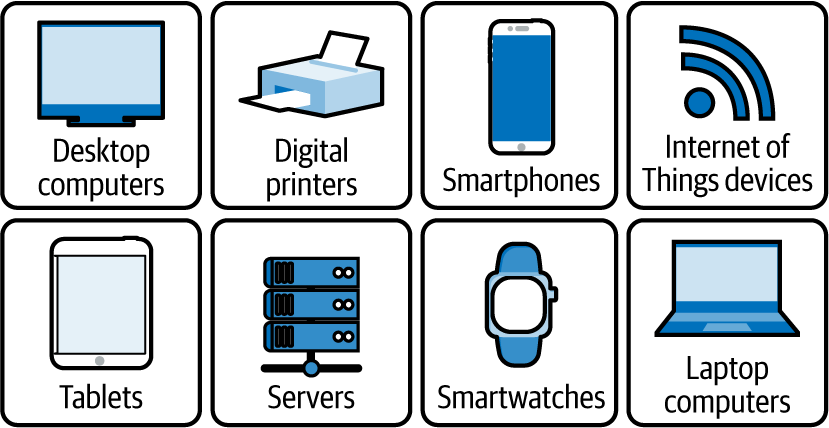

*Figure 3-2. A metamodel of an EMS* — angelehnt an SentinelOne, „What Is
Endpoint Management?" ([Fn. 3-2](#kapitel-3))

Acht Objekttypen als schlichte Kachelreihe:

Desktop computers · Digital printers · Smartphones · Internet of Things devices ·
Tablets · Servers · Smartwatches · Laptop computers

Das ist das **einfachste Metamodel im ganzen Buch** — eine flache Liste von
Objekttypen **ohne eingezeichnete Beziehungen**. Im Kontrast zu Figure 2-6
(CMDB) oder Figure 3-12 (EAM) zeigt das, wie unterschiedlich reif Metamodelle
sein können: Hier gibt es nur *was es gibt*, nicht *wie es zusammenhängt*.

Auffällig ist ausserdem, dass die Kachelreihe mehr Gerätetypen enthält, als der
Fliesstext nennt — Drucker, Tablets und Smartwatches kommen dort nicht vor.

> **Fürs Repository:** Das EMS ist die genaueste Quelle dafür, welche Software
> tatsächlich wo läuft — nicht welche laufen soll. Für die Bestandsprüfung des
> EAM-Repositories ist es damit die härteste verfügbare Gegenprobe, aber nur für
> Client-Software und nur innerhalb je einer der beiden Welten (On-Prem oder
> Cloud). Wer beide Welten abdecken will, braucht zwei Abzüge und muss sie
> selbst zusammenführen.

### Begriffe

**EMS — Endpoint Management System** — listet alle Geräte und die darauf
installierten Applikationen und kann Applikationen ausrollen.

**Endpoint** — jedes verwaltete Gerät: Server, Desktop, Laptop, Smartphone,
Tablet, Drucker, IoT-Gerät, Smartwatch.

**MECM** — Microsoft Endpoint Configuration Manager, die On-Premises-Variante im
Microsoft-Umfeld. **Intune** ist das Cloud-Gegenstück.

**SCOM** — System Center Operations Manager, laut [Fn. 3-1](#kapitel-3) ein noch
tieferes Repository zur Ergänzung von SCCM.

---

## 3.2 Integration Repository (IR)

### Kern

Das IR richtet sich **nicht auf einzelne Geräte** wie das EMS, sondern listet
Applikationen und IT-Infrastruktur **und wie sie integriert sind**. Wie das EMS
ist es aber zum Handeln gebaut: Es **entwirft, testet und führt Integrationen
aus**.

Und es ist der grosse Ausnahmefall unter den Repositories:

> Im Gegensatz zu den meisten anderen Metadata Repositories ist es **sehr
> unwahrscheinlich, dass du nur ein einziges IR hast.**

### Was ein IR beschreibt

Das IR beschreibt die **Natur der Integration** zwischen zwei Applikationen — in
Bezug darauf, **welche Daten** ausgetauscht werden und **wie** sie ausgetauscht
werden. Festgehalten wird das in Dokumenten, die im IR abgelegt sind und je nach
Haus verschieden heissen:

- **Data Sharing Agreements**
- **Integrations**
- **Data Contracts**

Manche IRs sitzen innerhalb von Plattformen, die eigens für Integrationen
gebaut sind — bekannt als **iPaaS** (Integration Platform as a Service).

### Die drei Integrationsarten

Das Buch bezeichnet das Verständnis dieser drei als **entscheidend** für das
übergreifende Thema des Buchs.

| | **Batch** | **API** | **Stream** |
|---|---|---|---|
| **Wesen** | geplante Aufgaben, die grosse Dateimengen oder viele Daten von A nach B bewegen | webbasierte Kommunikation, Austauschpunkte zwischen Applikationen — „wie ein Telefonanruf" | „die Mikrofone anlassen": sobald etwas passiert, weiss man es sofort |
| **Voraussetzung** | On-Premises-Technologie, altes Muster | moderne, cloudbasierte Applikation | modernes Muster |
| **Vorteil** | **Grösse** — man kann sehr viele Daten leicht bewegen | schneller und einfacher als Batch, wenn man Daten aus einer Quelle braucht | **Echtzeit** |
| **Nachteil** | man muss warten, bis der geplante Job durchgelaufen ist | | in der Praxis nicht garantiert (siehe unten) |

Zum Batch macht das Buch eine organisatorische Beobachtung: Diese Aufgaben
werden typischerweise von **nur einem Team** im Unternehmen ausgeführt, und
dieses Team ist **überlastet** — weil Batch ein altes Integrationsmuster ist,
das mit On-Premises-Technik arbeitet und das seit Jahren tut.

Zum Streaming die Einschränkung aus [Fn. 3-3](#kapitel-3): Echtzeit ist das
**Ziel**, nicht zwangsläufig die Realität. Nachrichten können sich in Queues
stauen, Consumer können zurückfallen.

Der Tipp dazu setzt das Ganze in einen grösseren Rahmen: Die **Abwägung der
wirtschaftlichen und technischen Vor- und Nachteile** von Batch, API und Stream
ist der Schlüssel zu **Data Mesh** und skalierbaren Datenarchitekturen — und zu
Integrationsarchitekturen überhaupt. Vertiefung: Piethein Strengholt, *Data
Management at Scale*, 2. Auflage (O'Reilly).

### Figure 3-3 — Core Capability des IR

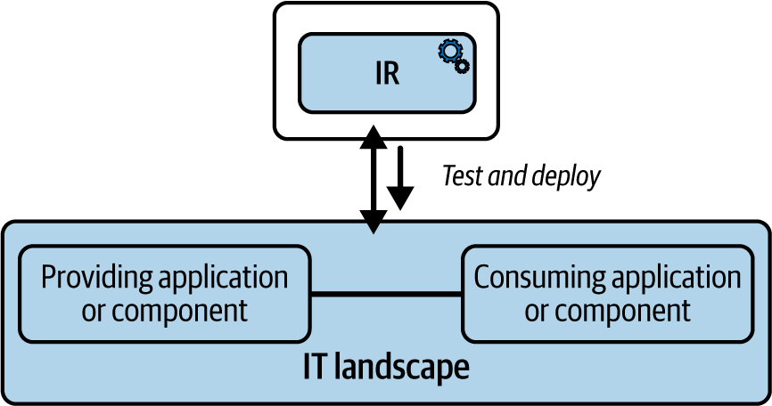

*Figure 3-3. Core capability of an IR*

In der IT-Landschaft stehen zwei Kästen: **Providing application or component**
und **Consuming application or component**, durch eine Linie verbunden. Das IR
darüber ist mit einem Doppelpfeil und einem zusätzlichen Abwärtspfeil *Test and
deploy* angebunden — dieselbe Zweiteilung wie beim EMS: lesen **und** handeln.

Die Begriffe **providing** und **consuming** sind die eigentliche Aussage der
Abbildung: Eine Integration hat immer eine Richtung und zwei Rollen.

### Warum es nie nur ein IR gibt

Die Begründungskette des Buchs, Schritt für Schritt:

1. Integrationen durchzuführen ist **nicht die Aufgabe eines Teams**. Das
   einfachste Szenario wäre, dass ein einziges Data-Engineering-Team alle
   Integrationen baut — aber so ist die Realität nicht.
2. **Jede Abteilung** eines relativ grossen Unternehmens (mindestens einige
   tausend Mitarbeitende) hat **ein oder sogar mehrere** Data-Engineering-Teams.
3. Jedes dieser Teams programmiert Data Pipelines mit relativ komplexen
   Programmiersprachen und spezialisierter Software.
4. Diese Software — etwa mathematische Data-Warehouse-Dienste — **ist selbst ein
   Metadata Repository**, weil sie die Pipelines auflistet, die sie ausführt.
5. Ergebnis: eine **sehr grosse Zahl** von Komponenten in der IT-Landschaft, die
   gleichzeitig Integrationen durchführen **und** deren Metadata Repository
   sind.
6. Die daraus entstehende Komplexität ist **in vielen Fällen unbeherrschbar
   hoch**.

Punkt 4 ist der eigentliche Mechanismus: Das Werkzeug, das die Integration
ausführt, wird dadurch automatisch zum Repository über sie. Man kann also nicht
Integrationen dezentral bauen und die Metadata darüber zentral halten wollen —
die Metadata entstehen dort, wo gebaut wird.

### Die ehrliche Erwartungshaltung

Bestimmte Technologieanbieter und Beratungen machen es zu ihrem Verkaufsargument,
diese Komplexität mit Werkzeugen oder methodischen Ansätzen zu reduzieren. Das
Buch stellt beides nebeneinander:

- Ja, man kann die Komplexität der Integrationsarchitektur **durchaus
  reduzieren**.
- Aber man muss **schlicht akzeptieren**, dass Integrationen ihrer Natur nach
  *dizzying and confusing* sind, sobald man versucht, auf Unternehmensmassstab
  ein vollständiges Bild von ihnen zu bekommen.

Wie das Data Discovery Team die Komplexität dennoch senkt, behandeln Teil II und
Teil III.

### Data Contracts

Die **Verfeinerung und Automatisierung** von IRs wurde als **Data Contracts**
geprägt. Die Einordnung des Buchs ist bemerkenswert nüchtern:

- Das Konzept ist **alt** und beschreibt seit Jahrzehnten Integrationsverträge,
  die in IRs abgelegt sind.
- Data Contracts durchliefen in der **ersten Hälfte der 2020er** einen Hype
  Cycle.
- Sie finden gerade **erneute und verdiente Relevanz**.

Quelle: Andrew Jones, *Driving Data Quality with Data Contracts* (Packt
Publishing).

### Figure 3-4 — Spaghetti

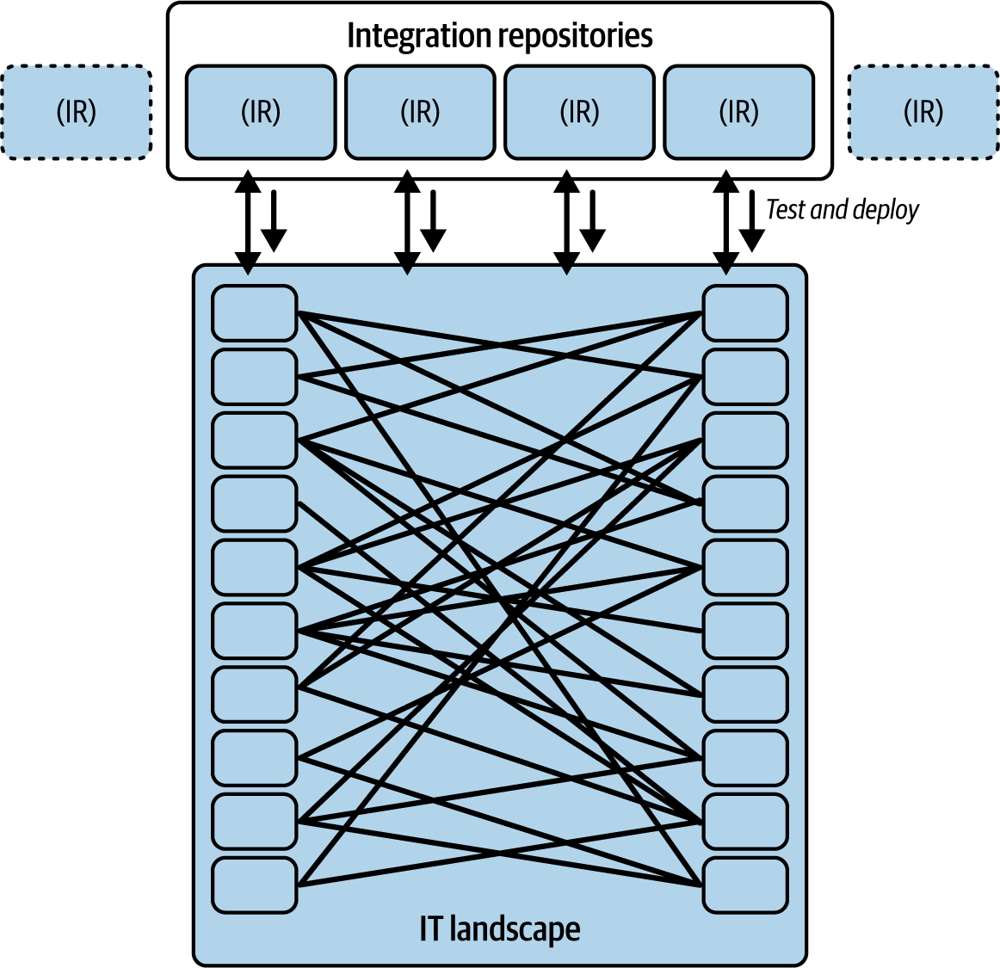

*Figure 3-4. Spaghetti: the reality of integration architecture and its metadata
repositories*

Die Abbildung zeigt die Realität in den meisten Unternehmen: **mehrere IRs**
orchestrieren, was als **Spaghetti-Architektur** bekannt ist — eine
undurchsichtige Gesamtheit von Integrationen.

Zwei gestalterische Details tragen Bedeutung:

- Die IR-Kästen sind **teils durchgezogen, teils gestrichelt** gezeichnet. Die
  gestrichelten stehen ausserhalb des umrahmten Blocks — es gibt also noch mehr
  IRs, als man erfasst hat.
- Innerhalb der IT-Landschaft sind zwei Spalten von Applikationen durch ein
  dichtes Gewirr sich kreuzender Linien verbunden. Kein Muster, keine Ordnung —
  genau das ist die Aussage.

Wichtige Klarstellung des Buchs: Die IRs in Figure 3-4 stellen **keine**
Integrationsplattform dar, auch nicht mehrere.

### Figure 3-5 — Metamodel des IR

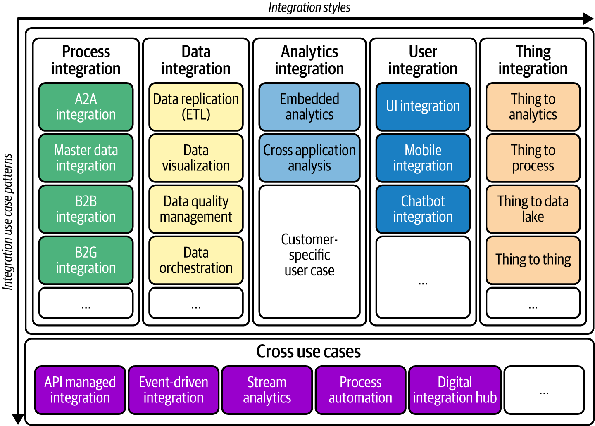

*Figure 3-5. A metamodel of an IR* — angelehnt an SAPs Integrationsrahmenwerk
**ISA-M** ([Fn. 3-4](#kapitel-3))

Anders als die bisherigen Metamodelle ist dieses eine **Matrix**: waagerecht
*Integration styles*, senkrecht *Integration use case patterns*.

| Integration style | Use Case Patterns |
|---|---|
| **Process integration** | A2A integration, Master data integration, B2B integration, B2G integration |
| **Data integration** | Data replication (ETL), Data visualization, Data quality management, Data orchestration |
| **Analytics integration** | Embedded analytics, Cross application analysis, kundenspezifischer Anwendungsfall |
| **User integration** | UI integration, Mobile integration, Chatbot integration |
| **Thing integration** | Thing to analytics, Thing to process, Thing to data lake, Thing to thing |

Darunter eine eigene Zeile **Cross use cases**, die quer über alle Styles
liegen: API managed integration · Event-driven integration · Stream analytics ·
Process automation · Digital integration hub.

Beachtenswert: Batch, API und Stream aus dem Fliesstext tauchen hier **nicht als
Kategorien** auf, sondern nur indirekt in den Cross use cases. Die Matrix
klassifiziert nach **Zweck** der Integration, nicht nach ihrer technischen
Bauart. Das sind zwei verschiedene Achsen über demselben Gegenstand.

> **Fürs Repository:** Punkt 4 der Begründungskette ist die praktisch wichtigste
> Aussage des Abschnitts. Jedes Werkzeug, das Integrationen ausführt, ist
> zugleich ein Repository über sie — die Middleware, das ETL-Werkzeug, jede
> Pipeline-Plattform. Für eine Schnittstellenübersicht im EAM-Repository heisst
> das: Die Frage ist nicht, ob man sie vollständig bekommt, sondern welche
> Auflösung man braucht und welche IRs man dafür anzapft. Vollständigkeit auf
> Unternehmensebene ist laut Buch kein erreichbares Ziel.

### Begriffe

**IR — Integration Repository** — listet Applikationen und Infrastruktur samt
ihrer Integration; entwirft, testet und führt Integrationen aus. Kommt praktisch
immer in Mehrzahl vor.

**iPaaS** — Integration Platform as a Service. Plattform, die eigens für
Integrationen gebaut ist und ein IR enthalten kann.

**Providing / Consuming application** — die beiden Rollen jeder Integration.

**Batch / API / Stream** — die drei Integrationsarten. Batch bewegt viel, aber
zeitversetzt; API ist ein Abruf; Stream ist Echtzeit.

**Data Sharing Agreement / Data Contract** — Dokumente im IR, die Natur und
Umfang eines Datenaustauschs festhalten. *Data Contract* ist der neuere Name für
ein jahrzehntealtes Konzept.

**Spaghetti-Architektur** — undurchsichtige Gesamtheit von Integrationen. Kein
Schimpfwort im Buch, sondern die beschriebene Normallage.

**ISA-M** — SAPs Integration Solution Advisory Methodology, Vorlage für das
Metamodel in Figure 3-5.

**Data Mesh** — Architekturansatz, für den die Abwägung zwischen Batch, API und
Stream laut Buch den Schlüssel darstellt.

---

## 3.3 Asset Management System (AMS)

### Kern

Das AMS dient der **Kostenkontrolle** der IT-Landschaft und typischerweise auch
der **Kostensenkung**. Es wird **reaktiv** eingesetzt, um genau zu verstehen:

- wie viele **Instanzen** einer bestimmten Software installiert sind,
- auf **welchen Geräten und Servern**,
- und ob sie **tatsächlich genutzt** werden.

### AMS gegen EMS

Die beiden ähneln sich, und das Buch arbeitet die Unterschiede sauber heraus:

| | **EMS** | **AMS** |
|---|---|---|
| **Einsatzweise** | **proaktiv** | **reaktiv** |
| **Pflege** | **manuell** gepflegt | **riesiger Netzwerk-Scan**, der eine Metadata-Datenbank erzeugt |
| **Anzahl** | oft **mehrere** — nach Regionen oder nach Einzelgesellschaften im Konzern | — |
| **Reichweite** | auf Client-Applikationen beschränkt | **alle** Cloud- und On-Premises-Technologie, ohne diese Einschränkung |
| **Misst** | was installiert ist | **Anzahl Software-Lizenzen und deren aktive Nutzung** |
| **Ausbaugrad** | einfacher | *more elaborate* |

Der Unterschied proaktiv/reaktiv ist die tragende Unterscheidung: Das EMS
**stellt her**, was gelten soll; das AMS **stellt fest**, was tatsächlich der
Fall ist.

### Figure 3-6 — Core Capability des AMS

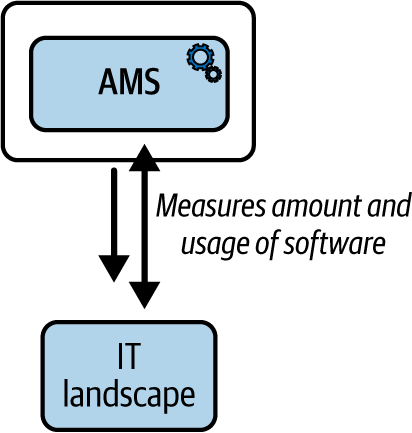

*Figure 3-6. Core capability of an AMS*

Bewusst schlicht: das AMS, die IT-Landschaft, dazwischen *Measures amount and
usage of software*. Auffällig im Vergleich zu EMS und IR — die IT-Landschaft ist
hier **ein einziger Kasten**, nicht in Bestandteile zerlegt. Das AMS interessiert
sich nicht für die Struktur der Landschaft, sondern für zwei Zahlen darüber:
Menge und Nutzung.

### Figure 3-7 — Metamodel des AMS

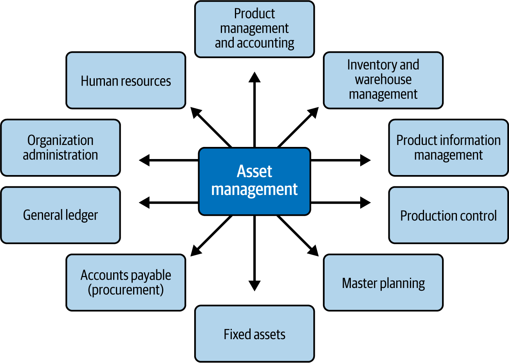

*Figure 3-7. A metamodel of an AMS* — angelehnt an Velosi, „The Quick Guide to
Your Asset Management System" ([Fn. 3-5](#kapitel-3))

**Asset management** steht im Zentrum, ringsum zehn Bereiche, alle über Pfeile
angebunden:

Product management and accounting · Inventory and warehouse management ·
Product information management · Production control · Master planning · Fixed
assets · Accounts payable (procurement) · General ledger · Organization
administration · Human resources

Das ist ein anderer Typ von Metamodel als alle bisherigen — **keine Objekttypen,
sondern angrenzende Funktionsbereiche**. Und der Zuschnitt ist auffällig
kaufmännisch: Hauptbuch, Kreditorenbuchhaltung, Anlagevermögen, Lagerhaltung,
Produktionssteuerung. Das AMS wird hier nicht als IT-Werkzeug modelliert,
sondern als betriebswirtschaftliches — was zur Aussage passt, dass das AMS der
Kostenrechnung dient und damit dem Operations-Driver zugeordnet wird.

### Begriffe

**AMS — Asset Management System** — misst Menge und tatsächliche Nutzung von
Software zur Kostenkontrolle und -senkung. Reaktiv, scanbasiert.

**Proaktiv vs. reaktiv** — die Kernunterscheidung zwischen EMS und AMS. Das EMS
setzt durch, das AMS misst nach.

**Netzwerk-Scan** — die Erhebungsmethode des AMS. Erzeugt automatisch eine
Metadata-Datenbank statt manueller Pflege.

**Aktive Nutzung** — nicht nur, ob eine Lizenz vorhanden ist, sondern ob sie
verwendet wird. Der eigentliche Hebel zur Kostensenkung.

---

## 3.4 Configuration Management Database (CMDB)

### Kern

Die Rolle der CMDB ist es, **Vergangenheit und Gegenwart** der IT-Landschaft
korrekt abzubilden. Sie erfasst Software und Hardware auf **Instanzebene** — also
nicht nur die Typen, sondern auch die **Anzahl** jeder Art.

### Software auf Instanzebene

Das Beispiel des Buchs macht den Instanzbegriff greifbar:

> **Tableau** ist eine Applikation, und das Unternehmen hat **vier verschiedene
> Instanzen** davon — also vier identische Applikationen mit **verschiedenen
> Eigentümern und verschiedenen Inhalten.**

Darüber hinaus listet die CMDB je Software:

- den **Zweck**
- welche **Art von Daten** sie enthält
- die **Eigentümer**
- wie die Applikationen **untereinander integriert** sind
- wie sie **verändert** wurden

### Hardware

Typen und Mengen der Server (On-Premises), ihre genauen Namen und Nummern sowie
weitere Geräte wie Laptops und **IoT-Geräte**.

Aber ausdrücklich **nicht**: eine vollständige Liste, welche Arten von
Client-Applikationen auf welchen Geräten installiert sind. **Das ist die Rolle
des EMS.** Diese Grenzziehung ist eines der klarsten Abgrenzungsbeispiele des
Kapitels.

### Configuration Item (CI)

Für jeden Hardware- und Softwaretyp — und für **jede Instanz jeder
Softwareapplikation** — wird die **aktuelle Konfiguration** dokumentiert. Deshalb
heisst jedes Element der CMDB ein **Configuration Item (CI)**.

Konfiguration meint dabei, wie die Software eingerichtet ist, in Bezug auf:

1. **Purpose (capability)** — Zweck
2. **Owners** — Eigentümer
3. **Activated modules** — aktivierte Module
4. **Integrations** — Integrationen
5. **Types of data** — Datenarten
6. **Level of confidentiality** — Vertraulichkeitsstufe

Zusätzlich werden **Konfigurationsänderungen protokolliert**, sodass auch
vergangene Konfigurationen lesbar bleiben. Damit ist die CMDB nicht nur ein Bild
der gegenwärtigen IT-Landschaft, sondern **idealerweise auch ihrer gesamten
Vergangenheit.**

### Figure 3-8 — Core Capability der CMDB

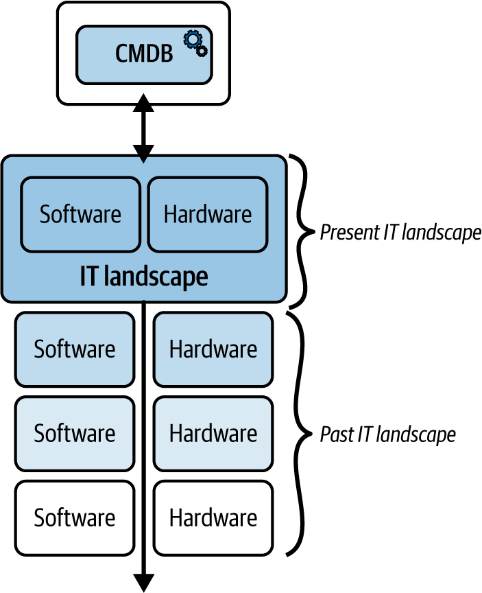

*Figure 3-8. Core capability of a CMDB*

Die eleganteste Abbildung des Kapitels. Oben die **Present IT landscape** mit
Software und Hardware, kräftig gezeichnet. Darunter, an einem nach unten
laufenden Zeitpfeil aufgereiht, **immer blasser werdende** Software-Hardware-
Paare als **Past IT landscape**.

Die abnehmende Farbsättigung ist keine Dekoration: Sie stellt dar, dass ältere
Zustände zwar weiterhin lesbar, aber nicht mehr gegenwärtig sind. Zeit ist in
dieser Abbildung eine eigene Dimension — bei keinem anderen Repository des
Kapitels ist das so.

### Die CMDB als Quelle gegenüber Behörden

> In **hochregulierten Branchen** dient die CMDB oft als **Source of Truth**,
> wenn Fragen von Behörden zur gegenwärtigen IT-Landschaft zu beantworten sind.

Das ist bemerkenswert, weil das Buch den Begriff *source of truth* in 2.5
ausdrücklich problematisiert hat — hier steht er ohne Einschränkung.

### ITIL

CMDBs folgen üblicherweise dem Rahmenwerk **ITIL** (Information Technology
Infrastructure Library). ITIL ist als **Methodik zur Erbringung von IT-Services
für das Geschäft** zu verstehen.

Der Mechanismus: Wenn eine IT-Lösung **eingeführt, verändert oder ausser Betrieb
genommen** wird, schlägt ITIL einen Rahmen vor, um die zugehörigen operativen
Aufgaben **jedes Mal exakt gleich** auszuführen. Das sichert verständliche
IT-Operations und **Transparenz darüber, was in der Vergangenheit geschehen
ist**.

### Exkurs: DevOps gegen ITIL

Ein längerer Einschub des Buchs, der eine verbreitete Geringschätzung einordnet:

- Moderne Softwareentwicklung arbeitet mit der **Fail-Fast**-Methodik **DevOps**,
  die häufige tägliche Releases für Endnutzersoftware vorschlägt — als
  hochsinnvolle Reaktion auf Kundenbedürfnisse.
- DevOps folgt dem Spruch *„It ain't tested before it crashes in production"* und
  bevorzugt damit **das Experimentelle vor dem Sicheren**.
- Weil DevOps modern und unterhaltsam ist, **verachten manche Softwareentwickler
  ITIL** als langsam, klobig und alt. Und tatsächlich stammt es aus der
  On-Premises-Ära.
- **Aber jede Methodik hat ihren Platz.** ITIL wird häufig in der
  Softwareproduktion mit hochkomplizierter Hardware eingesetzt, die einen
  Produktionsabsturz schlicht nicht riskieren kann.
- Das Beispiel: Als der Raumflug **Ariane 501** am **4. Juni 1996** **37 Sekunden
  nach dem Start** wegen **einer einzigen Codezeile** explodierte, war eine
  nachlässige Methodik im Spiel.
- Schlusssatz: **Nicht alles sollte in der Produktion abstürzen.**

### Figure 3-9 — Metamodel der CMDB

*Figure 3-9. A metamodel of a CMDB* — angelehnt an ServiceNow und das
zugehörige E-Book ([Fn. 3-6](#kapitel-3))

**Identisch mit Figure 2-6.** Die ausführliche Beschreibung der Domänen —
Foundation, Design, Build, Manage technical services, Sell/consume, Manage
portfolio — steht in [2.7](#27-structure-the-metamodel-in-metadata-repositories)
und wird hier nicht wiederholt.

Die Fussnote ergänzt einen wichtigen Vorbehalt: **Viele Unternehmen entwickeln
Applikationen auf Basis von CMDBs**, woraus zahlreiche massgeschneiderte
Versionen entstehen, die **weit mehr zeigen** als das hier Dargestellte.

> **Fürs Repository:** Die Sechserliste der Konfigurationsattribute — Zweck,
> Eigentümer, aktivierte Module, Integrationen, Datenarten, Vertraulichkeitsstufe
> — ist eine brauchbare Prüfliste dafür, was die CMDB liefern *soll*. Vier davon
> überschneiden sich direkt mit typischen EAM-Attributen. Die Grenze zieht das
> Buch selbst: Client-Software auf Geräten gehört ins EMS, nicht in die CMDB —
> und Zukunftsaussagen gehören ins EAM-Werkzeug, nicht in die CMDB.

### Begriffe

**CMDB — Configuration Management Database** — bildet Gegenwart und
Vergangenheit der IT-Landschaft auf Instanzebene ab.

**Instanzebene** — nicht nur Typen, sondern Anzahl. Vier Tableau-Instanzen sind
vier Einträge, nicht einer.

**Configuration Item (CI)** — jedes Element der CMDB. Trägt die dokumentierte
aktuelle Konfiguration.

**ITIL** — Information Technology Infrastructure Library. Methodik zur
Erbringung von IT-Services; sorgt dafür, dass Einführung, Änderung und
Ausserbetriebnahme jedes Mal gleich ablaufen.

**DevOps / Fail Fast** — Gegenmodell zu ITIL: häufige Releases, das
Experimentelle vor dem Sicheren. Laut Buch berechtigt, aber nicht überall.

---

## 3.5 IT Service Management System (ITSM)

### Kern

Das ITSM-System ist eine **grosse Suite von Komponenten**, die auf die Verwaltung
der bestehenden IT-Landschaft zielt. Typischerweise steht eine **CMDB als
Kernkomponente** im Zentrum. Die Einordnung des Buchs ist deshalb eindeutig:

> Das ITSM-System ist als ein **CMDB-Metadata-Repository mit eingeschlossenen
> Peripheral Capabilities** zu betrachten.

Und entsprechend: Das Metamodel des ITSM ist **identisch mit dem der CMDB**.
Manche ITSM-Anbieter am Markt verkaufen ihr Angebot ohnehin schlicht als CMDB.

### Der Helpdesk

Das **wichtigste Merkmal** des ITSM-Systems. Ein Ort, an dem jede und jeder im
Unternehmen

- Zugang zu Applikationen beantragen,
- Fehlfunktionen melden,
- die Ausserbetriebnahme einer Applikation mitteilen

und vieles mehr kann. Die gesamte Kommunikation läuft über ein
**Ticketing-System**.

Damit ist der Kern eines ITSM-Systems eine **Helpdesk-Applikation, die auf einer
CMDB aufsitzt**, um Anforderungen aus dem Geschäft zu bearbeiten.

### Figure 3-10 — Hochlevelsicht des ITSM

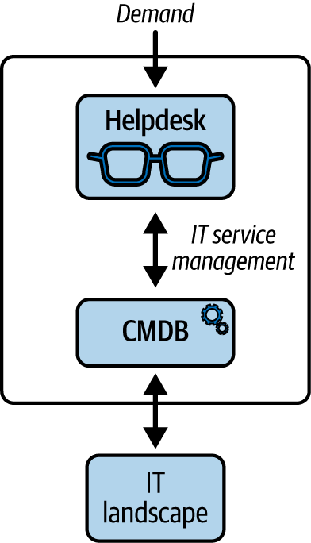

*Figure 3-10. High-level view of an ITSM system*

Ein senkrechter Stapel: Von oben kommt **Demand** in den **Helpdesk**, darunter
sitzt die **CMDB**, die Verbindung dazwischen ist mit *IT service management*
beschriftet. Darunter, ausserhalb des ITSM-Rahmens, die **IT-Landschaft**.

Die Abbildung sagt zweierlei: Der Helpdesk berührt die IT-Landschaft **nie
direkt** — er wirkt ausschliesslich über die CMDB. Und die Anforderung kommt von
**oben und aussen**, nicht aus der IT selbst.

### Das Problem der Überlastung

Hier liegt der eigentliche Punkt des Abschnitts, und er ist eine direkte
Anwendung von 2.5.

**Die gute Seite:** ITSM-Systeme sind typischerweise **gut etablierte**
Repositories. Sie sind nicht schwer zu verstehen oder zu rechtfertigen, deshalb
wird ihre Existenz **akzeptiert und nicht infrage gestellt**. Es geht darum, eine
betriebsfähige IT-Landschaft in der Gegenwart zu erhalten — das sollte jedes
Unternehmen haben.

**Die schlechte Seite** — und das Buch nennt sie ausdrücklich *„far from a
blessing"*: Genau deshalb werden ITSM-Systeme **überlastet** und dazu gedrängt,
**Peripheral Capabilities** zu erfüllen:

- Kosten
- Integrationen
- Data Ownership
- Datenschutz
- Vertraulichkeit

Sie **können** das nicht wirklich leisten, und die Begründung ist präzise: Sie
werden **überwiegend manuell** befüllt und gepflegt. Das ist **zu langsam** und
damit **nicht skalierbar** — im Fall des AMS und des IR. **Nicht zwangsläufig
aber beim EAM-Werkzeug.**

Der Einschub ist wichtig: Beim EAM-Werkzeug ist manuelle Pflege kein
Ausschlusskriterium, weil dessen Gegenstand ohnehin nicht durch Scannen
ermittelbar ist.

Ergänzend weist das Buch darauf hin, dass sich die Metadata des ITSM mit den
Repositories für **Information und Wissen** überschneiden, sobald es um
Datenschutz, Sensibilität und Unternehmenswissen geht.

### Begriffe

**ITSM-System** — Suite zur Verwaltung der bestehenden IT-Landschaft, typischerweise
um eine CMDB herum gebaut, mit Helpdesk als wichtigstem Bestandteil.

**Helpdesk** — die zentrale Anlaufstelle für Anforderungen aus dem Geschäft,
abgewickelt über Tickets.

**Demand** — die von aussen kommende Anforderung, die den ITSM-Prozess auslöst.

**Überlastung durch Peripheral Capabilities** — das charakteristische Leiden des
ITSM: Weil es unangefochten dasteht, wird ihm Kosten-, Integrations- und
Datenschutzverwaltung aufgebürdet, die es mangels automatischer Befüllung nicht
tragen kann.

---

## 3.6 Enterprise Architecture Management Tool (EAM)

### Kern

Das abstrakteste, strategischste und zukunftsgerichtetste Werkzeug des Kapitels.
Der entscheidende Satz, den das Buch mehrfach wiederholt:

> Das EAM-Werkzeug ist für **strategische Entscheidungen über den künftigen
> Zustand** der IT-Landschaft gedacht — **nicht für den gegenwärtigen Zustand.**
> Es blickt in die Zukunft und **nur** dorthin.

### Was das EAM-Werkzeug ausdrücklich nicht tut

Das Buch ist hier ungewöhnlich nachdrücklich:

- Es **soll den gegenwärtigen Zustand nicht pflegen**.
- Es ist **nicht dafür gedacht**, diesen Überblick zu halten.
- Es ist auch nicht dafür gedacht, **Entscheidungen über die gegenwärtige
  Konfiguration** zu treffen.

Stattdessen **stützt es sich auf andere Repositories** für den Ist-Zustand:

| Repository | |
|---|---|
| **ITSM-System** | Kapitel 3 |
| **CMDB** | Kapitel 3 |
| **ISMS** — Information Security Management System | Kapitel 5 |
| **PIMS** — Privacy Information Management System | Kapitel 5 |

Die Anforderung an das Verhältnis ist dreifach formuliert: Das EAM-Werkzeug muss
mit diesen Repositories **abgestimmt** sein und sie **widerspiegeln** — aber
**ohne denselben Detailgrad** zu enthalten und **ohne deren Verantwortung zu
übernehmen**.

**Warnung des Buchs:** Wer das EAM-Werkzeug dazu zwingt, sowohl den Überblick
über die gegenwärtige Landschaft zu halten als auch das Werkzeug für
Entscheidungen über sie zu sein, **schiebt es in External Capabilities** statt in
seinen vorgesehenen Zuschnitt. Es wird diese Capabilities **schlecht erfüllen**
(Beleg: Table 7-1).

Das ist die konkreteste Anwendung des Modells aus 2.5 im ganzen Buch bis hierher.

### Enterprise Architecture als Disziplin

- Enterprise Architecture ist die **IT-Architekturdisziplin, die die meiste
  Erfahrung verlangt**.
- Deshalb beschäftigen Unternehmen **selten viele** Enterprise-Architekten — sie
  sind rar.
- **Idealerweise** wird Enterprise Architecture **nicht nur von
  Enterprise-Architekten ausgeübt, sondern von ihnen lediglich moderiert.**
- Ausüben soll sie **jede und jeder, die mit IT arbeiten**: von den
  IT-Operations-Architekten über die strategische Leitung der IT bis hinauf zum
  **CIO**.
- Der Kreis der Beteiligten kann über die IT-Abteilung hinausreichen, ist aber
  typischerweise auf Personen mit **relativ tiefem technischem Verständnis**
  begrenzt.

Zweck der Disziplin: eine **passende, funktionsfähige und wirtschaftlich
rationale** IT-Landschaft sicherstellen.

### Das Herz: die Capability Map

> Um diesen Zweck zu erfüllen, ist das **Herz des EAM-Werkzeugs die Capability
> Map.**

Definition des Buchs: Eine **Capability** besteht aus **Menschen, Prozessen und
Technologien**, die zusammen einen bestimmten Satz von Fähigkeiten liefern.

Und daraus die Regel für den Datenbestand:

> **Alles, wozu ein Unternehmen fähig ist, ist die Core Metadata des
> EAM-Werkzeugs und sollte als Capabilities gelistet sein.**

EAM-Werkzeuge sind ausserdem an den Rahmenwerken ausgerichtet, über die die
Disziplin ausgeübt wird — genannt wird **TOGAF** (The Open Group Architecture
Framework).

### Die drei Leitfragen

Der gesamte Zweck des EAM-Werkzeugs ist es, die Capabilities eines Unternehmens
**mit Blick in die Zukunft** zu steuern und Fragen dieser Art zu beantworten:

1. **Was wären die Folgen**, wenn wir unser derzeitiges CRM-System durch dieses
   andere CRM-System ersetzen?
2. **Welche On-Premises-Abhängigkeiten** haben wir, und wie würden sie eine
   Cloud-Migration beeinflussen?
3. **Warum haben wir drei Applikationen**, die dieselbe Capability erfüllen —
   welche liesse sich technisch am leichtesten abbauen, und was wäre der
   wirtschaftliche Nutzen?

Diese drei Fragen sind die beste Kurzdefinition dessen, wofür ein EAM-Repository
da ist: **Folgenabschätzung, Abhängigkeitsanalyse, Redundanzabbau.**

### Woher die Metadata kommen

Um solche Fragen zu beantworten, sind viele Metadata-Arten nötig: Listen von
Applikationen, Integrationen, Komponenten, Projekten, Kosten, Strategien,
Technologiekategorien, Personen, Rollen, Teams und Abteilungen.

Und der entscheidende Halbsatz:

> Diese werden im EAM-Werkzeug aus **vielen anderen Metadata Repositories
> gespiegelt**, in denen die Metadata **gepflegt** werden.

Gespiegelt, nicht gepflegt — das ist die operative Fassung der
Zuständigkeitsregel von oben.

### Figure 3-11 — Core Capability des EAM

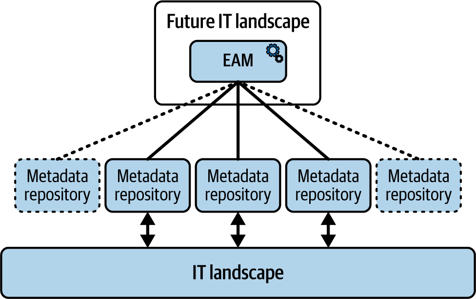

*Figure 3-11. Core capability of an EAM tool*

Drei Ebenen. Ganz oben ein Kasten **Future IT landscape**, darin das **EAM**.
Darunter fünf **Metadata repositories**, die über Doppelpfeile mit der
**IT landscape** ganz unten verbunden sind.

Zwei Details:

- Das EAM ist mit den Repositories durch **Linien** verbunden, aber **nicht mit
  der IT-Landschaft**. Es hat keinen direkten Draht zur Realität — nur über die
  anderen Repositories. Genau das ist die Aussage des Abschnitts.
- Die **äusseren beiden** Repositories sind **gestrichelt** gezeichnet, ebenso
  ihre Verbindungslinien: Es gibt mehr Quellen, als das EAM-Werkzeug tatsächlich
  angebunden hat.

Das Buch fasst zusammen: Das EAM-Werkzeug ist die **Source of Truth über die
künftige** IT-Landschaft, **auf Basis des Wissens über die gegenwärtige**, das
in anderen Repositories gepflegt wird — eines davon die CMDB.

### Figure 3-12 — Metamodel des EAM

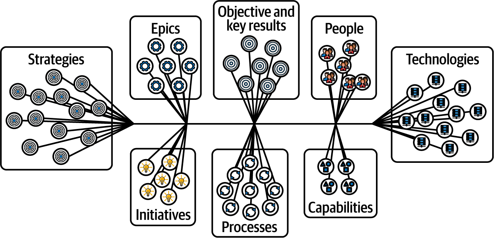

*Figure 3-12. A metamodel of an EAM tool* — angelehnt an den Ardoq-Artikel „Your
Holistic View of People, Processes, and Technology" ([Fn. 3-7](#kapitel-3))

Acht Cluster, die an einer waagerechten Achse aufgereiht sind, jeweils als
Knotenwolke mit eigenem Symbol:

**Strategies** · **Epics** · **Objective and key results** · **People** ·
**Technologies** · **Initiatives** · **Processes** · **Capabilities**

Das ist bemerkenswert, weil es **das zweite EAM-Metamodel im Buch** ist und ganz
anders aussieht als Figure 2-5:

| | **Figure 2-5** (LeanIX) | **Figure 3-12** (Ardoq) |
|---|---|---|
| **Form** | vier waagerechte **Schichten** | **Graph** aus verbundenen Clustern |
| **Logik** | Strategie oben, Technik unten | alles über eine gemeinsame Achse verbunden |
| **Enthält** | Objective, Platform, Initiative, Organization, Business capability, Business context, Data object, Application, Interface, Provider, IT component, Tech category | Strategies, Epics, OKRs, People, Technologies, Initiatives, Processes, Capabilities |

Zwei Werkzeuge derselben Kategorie, zwei völlig verschiedene Metamodelle — die
praktische Bestätigung der Warnung aus 2.7, dass es kein universelles Metamodel
gibt. Auffällig ist zudem, dass das Ardoq-Modell **Epics und OKRs** führt, also
Elemente aus der agilen Steuerung, die bei LeanIX gar nicht vorkommen.

> **Fürs Repository:** Die Warnung zu den External Capabilities ist die
> praktisch folgenreichste Aussage des Kapitels für dich. Sobald das
> EAM-Repository den Ist-Zustand *pflegen* statt *spiegeln* soll, ist es laut
> Buch ausserhalb seines Zuschnitts — und wird dort schlecht abliefern. Die
> Verteidigungslinie dagegen ist die Zuständigkeitsregel: abgestimmt sein,
> widerspiegeln, aber weder den Detailgrad noch die Verantwortung übernehmen.

### Begriffe

**EAM-Werkzeug** — strategisches Werkzeug für Entscheidungen über den **künftigen**
Zustand der IT-Landschaft. Pflegt den Ist-Zustand ausdrücklich nicht.

**Capability** — Menschen, Prozesse und Technologien, die zusammen einen
bestimmten Satz von Fähigkeiten liefern.

**Capability Map** — das Herz des EAM-Werkzeugs. Alles, wozu das Unternehmen
fähig ist, gehört als Capability hinein.

**ISMS** — Information Security Management System. Eine der Ist-Zustandsquellen
des EAM-Werkzeugs, behandelt in Kapitel 5.

**PIMS** — Privacy Information Management System. Ebenso, Kapitel 5.

**Spiegeln vs. Pflegen** — die Zuständigkeitsregel: Das EAM-Werkzeug spiegelt
Metadata aus anderen Repositories, es pflegt sie nicht.

---

## 3.7 Metadata Repositories for IT Management

### Figure 3-13 — die Gesamtübersicht

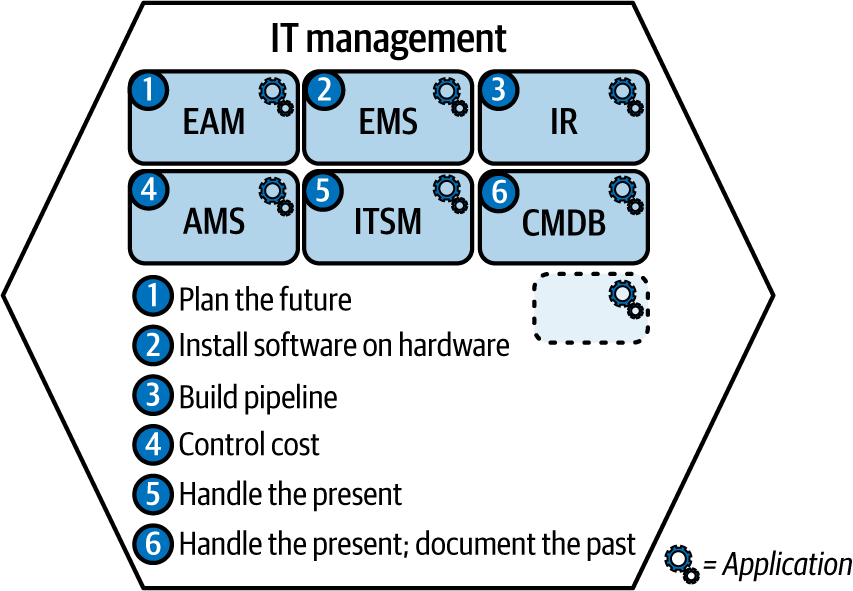

*Figure 3-13. Metadata repositories for IT management*

Ein Sechseck **IT management** mit den sechs Repositories, jedes mit einer
nummerierten Kurzfassung seiner Core Capability. Das ist die brauchbarste
Zusammenfassung des ganzen Kapitels:

| # | Repository | Core Capability |
|---|---|---|
| 1 | **EAM** | Plan the future |
| 2 | **EMS** | Install software on hardware |
| 3 | **IR** | Build pipeline |
| 4 | **AMS** | Control cost |
| 5 | **ITSM** | Handle the present |
| 6 | **CMDB** | Handle the present; document the past |

Das Zahnradsymbol an jedem Kasten bedeutet laut Legende **Application** — alle
sechs sind also Repositories der Erscheinungsform „Applikation" im Sinne von 2.6.
Ein zusätzlicher **gestrichelter, leerer** Kasten am Rand steht für weitere,
nicht benannte Repositories.

### Die sechs im Verhältnis zueinander

Das Buch geht sie abschliessend noch einmal durch und stellt dabei die
Abhängigkeiten heraus:

**EAM** — blickt in die Zukunft und zeigt die Folgen von Änderungen. Dabei ist es
**abhängig von einer frischen, gut gepflegten Abbildung der gegenwärtigen
Landschaft, die es selbst nicht liefert.**

**ITSM** — Kernfokus auf der Erhaltung der gegenwärtigen Landschaft, dokumentiert
hauptsächlich über eine CMDB, kombiniert mit einer Helpdesk-Funktion. Dabei
dokumentiert es auch die **nahe Vergangenheit**. Und: **Das ITSM-System kann ein
EAM-Werkzeug enthalten, ebenso ein AMS und ein IR.**

**CMDB** — listet nicht nur Hard- und Software, sondern auch die **Mengen** aller
Arten von Hardware, Software-Instanzen und Lizenzen. Ein **abstraktes, manuell
gepflegtes** Bild der Gegenwart und Vergangenheit.

**AMS** — **näher an der physischen Realität**, rückblickend eingesetzt, *„nachdem
eine Katastrophe passiert ist"*. Scannt die Realität, um Nutzung und Kosten
wirksam zu berechnen und die Kosten zu senken.

**IR** — **nicht wirklich ein Repository**, sondern ein **Konglomerat von Listen**
in Werkzeugen, die Data Pipelines oder einfachere Batch-Jobs ausführen. Bildet
physische Realität ab und kann Auskunft geben, wie Daten durch die Landschaft
fliessen.

**EMS** — dokumentiert Software auf Servern und Client-Applikationen auf Laptops
und Smartphones. Eng mit der CMDB verbunden, weil es **durchsetzt, was die CMDB
festhält**.

Die letzte Formulierung ist die interessanteste Beziehungsaussage des Kapitels:
Zwischen CMDB und EMS besteht ein **Soll-Ist-Verhältnis**. Die CMDB sagt, was
gelten soll; das EMS setzt es durch.

### Die Achse, auf der alle sechs liegen

Ordnet man die sechs nach ihrem Zeitbezug, ergibt sich eine durchgehende Reihe:

| Zeitbezug | Repository |
|---|---|
| **Zukunft** | EAM |
| **Gegenwart** | ITSM, CMDB |
| **Vergangenheit** | CMDB |
| **Physische Realität, rückblickend gemessen** | AMS, IR |
| **Durchsetzung in der Gegenwart** | EMS |

Nur die CMDB deckt zwei Felder ab — und ist deshalb die Drehscheibe des
Kapitels.

---

## 3.8 Summary

Die Zusammenfassung des Buchs:

- Als Ganzes sind Metadata Repositories für IT als der **Schlüssel zur Steuerung
  der IT-Landschaft** zu verstehen.
- Richtig eingesetzt helfen sie, die **Zukunft** der IT-Landschaft perfekt zu
  planen — hauptsächlich über das **EAM-Werkzeug**.
- Die **Gegenwart** lässt sich hauptsächlich über die **CMDB** steuern,
  eingebettet in ein ITSM-System.
- Ebenso lässt sich die **Vergangenheit** über die **CMDB** verwalten.
- **AMS** und **IR** betrachten Kosten und Integrationen auf der **physischen
  Ebene** der IT-Landschaft.
- Das **EMS** listet alle Software auf aller Hardware — **idealerweise!**

Und dann die zwei Sätze, die den Ton des Kapitels korrigieren:

> **Ideale sind grossartig, aber die Realität ist, dass die meisten der in
> diesem Kapitel besprochenen Metadata Repositories üblicherweise schlecht
> geführt werden — wegen mangelndem Verständnis und mangelnder Unterstützung
> durch das obere Management.**

> **Metadata Repositories kollidieren und überschneiden sich häufig, weil sie
> dieselbe Realität aus verschiedenen Blickwinkeln beschreiben.**

Der zweite Satz ist die Brücke zurück zu 2.7 und die Rechtfertigung des ganzen
Buchvorhabens. Der erste ist die nüchternste Aussage des Kapitels: Das Problem
ist nicht in erster Linie ein methodisches, sondern eines der Aufmerksamkeit und
Rückendeckung von oben.

Das nächste Kapitel behandelt Metadata Repositories **für Daten**.

---

# Kapitel 4 — Data Management

## 4.0 Überblick über das Kapitel

### Kern

Ein bewusst **kurzes** Kapitel. Es behandelt zwei echte Metadata Repositories —
**Data Catalogs** und **Database Model Management** — und danach eine Handvoll
Technologien, die verschiedene Aspekte des Data Management stützen, darunter
Data Engineering und Data Science.

Die Einschränkung, die das Buch ausdrücklich zum Mitlesen mitgibt:

> Diese weiteren Technologien sind **keine Metadata Repositories im eigentlichen
> Sinn**, lassen sich aber dennoch als Träger entscheidender Metadata verstehen,
> die für das Gesamtthema des Buchs relevant sind.

### Aufbau

1. **DC** — Data Catalogs
2. **DBM** — Database Model Management
3. Weitere Metadata Repositories für Data Management

---

## 4.1 Data Catalog (DC)

### Kern

> Der DC ist wie eine **Suchmaschine für die Daten** im Unternehmen.

Der entscheidende Unterschied zu anderen Repositories liegt im Verhältnis zur
Realität. Manche Repositories — die CMDB aus Kapitel 3, das ISMS aus Kapitel 5 —
führen **generische und eher abstrakte Listen** der Daten, von denen **angenommen
wird**, dass sie in der IT-Landschaft liegen. Beim DC ist das anders:

> Der DC zeigt die Daten, die **tatsächlich** in deiner IT-Landschaft sind.

### Die physische Verbindung

Der DC bildet die Daten auf einem Metadata Layer ab, indem er Metadata aus den
Data Sources der IT-Landschaft entweder **crawlt** oder **streamt**. Damit hat er
eine **physische Verbindung zu dem, was er abbildet** — anders als die
annahmebasierten Repositories.

Das ist die Wiederaufnahme des Interpretationsgedankens aus 2.4: Der DC liegt am
unteren Ende der Interpretationsskala, regulatorische Repositories am oberen.

### Figure 4-1 — Core Capability des DC

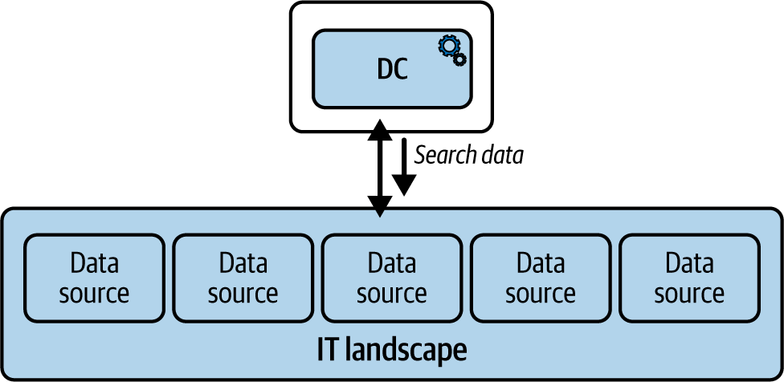

*Figure 4-1. The core capability of a DC*

Dasselbe Bildschema wie bei EMS und IR: Der DC sitzt über der IT-Landschaft, in
der fünf **Data sources** nebeneinanderstehen. Doppelpfeil plus separater Pfeil
nach unten mit *Search data*.

Bemerkenswert im Vergleich: Beim EMS hiess der Handlungspfeil *Install
application*, beim IR *Test and deploy* — beides verändernde Handlungen. Beim DC
heisst er *Search data*. Die Core Capability des DC ist **Finden**, nicht
Verändern. Das schliesst direkt an die Metadata-Definition aus 2.1 an.

### Wozu der DC taugt

**Innovation** ist der Hauptzweck. Das Potenzial wird hoch eingeschätzt: Der DC
ist ein **Eckstein datengetriebener Innovation**. Netflix, Facebook, Amazon,
LinkedIn und viele weitere Technologiekonzerne erreichten ihren Erfolg **mit dem
DC als entscheidender Komponente** — er liefert den nötigen Überblick und die
Suchfähigkeit für eine IT-Landschaft mit riesigen Datenmengen.

**Governance** ist der zweite Einsatzbereich: das Erkennen und Kennzeichnen
**sensibler Daten über bestimmte Personen**, die der DSGVO unterliegen.

**Integrationen** kommen hinzu: DCs bilden Pipelines und andere Integrationen
**auf physischer Ebene** ab.

Der DC ist damit hauptsächlich ein Werkzeug für **Innovation auf Datenbasis**,
hat aber **funktionsübergreifendes Potenzial** und lässt sich je nach
Anwendungsfall auch für **Regulation** und **IT operations** nutzen.

### Warum DC-Einführungen scheitern

Hier wird das Buch ungewöhnlich direkt — der Autor hat ein eigenes Buch über
Data Catalogs geschrieben (*The Enterprise Data Catalog*).

> **DCs sind heikel — ihre Einführung scheitert oft.**

Die Diagnose:

1. Viele DCs sind auf einer Technologie gebaut, die **nicht zum Zweck passt** —
   sie sind **gleichzeitig zu komplex und nicht stark genug**.
2. Es ist **schwierig, Daten darin zu organisieren**.
3. Und selbst wenn die Organisation gelingt, sind sie **nicht gut genug darin,
   die Daten wieder herauszuholen**.

Der Lösungsvorschlag folgt aus dem Vergleich mit der Suchmaschine: Wenn man den
DC als Suchmaschine denken soll, sollte er idealerweise auch **auf derselben Art
Technologie gebaut** sein — nämlich einem **Knowledge Graph**. Das erlaubt,
Daten leicht zu organisieren und mit grosser Wirkung wieder zu durchsuchen.

**KI** ergänzt das um weitere Fähigkeiten: **natürlichsprachliche und
konversationelle Suche** sowie die Nutzung **ontologischen Kontexts für agentische
KI** (Teil III).

### Die eigentliche Ursache: die falsche Denkweise

Der Kernsatz aus dem Hinweis des Autors auf sein eigenes Buch:

> **Das Problem mit DCs ist, dass sie von Softwareentwicklern erdacht werden —
> aber um wirklich zu funktionieren, müssen sie mit der Denkweise von
> Bibliothekaren kuratiert werden.**

Das ist die konkreteste Anwendung der LIS-Grundlage des Buchs aus 2.1. Der
technische Bau ist nicht das Problem; die Kuratierung ist es.

### Figure 4-2 — Metamodel des DC

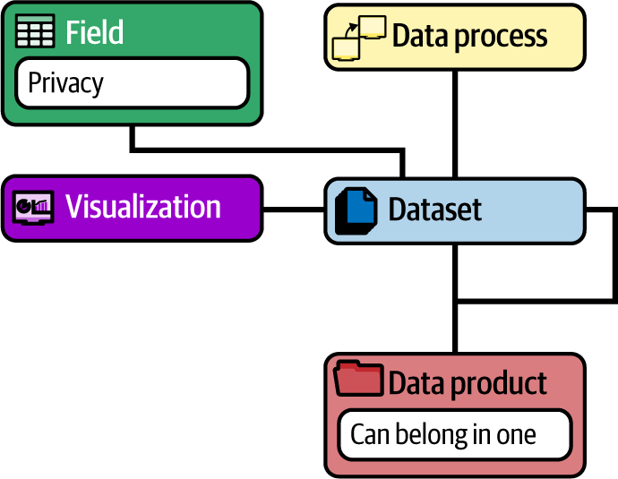

*Figure 4-2. An example of a minimal, flexible metamodel for a DC* — angelehnt an
den DC der Actian Data Intelligence Platform ([Fn. 4-2](#kapitel-4))

Das Metamodel eines DC **soll flexibel sein**, sodass es sich in alle Richtungen
erweitern lässt. Trotz dieser Flexibilität kommt es meist mit einem
**vorkonfigurierten minimalistischen** Metamodel.

Im Zentrum steht **Dataset**, verbunden mit vier weiteren Typen:

| Element | Bedeutung laut Buch |
|---|---|
| **Dataset** | eine **Tabelle** |
| **Field** | **sensible Daten** in Tabellen — in der Abbildung mit dem Attribut *Privacy* |
| **Data process** | Integrationen verschiedener Art |
| **Visualization** | **analytische Berichte** |
| **Data product** | **konsumierbar gemachte Daten** — in der Abbildung mit dem Vermerk *Can belong in one* |

Und die Merkregel, die das Buch ausdrücklich anschliesst:

> **Metamodelle für DCs sollten nicht gross und kompliziert sein.**

Das ist eine bemerkenswerte Umkehrung: Bei EAM und CMDB war die Reichhaltigkeit
des Metamodels ein Qualitätsmerkmal. Beim DC ist Sparsamkeit die Vorgabe — weil
Flexibilität und Erweiterbarkeit wichtiger sind als Vollständigkeit im Voraus.

> **Fürs Repository:** Der DC ist die einzige Quelle im Buch bisher, die
> **gescannte** statt behauptete Daten liefert. Für ein EAM-Repository heisst
> das: Wo es um Datenobjekte und deren Verortung geht, ist der DC führend und
> das EAM-Repository spiegelt — nicht umgekehrt. Die Abgrenzung aus dem
> Fliesstext ist dafür brauchbar formuliert: CMDB und ISMS führen an, was
> vermutet wird, der DC zeigt, was ist.

### Begriffe

**DC — Data Catalog** — Suchmaschine für die Daten des Unternehmens. Zeigt die
tatsächlich vorhandenen Daten, nicht die vermuteten.

**Crawling / Streaming** — die beiden Wege, auf denen der DC Metadata aus den
Data Sources bezieht. Begründen seine physische Verbindung zur Realität.

**Knowledge Graph** — die laut Buch angemessene Technologiegrundlage für einen
DC, weil er wie eine Suchmaschine funktionieren soll.

**Data Dictionary** — laut [Fn. 4-1](#kapitel-4) ein einfaches Werkzeug, das die
vorhandenen Datenarten auf generischer Ebene beschreibt, typischerweise über
Feldnamen plus Beschreibung des Feldinhalts. Nicht dasselbe wie ein DC.

**Data Product** — konsumierbar gemachte Daten. Eigener Objekttyp im
DC-Metamodel.

---

## 4.2 Database Model Management (DBM)

### Kern

DBM-Werkzeuge bieten eine **faktenbasierte, empirische Alternative** zu
Modellierungsannahmen. Sie lesen die Struktur einer Datenbank, indem sie deren
Abfragesprache analysieren, und erzeugen daraus ein **visuelles Datenmodell**.

### Das Problem, das sie lösen: Annahmen statt Fakten

Die Argumentation des Buchs ist gestuft, und die Stufen sind für das Verständnis
wichtig:

**Stufe 1 — Zeichnungen.** Viele Repositories haben Module, mit denen sich
Diagramme erstellen und ablegen lassen, etwa als Zeichnung. Diese Diagramme sind
aber **nicht mit einer physischen, technologischen Realität verbunden**. Sie sind
**Annahmen der Person**, die sie erstellt hat — wahrscheinlich ein
Datenarchitekt. Solche Diagramme finden sich zum Beispiel in **EAM-Werkzeugen und
CMDBs**.

**Stufe 2 — Evidence-Based Modeling.** Manche EAM-Werkzeuge erlauben
*evidence-based modeling*: Modelle basieren auf den bereits registrierten
Metadata. Das Buch nennt das *„a nice functionality"* und einen Schritt weg von
rein annahmebasierter Modellierung.

**Stufe 3 — DBM.** Aber man kann noch tiefer gehen. Das DBM-Werkzeug liest die
tatsächliche Datenbankstruktur.

Diese drei Stufen sind die nützlichste Systematik des Kapitels: gezeichnet →
aus vorhandenen Metadata abgeleitet → aus der Datenbank selbst gelesen.

### Was DBM-Werkzeuge zusätzlich können

Sie erlauben, **neue Abfragen visuell** zu erstellen — als Point-and-Click-
Aktionen, statt sie in der Abfragesprache zu tippen. Damit **verändern sie die
Realität, die sie visualisieren**.

### Die Einschränkung

> Ein DBM-Werkzeug hat einen **engen Zuschnitt**, etwa nur auf SQL. Sie sind
> **nicht für unternehmensweiten Einsatz über alle Technologien hinweg**
> gedacht.

Und genau deshalb — das ist die überraschende Wendung — sind sie laut Buch eine
Schlüsselkomponente:

> Sie liefern ein Bild eines **Ausschnitts** der IT-Landschaft, und dieses Wissen
> ist für das **ganze Unternehmen** nützlich, nicht nur für die
> Datenbankadministratoren und Entwickler, die das DBM benutzen.

### Figure 4-3 — Hochlevelsicht des DBM

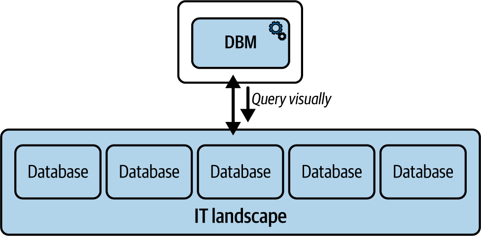

*Figure 4-3. High-level view of a DBM tool*

Parallel zu Figure 4-1 aufgebaut, aber in der IT-Landschaft stehen **Databases**
statt Data sources, und der Handlungspfeil heisst **Query visually**. Die
Gegenüberstellung der beiden Abbildungen bringt den Unterschied auf den Punkt:
Der DC durchsucht, das DBM befragt und verändert.

### Reverse Engineering

Der Nutzen empirischer Datenmodellierung über ein DBM-Werkzeug ist **Reverse
Engineering**. Definition im Kontext der Datenmodellierung:

> Der Vorgang, Datenbankstrukturen — hier **visuell** — zu verstehen, **nachdem
> sie erstellt wurden**, um sie besser zu analysieren und sie von da an
> intelligent zu verwalten, indem man **funktionale, logische Modelle** erzeugt.

### Figure 4-4 — Metamodel des DBM

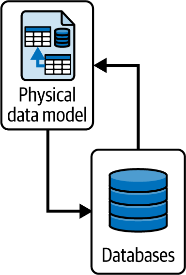

*Figure 4-4. A metamodel of a DBM tool* — angelehnt an ein Detail aus dem
Diagramm von SAP PowerDesigner ([Fn. 4-3](#kapitel-4))

Nur zwei Elemente: **Physical data model** und **Databases**, verbunden durch
zwei gegenläufige Pfeile. Der Kreislauf ist die Aussage — das Modell wird aus der
Datenbank gelesen und wirkt auf sie zurück.

Das Buch schränkt selbst ein: Dieses Metamodel ist **ziemlich simpel** und
bezieht sich **nur auf das physische Datenmodell**, also die Visualisierung der
konkreten Struktur in der Datenbank.

### Die drei Modellebenen

Oberhalb des physischen Datenmodells liegen **logische** und **konzeptionelle**
Datenmodelle. Diese sind **im Prinzip nicht mit einer Datenbank verbunden** und
können frei in PowerPoint, Visio und anderen leichtgewichtigen
Modellierungswerkzeugen gezeichnet werden.

Und daraus formuliert das Buch sein eigenes Anliegen neu:

> Dieses Buch handelt nicht von Datenmodellierung im Allgemeinen, sondern von
> den **vielen Repositories, in denen Datenmodelle leider abgelegt werden** —
> wodurch ein **Überblicksproblem auf der Metadata-Ebene** entsteht.

Für eine Einführung in Datenmodellierung empfiehlt das Buch die Arbeit von **Joe
Reis**.

### Begriffe

**DBM — Database Model Management** — Werkzeug, das Datenbankstrukturen ausliest
und daraus visuelle Datenmodelle erzeugt; erlaubt zudem visuelles Abfragen.

**Annahmebasiert vs. evidence-based vs. empirisch** — die drei Stufen der
Modellherkunft: gezeichnet, aus registrierten Metadata abgeleitet, aus der
Datenbank gelesen.

**Reverse Engineering** — nachträgliches, visuelles Verstehen bestehender
Datenbankstrukturen zum Zweck besserer Analyse und Verwaltung.

**Physisches / logisches / konzeptionelles Datenmodell** — die drei Ebenen. Nur
das physische ist mit einer Datenbank verbunden; die anderen beiden lassen sich
frei zeichnen — was genau das Ablageproblem erzeugt, das das Buch behandelt.

---

## 4.3 Other Metadata Repositories for Data Management

### Die Einordnung

Sämtliche Werkzeuge des Data Management lassen sich **als Metadata Repositories
verstehen** — in dem Sinn, dass sie Daten repräsentieren und mit Daten arbeiten,
die **anderswo entstanden** sind. Genannt werden:

- Data Warehouses
- Data Lakes
- Data Lakehouses
- Data Pipeline Tools
- Data Quality Tools
- Identity and Access Management

Die Begründung, warum sie überhaupt in diesem Kapitel stehen:

> Jedes dieser Werkzeuge funktioniert als eine **Art DC** — wenn auch nicht so
> allgemein und mächtig wie der Enterprise-DC. In gewissem Sinn besteht die Rolle
> des Enterprise-DC darin, die **Suchfähigkeiten dieser repository-eigenen
> Kataloge zu bündeln und zu verbessern.**

Und der ehrliche Vorbehalt, den das Buch selbst formuliert: Man könnte
argumentieren, dass diese Technologien keine Metadata Repositories sind, sondern
schlicht **Datenspeicherlösungen** mit den nötigen Fähigkeiten für Data
Management, Engineering und Science. Dieses Argument ist **richtig** — aber es
ist nur ein, wenn auch grosser, Teil des Bildes. Denn in diesen Werkzeugen sitzen
**entscheidende Metadata**, die die Gesamtmenge der Daten strukturieren: Listen
von Applikationen, Produkten, Mitarbeitenden und so weiter, die sich in
Kundenaufträgen, ETL-Jobs und Ähnlichem konkretisieren.

### Data Warehouse

Ein **glänzender Durchbruch** in der Arbeit mit Unternehmensdaten, eingeführt von
**Bill Inmon in den 1980ern**.

Zum ersten Mal im Data Management erlaubte es das Data Warehouse, die
**operativen, strukturierten Daten** zu sehen, die von den IT-Systemen erzeugt
werden, welche die Wertschöpfungskette eines Unternehmens abwickeln — von frühen
Laborversuchen über Fertigung, Vertrieb und Marketing bis hin zu Versand und
Retouren.

Die grosse Verschiebung war eine **Fokusverschiebung**:

> weg von den **hostenden Datenbanktechnologien**, die das Geschäft betrieben,
> hin zur **Informations- und Wissensstruktur** des Data Warehouse — samt allen
> zugehörigen Prozessen, einschliesslich ETL —, die es möglich machte, **alle
> Aspekte des Geschäftsbetriebs zu verstehen.**

Damit ermöglichte das Data Warehouse **Business Intelligence**, allgemeiner:
Analytik darüber, **wie das Unternehmen abgeschnitten hat** — also
rückwärtsgerichtet.

### Figure 4-5 — ETL

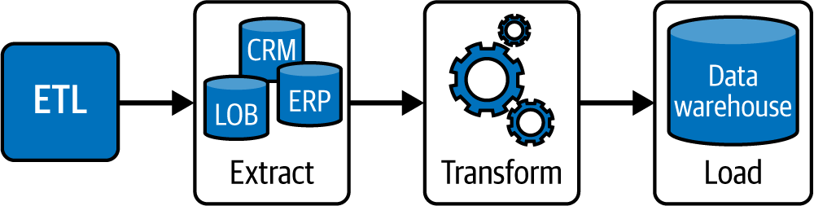

*Figure 4-5. Extract, transform, load*

Der Ablauf von links nach rechts: **Extract** aus den Quellsystemen (in der
Abbildung LOB, CRM, ERP) → **Transform** (Zahnräder) → **Load** in das **Data
warehouse**.

Entscheidend ist die Reihenfolge: Die Transformation findet **vor** dem Laden
statt. Was im Warehouse ankommt, ist bereits in die gewünschte Struktur gebracht.

### Data Lake

Entstand als **Alternative** zum Data Warehouse. Der Data Lake **beseitigt die
Struktur** des Data Warehouse im Wesentlichen — **sogar der Tabellenkatalog**,
den man bei einer klassischen SQL-Datenbank bekommt, fällt weg.

Das funktioniert gut, wenn Daten **gross, aber relativ einfach zu
charakterisieren** sind. Es funktioniert **nicht gut** bei **grosser Vielfalt**
der Daten.

Der historische Auslöser: In den 2000ern und 2010ern kam **Data Science** auf und
verlangte grössere Datenmengen, als in Data Warehouses enthalten waren — für
**vorwärtsgerichtete** Anwendungsfälle: **Predictive Analytics**. Anders als
Business Intelligence arbeitete Data Science mit **Big Data**, und die zutiefst
mathematische Programmierung auf diesen Datensätzen priorisierte **Volumen über
Qualität**.

Die kürzestmögliche Erklärung des Wandels liegt laut Buch in den Anwendungsfällen
der (Big-)Data-Science. Sie:

1. **Priorisieren statistisch Korrelation über Kausalität.** Indem man eine
   Verbindung in der Gesamtdatenmenge identifiziert, lässt sich eine wirksame
   Änderung vornehmen, **ohne die Wahrheit dieser Verbindung zu behaupten.**
2. **Führen genau die Transformationen aus**, die zur Lösung des jeweiligen
   Anwendungsfalls nötig sind — typischerweise kleinere Anwendungsfälle.

Punkt 1 ist die eigentliche Begründung: Wenn man Kausalität gar nicht behauptet,
braucht man die vorgelagerte Strukturierung nicht.

### Figure 4-6 — ELT

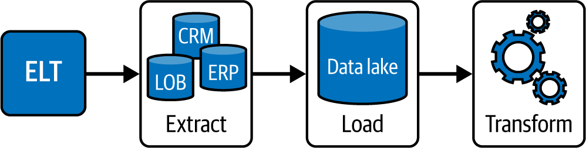

*Figure 4-6. Extract, load, transform*

Dieselbe Bildsprache wie Figure 4-5, aber **Load** und **Transform** sind
vertauscht: **Extract** → **Load** in den **Data lake** → **Transform**.

Die beiden Abbildungen nebeneinander sind die kompakteste Erklärung des
Unterschieds: ETL transformiert vor dem Speichern und legt sich damit auf eine
Struktur fest. ELT speichert erst und transformiert **je Anwendungsfall** — was
genau zu Punkt 2 oben passt.

### Data Lakehouse

Eine **wirksame Kombination** aus Data-Warehouse- und Data-Lake-Architektur, die
beide Analytikarten erlaubt. Zwei Dinge werden dem Data Lake hinzugefügt, um ein
Lakehouse zu erzeugen:

1. eine **SQL Query Engine**
2. eine **interne Übersicht (Katalog)**

Der zweite Punkt ist bemerkenswert: Der Katalog, der beim Data Lake ausdrücklich
weggefallen war, kommt hier zurück.

Vertiefung: James Serra, *Deciphering Data Architectures* (O'Reilly), Kapitel 12.

### Data Pipeline Tools

Ein Mittel, um Daten zu **transportieren und zu transformieren**, damit sie für
analytische Nutzung bereit sind, etwa in Data Warehouses.

Die Transformation kann **geschichtet** erfolgen, also über mehrere Stufen —
typischerweise **bronze, silver und gold** genannt —, bis ein Reinheitsgrad
erreicht ist, der die Daten für Analytik perfekt macht.

Der Transportteil besteht aus **Integrationen** zwischen verschiedenen
Applikationen: vom Quellsystem in das Pipeline-Werkzeug und weiter in die
Speicherlösung des Warehouse.

### Data Quality Tools

Messen den **Zustand von Daten** und prüfen auf **Vollständigkeit, Genauigkeit**
und mehr. Genutzt von **Business Ownern und Datenanalysten**, um ihre Regeln und
Datenqualitätsprüfungen auszuführen.

### Identity and Access Management (IAM)

> Die **entscheidende und oft ignorierte** Komponente, die Nutzern Zugang zu
> Daten gibt.

Die Begründung ihres Gewichts: Moderne Datenarchitekturen und -plattformen
**stehen und fallen oft genau mit dieser Funktion** — weil der Zugang zu Daten
kompliziert ist und deshalb Zeit kostet.

IAM wird über eine von zwei Methoden umgesetzt:

| | **RBAC** — Role-Based Access Control | **ABAC** — Attribute-Based Access Control |
|---|---|---|
| **Ansatzpunkt** | die **Person**, die Zugang will | die **Daten** selbst |
| **Mechanismus** | Rollen, über die Zugang gewährt wird | Attribute an Datenquellen; die Dateneigentümer legen **im Voraus** fest, wer welche Daten wozu sehen darf |
| **Einführung** | **am einfachsten** umzusetzen und auszuführen | **schwieriger**, wegen der Vorarbeit |
| **Langfristig** | laut Studien **am schwersten zu verwalten** — begünstigt eine **Explosion von Rollen**; die Verwaltung wird kompliziert, fehleranfällig und **sicherheitsgefährlich** | **deutlich einfacher** zu verwalten |

IAM ist häufig **in Datenwerkzeuge eingebaut**; kombinieren lässt es sich mit
**domänenübergreifenden IAM-Diensten**, um Datenzugriff in einer grossen
Organisation mit vielen Werkzeugen zu steuern.

Der RBAC/ABAC-Vergleich ist eines der wenigen Stellen im Buch mit einer klaren
Empfehlung zwischen zwei Optionen: einfacher Start gegen langfristige
Beherrschbarkeit.

---

## 4.4 Rebundling of Data Management Technologies

### Kern

> **Der Modern Data Stack ist längst vorbei.**

Stattdessen ist ein **Rebundling** von Technologien im Data-Management-Raum zu
beobachten.

### Das Zitat

Das Buch belegt das mit Andrea Gioia, *Managing Data as a Product* (Packt, 2024)
([Fn. 4-4](#kapitel-4)):

> Während der innovative Antrieb des MDS-Ökosystems die Entwicklungszeiten und
> die Wartungskosten von Analysen gesenkt hat, hat er andererseits die
> **Betriebskosten** für Entwicklung und Wartung der zugrunde liegenden
> Plattform **erhöht**. … Wahrscheinlich wird das Angebot in den kommenden
> Jahren, nach einer stark expansiven Phase (**Unbundling**), wieder zu einer
> Rationalisierungsphase (**Bundling**) konvergieren — wobei einige MDS-Anbieter
> fusionieren, andere von Big Tech übernommen werden und einige womöglich
> scheitern, sobald die Antriebskraft des eingesammelten Investitionskapitals
> nachlässt.

### Die Prognose des Autors

Für die **zweite Hälfte der 2020er**:

- Datentechnologien, die **sehr detaillierte Core Capabilities als
  Einzellösungen** anbieten, **werden verschwinden**.
- Der Markt hat sich geändert; **Wagniskapital** wird sich auf Technologien
  konzentrieren, **die KI als primären Anwendungsfall** haben.
- Solche Anwendungsfälle brauchen die Unterstützung **vollständiger,
  konsolidierter Data-Intelligence-Plattformen**.

Und dann der Punkt, der für dieses Buch entscheidend ist:

> Diese Plattformen arbeiten **auf der Metadata-Ebene**. Sie enthalten deshalb
> **keine Data Pipeline Tools, sondern Data Lineage Tools**; **keine Data
> Warehouses, sondern Data Catalogs**, die Struktur und Inhalt der Data
> Warehouses zeigen — und so weiter.

Das ist eine klare Ansage über die Richtung des Markts: Konsolidierung findet
nicht auf der Daten-, sondern auf der Metadata-Ebene statt.

---

## 4.5 Metadata Repositories for Data Management

### Figure 4-7 — die Gesamtübersicht

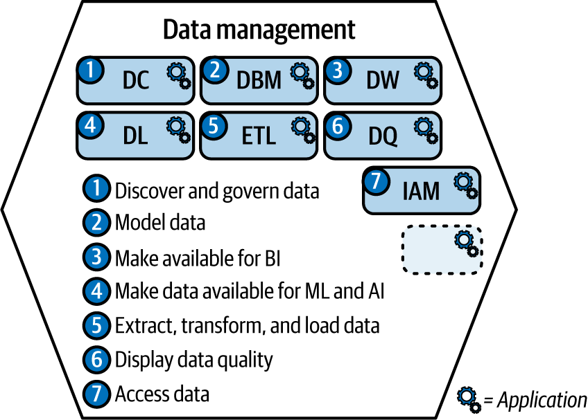

*Figure 4-7. Metadata repositories for data management*

Dieselbe Sechseckdarstellung wie Figure 3-13, hier mit **sieben** Einträgen:

| # | Repository | Core Capability |
|---|---|---|
| 1 | **DC** | Discover and govern data |
| 2 | **DBM** | Model data |
| 3 | **DW** — Data Warehouse | Make available for BI |
| 4 | **DL** — Data Lake | Make data available for ML and AI |
| 5 | **ETL** | Extract, transform, and load data |
| 6 | **DQ** — Data Quality | Display data quality |
| 7 | **IAM** | Access data |

Wieder mit Zahnradsymbol (= Application) und einem gestrichelten, leeren Kasten
für weitere, nicht benannte Repositories.

Beachtenswert: Das **Data Lakehouse** taucht in der Abbildung nicht als eigener
Eintrag auf, obwohl es im Text behandelt wird — konsequent, da es als Kombination
aus DW und DL beschrieben ist.

### Der Durchgang des Buchs

**DC** — nah an der **physischen Realität** der IT-Landschaft, weil er sie
ebenfalls scannt, um zu zeigen, welche Arten von Daten in welchen Quellen
existieren.

**DBM** — geht darum, einen **visuellen Eindruck einer physischen Realität** zu
gewinnen. Wiedergegeben in **empirischen Datenmodellen, die auf Fakten beruhen,
nicht auf Annahmen**. Erlaubt zudem das Abfragen von Datenbanken und **verändert
damit die Realität, die es visualisiert**.

**Die übrigen** — eine Handvoll Technologien und Konzepte im Data Management
**enthalten** Metadata Repositories, auch wenn ihr Hauptzweck darin besteht,
Daten verfügbar zu machen:

- **Data Warehouses und Data Lakes** — Daten speichern
- **ETL/ELT-Werkzeuge** — Daten transformieren und transportieren
- **Data Quality Tools** — Datenqualität messen
- **IAM** — Zugang zu Daten gewähren

---

## 4.6 Summary

### Warum das Kapitel kurz ist

Das Buch begründet die Kürze selbst — und der Begründungssatz ist der
interessanteste des ganzen Kapitels:

> Es ist **nicht das Hauptanliegen dieses Buchs**, Metadata Management eng im
> Kontext des Data Management zu betrachten — **obwohl das Data Management
> dazu neigt, sich selbst als mit unternehmensweiter Autorität ausgestattet zu
> begreifen**, was den Überblick über die IT-Landschaft des Unternehmens
> angeht. **Empirisch ist das üblicherweise nicht der Fall**, wie die übrigen
> Kapitel des Buchs nahelegen.

Das ist eine direkte Zurückweisung eines Anspruchs — und zugleich die
Rechtfertigung dafür, warum die Kapitel 3 und 5 länger sind als dieses.

### Die Kernaussagen

- Als Ganzes sind Metadata Repositories für Data Management als der **Schlüssel
  zur Datenanalytik** zu verstehen: **Business Intelligence und Data Science**.
- **DCs** liefern einen **ganzheitlichen Metadata-Überblick** über die
  Werkzeuglandschaft dieses Prozesses, lassen sich aber durchaus auch für andere
  Zwecke nutzen — **operative wie regulatorische**.
- **DCs** liefern Datenbeschreibungen, die **über Werkzeuge und Domänen hinweg**
  reichen.
- **DBM-Werkzeuge** enthalten Datenmodelle, die aus einem **empirischen Prozess**
  hervorgehen — dem Abtasten von Datenbankstrukturen, etwa SQL-Strukturen. Sie
  sind **technologiespezifisch** und werden **niemals die gesamte IT-Landschaft
  beschreiben**.
- Die übrigen hier behandelten Repositories, die für Data Engineering und damit
  für Datenanalytik nötig sind, lassen sich **als Metadata Repositories denken**,
  auch wenn sie bestimmte Fähigkeiten für den Gesamtzweck des Data Management
  liefern.

Das nächste Kapitel behandelt Metadata Repositories für **Information
Management**.

---

# Kapitel 5 — Information Management

## 5.0 Überblick über das Kapitel

### Kern

Der Unterschied zwischen Data Management (Kapitel 4) und Information Management
(dieses Kapitel) ist in einem Satz gefasst:

> Metadata Repositories für **Information** sind **reicher an menschlicher
> Interpretation**. Dadurch können sie Zwecke erfüllen, die ein höheres Mass an
> **intellektueller — nicht technischer — Abstraktion** verlangen.

Wichtige Einschränkung des Autors: Das Kapitel führt **keine intellektuelle
Debatte**. Information Management existiert als **Disziplin**, mit zugehörigen
Technologien, ISO-Normen und mehr.

### Die vier Repositories

| Abkürzung | Repository | Gegenstand |
|---|---|---|
| **RIMS** | Records and Information Management System | Lebenszyklus von Records |
| **ISMS** | Information Security Management System | Informationssicherheit |
| **DPR** | Data Protection Repository | Datenschutz |
| **BPMS** | Business Process Management System | Geschäftsprozesse |

Die Zwecke: überwiegend **regulatorisch** — Aufbewahrung von Records und
Informationen über deren Lebenszyklus hinweg sowie Informationssicherheit und
Datenschutz. Dazu die Prozessrepositories.

---

## 5.1 Records and Information Management System (RIMS)

### Kern

Mit einem RIMS lässt sich der **Lebenszyklus der Records und Informationen**
steuern, die ein Unternehmen erzeugt.

> Ein **Record** ist ein Dokument oder ein Datensatz, der als **Nachweis für
> etwas** dient.

Daraus folgt unmittelbar: **Nicht jedes erzeugte Dokument ist ein Record.**

| **Kein Record** (in den meisten Unternehmen) | **Record** |
|---|---|
| Entwurfsdokumente | Studienberichte aus Forschung und Entwicklung |
| Temperaturprotokolle von Besprechungsräumen | Verträge mit Lieferanten |
| | Protokolle, die Faktoren wie die Temperatur in Produktionsanlagen überwachen |

Der Unterschied zwischen den beiden Temperaturbeispielen ist lehrreich:
Dieselbe Art Messung ist einmal Beiwerk und einmal Nachweis — es kommt darauf
an, **wofür sie einstehen muss**.

**Records Management** ist die Zusicherung, dass diese Records über ihren
gesamten Lebenszyklus hinweg ordnungsgemäss behandelt werden — also über den
Zeitraum, in dem sie in der Organisation aufbewahrt werden müssen.

### Figure 5-1 — Der Information Lifecycle

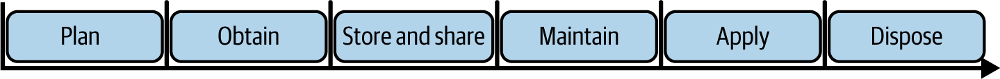

*Figure 5-1. The information lifecycle*

Sechs Phasen auf einem durchgehenden Zeitpfeil:

**Plan** → **Obtain** → **Store and share** → **Maintain** → **Apply** →
**Dispose**

Bemerkenswert: Der Lebenszyklus beginnt bei **Plan**, also **bevor** die
Information existiert, und endet bei **Dispose** — der Vernichtung. Aufbewahrung
ist damit nicht der Endzustand, sondern eine Phase mit definiertem Ende.

### Warum das ernst ist: das Aufbewahrungsszenario

Das Buch führt den Sinn über ein Beispiel ein, das die Zeiträume greifbar macht.

Ein Pharmaunternehmen muss vor Gericht verteidigen können, dass sein Medikament
**nicht** die Todesursache eines Patienten war — obwohl der Patient das
Medikament eingenommen hat. Damit die Anwälte das können, brauchen sie
**Beweise**: die klinischen Studien, die zeigen, dass keine Nebenwirkungen
gemeldet wurden, die dem Todesumstand entsprechen.

Und dann die Zahl:

> Die **US-amerikanische FDA** schreibt vor, dass der Pharmasektor bestimmte
> Datenarten für die **Lebensdauer eines Produkts plus 35 Jahre** aufbewahren
> muss — passend zur typischen Lebensspanne eines Patienten, **auch nachdem das
> Produkt nicht mehr am Markt ist.**

Später konkretisiert das Buch das auf **65 Jahre** in vielen Fällen. Und daraus
die Frage, die den ganzen Abschnitt trägt:

> Würdest du eine Applikation **65 Jahre lang** laufen lassen, nur weil die
> Daten darin so lange aufbewahrt werden müssen?

Natürlich nicht. Deshalb werden die Daten **irgendwann aus der Applikation in
eine Speicherlösung überführt** — und genau das ist der Grund, warum ein RIMS
über den Lebenszyklus hinweg denken muss und nicht über Systeme.

### Branchenabhängigkeit

Stark regulierte Branchen — **Pharma, Petrochemie, Finanzwesen** — haben
tendenziell **feiner strukturierte und besser gepflegte** RIMSs als locker
regulierte Geschäfte wie **Tourismus und Gastgewerbe**. Grund: Die Aufsicht
verlangt dort strikte Nachweisbarkeit für das, was später beweisbar sein muss.

### Die Normen

Records and Information Management ist ein Feld, das **durch internationale
Normen strukturiert** ist. Anders als bei vielen anderen Repositories gibt es
hier **klare Anleitung**:

| Norm | Rolle |
|---|---|
| **ISO 15489** | zentrale Norm des Records and Information Management |
| **ISO/TC 46/SC 11** | das ISO-Gremium, das diese Normen definiert |
| **ISO 9001** | weitere einschlägige Norm |
| **FDA Chapter 21, Part 11** | branchenspezifisch (Pharma, USA) |

### Figure 5-2 — Der Lebenszyklus aus RIMS-Sicht

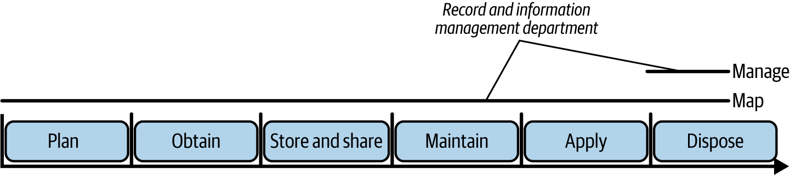

*Figure 5-2. The information lifecycle, RIMS focus*

Dieselben sechs Phasen wie in Figure 5-1, aber mit **zwei darüberliegenden
Balken**, beide der Records-and-Information-Management-Abteilung zugeordnet:

- **Map** — läuft über den **gesamten** Lebenszyklus
- **Manage** — greift **nur am Ende**, im Bereich Apply/Dispose

Das ist die präziseste Aussage der Abbildung: Die Abteilung **kartiert
durchgehend**, aber **verwaltet direkt nur am Lebensende**. Dazwischen liegt die
Verantwortung bei anderen.

Alle Records müssen unternehmensweit von der Abteilung kartiert werden. Sie
müssen **unter Kontrolle** sein, das heisst:

1. **identifiziert**
2. mit **Eigentümerschaft** versehen
3. ordnungsgemässen **Aufbewahrungsverfahren** unterworfen

### Legal Hold

> Wenn das Unternehmen mit einer Klage konfrontiert wird, verhängt die
> Records-Abteilung einen **Legal Hold**.

Das bedeutet: Alle für die Klage relevanten Records werden identifiziert und
**eingefroren**. Die normalen Handlungen im Lauf des Lebenszyklus werden
ausgesetzt — etwa das Teilen von Records zwischen Abteilungen oder das **Löschen
gemäss Aufbewahrungsfristen**.

Die Begründung ist knapp und einleuchtend: *Records sind Nachweise von
Handlungen, und wenn sie gebraucht werden, müssen sie sicher sein.*

### Vertraulichkeit

Ein RIMS gruppiert Records wahrscheinlich nach ihrer **Confidentiality**.

> **Confidentiality** bezeichnet den Grad an Geheimhaltung, der mit einem
> bestimmten Record verbunden ist, und bestimmt damit die **Zahl der
> Mitarbeitenden, die darauf zugreifen dürfen.**

### Was in einem RIMS liegt

Am Pharma-Beispiel weitergeführt:

**Physische oder digitale Dokumente**

- Arbeitsverträge
- Rechtliche Vereinbarungen
- Forschungsstudien
- Strategiedokumentation
- Memos

**Kategorisierte Daten, in grösseren Blöcken gruppiert**

- Klinische Daten
- Finanzdaten
- Laborergebnisse
- Gebäudeüberwachung

### Figure 5-3 — Hochlevelsicht des RIMS

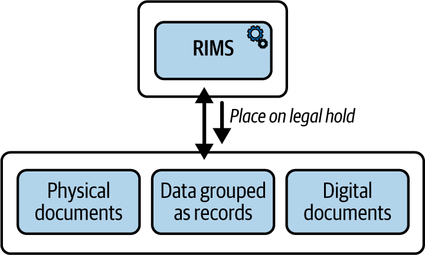

*Figure 5-3. High-level view of a RIMS*

Drei Gegenstandsarten: **Physical documents**, **Data grouped as records**,
**Digital documents**. Der Handlungspfeil heisst **Place on legal hold** — das
ist die Core Capability, die das RIMS ausübt.

Auffällig gegenüber allen bisherigen Abbildungen: Der untere Kasten ist **nicht**
mit *IT landscape* beschriftet. Das RIMS bildet mehr ab als die IT-Landschaft.

### Figure 5-4 — RIMS über die IT-Landschaft hinaus

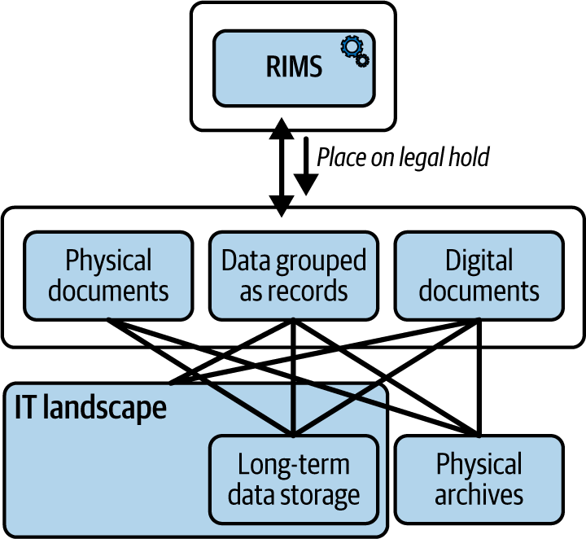

*Figure 5-4. Records and information management related to the IT landscape and
beyond*

Die Erweiterung von Figure 5-3. Unter den drei Record-Arten liegen zwei
Speicherorte, verbunden durch ein Netz sich kreuzender Linien:

- **Long-term data storage** — **innerhalb** der IT-Landschaft
- **Physical archives** — **ausserhalb** davon

Damit bildet ein RIMS ausdrücklich **nicht nur die IT-Landschaft** ab, sondern
auch eine **analoge Realität** von Records in physischen Archiven. Und dazu
eigens für Records ausgelegte **Langzeitspeicherlösungen**.

Die Begründung dafür ist ökonomisch:

> Im Lauf des Lebenszyklus können als Records gruppierte Daten aus der laufenden
> IT-Landschaft in einen **Langzeitspeicher** verschoben werden, wo **Zugriff
> teuer, Speicherung aber billig** ist. Da Records aus regulatorischen Gründen
> aufbewahrt werden, ist die **Nutzungshäufigkeit gering** — sie werden nur bei
> Klagen oder Inspektionen konsultiert.

Und im Extremfall: Es kann Szenarien geben, in denen Daten **als physische
Dokumente ausgedruckt** werden, weil Langzeitspeicherung in physischer Form am
billigsten ist.

Ergänzend der Hinweis auf **hot** und **cold** data nach Nutzungshäufigkeit:
Records and Information Management ist als der überwachende Prozess zu verstehen,
**bis die Daten den Punkt erreichen, an dem sie „ice cold" werden.** Vertiefung:
Joe Reis und Matt Housley, *Fundamentals of Data Engineering* (O'Reilly),
Figure 6-9.

### Zweck und Überschneidungen

RIMSs werden aus **regulatorischen** Gründen eingeführt, sowohl branchenneutral
als auch branchenspezifisch. Der übergreifende Zweck ist **Retention und Legal
Hold**; branchenspezifische Regulierung bestimmt die **Dauer**.

Und schon hier deutet das Buch die Überlappungen an, die in 5.5 systematisch
werden:

- Ein Teil der RIMS-Rolle kann vom **DPR** übernommen werden, der Retention
  speziell für **sensible Daten** handhabt.
- Ein anderer Zweck kann vom **ISMS** übernommen werden, das **Vertraulichkeit**
  bewertet.

> **Fürs Repository:** Das ist die saubere Fassung dessen, was ich in der
> Bank-Taxonomie „aufbewahrungspflichtige Ablage" genannt hatte. Der Kern ist die
> Record-Definition: Nachweis für etwas. Wenn ein System keine Nachweise hält,
> unterliegt es keiner Retention-Pflicht — und wenn es welche hält, ist die
> Aufbewahrungsfrist ein Attribut, das ins Repository gehört, nicht in den Kopf
> des Fachbereichs.

### Begriffe

**RIMS** — steuert den Lebenszyklus von Records und Informationen.

**Record** — Dokument oder Datensatz, der als **Nachweis für etwas** dient. Nicht
jedes Dokument ist ein Record.

**Information Lifecycle** — Plan → Obtain → Store and share → Maintain → Apply →
Dispose.

**Retention** — Aufbewahrung über eine regulatorisch bestimmte Dauer.

**Legal Hold** — Einfrieren aller klagerelevanten Records; setzt Teilen und
Löschen aus.

**Confidentiality** — Geheimhaltungsgrad eines Records; bestimmt, wie viele
Personen zugreifen dürfen. Abzugrenzen von **Sensitivity** (siehe 5.3), die den
Grad an Personenbezug meint.

**Hot / cold / ice cold data** — Einteilung nach Nutzungshäufigkeit. Records
wandern über ihren Lebenszyklus in Richtung „ice cold".

**ISO 15489** — zentrale Norm des Records and Information Management.

---

## 5.2 Information Security Management System (ISMS)

### Kern

Die Disziplin ist heute eng mit **ISO/IEC 27001:2022** verbunden — Informations-
sicherheit, Cybersicherheit und Schutz der Privatsphäre. Die Norm bildet
zusammen mit den verbundenen Normen die **27000-Reihe** und liefert einen Rahmen
für Informationssicherheit.

Der entscheidende Punkt gleich zu Beginn:

> Informationssicherheit **reicht über die Grenzen der IT-Landschaft hinaus** —
> sie umfasst mehr als nur Cybersicherheit.

### Die drei Asset-Arten

**Asset** meint dabei **alles, was für das Unternehmen von Wert ist.**

| Art | Umfasst |
|---|---|
| **Intangible assets** | geistiges Eigentum, Insiderwissen, **sogar Gerüchte** |
| **IT landscape assets** | alles von Hardware bis Software: Serverräume vor Ort, Kabel, Laptops, Applikationen |
| **Tangible assets** | **Personen** mit aussergewöhnlichem Expertenwissen oder besonderem Status — hochrangige Mitarbeitende oder Personen des öffentlichen Lebens |

Zwei Beobachtungen dazu: **Gerüchte** als Asset zu führen ist ungewöhnlich und
folgerichtig zugleich — [Fn. 5-1](#kapitel-5) begründet es damit, dass
Informationssicherheit **wie eine interne Nachrichtendienststelle** arbeiten
muss, weil immaterielle Vermögenswerte extrem mächtig sein können. Genanntes
Beispiel: **Insiderhandel**.

Und **Personen als Asset** zu führen, bricht mit der üblichen Vorstellung von
Sicherheitsinventaren.

### Die vier Bewertungskriterien

Im Kern der 27000-Reihe steht die Schaffung eines ISMS. Dieses führt
**fortlaufende Risikobewertungen** der identifizierten Assets durch, anhand von
vier Kriterien:

| Kriterium | Frage |
|---|---|
| **Threats** | Welchen potenziellen Bedrohungen sieht sich das Unternehmen gegenüber seinen Assets ausgesetzt? |
| **Vulnerabilities** | Wie **wahrscheinlich** ist es, dass diese Assets von den Bedrohungen getroffen werden? |
| **Impact** | Welche **Grössenordnung** hätte der Schaden, wenn eine Bedrohung sich verwirklicht? |
| **Mitigation** | Welche Massnahmen sind eingerichtet, um die Bedrohung zu verhindern? |

### Organisation und der Shewhart-Zyklus

Ein ISMS wird von einem **CISO** (Chief Information Security Officer)
verantwortet, dem ein Team für den Tagesbetrieb zur Seite stehen kann. Die
Führung der Abteilung ist ein **fortlaufender Prozess**.

ISO-Normen — auch die 27000-Reihe — folgen dem **Shewhart-Zyklus** mit vier
Phasen:

| Phase | Bedeutung fürs ISMS |
|---|---|
| **Plan** | das ISMS **etablieren** |
| **Do** | es **umsetzen** |
| **Check** | es **überwachen** |
| **Act** | es **erhalten** |

Der Zyklus wird **jährlich wiederholt**, um das Risiko in der Organisation
schrittweise zu senken.

### Figure 5-5 — Hochlevelsicht des ISMS

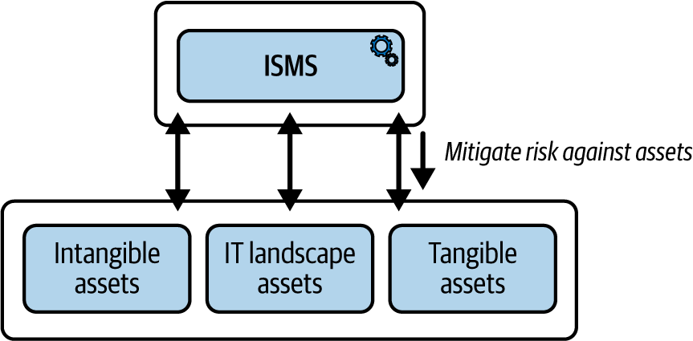

*Figure 5-5. High-level view of an ISMS*

Das ISMS über den drei Asset-Arten, verbunden durch je einen Doppelpfeil. Der
Handlungspfeil heisst **Mitigate risk against assets**.

Auch hier ist der untere Kasten **nicht** die IT-Landschaft — sie ist nur eine
von drei Kategorien darin.

### Das Asset Inventory — der eigentliche Punkt

Hier setzt das Buch einen ausdrücklichen Fokus, der von der üblichen
Sicherheitsperspektive abweicht:

> Im Zusammenhang dieses Buchs ist der Brennpunkt des ISMS **nicht** die
> Minderungsarbeit des CISO, sondern das **Bewusstsein über die Assets und die
> potenziellen Risiken**. Minderung ist das Endergebnis — der Schlüssel liegt
> darin, **wie der CISO überhaupt erst in die Lage kommt**, Risiken zu mindern.

Dieser entscheidende Aspekt heisst **Asset Inventory**: schlicht die Liste der
Assets, die der CISO und sein Team gesammelt haben. Sie führt IT-Assets ebenso
wie tangible und intangible Assets.

> **Alle Risikobewertungen und Minderungen des CISO werden gegen das Asset
> Inventory durchgeführt.**

### Risk Owner wird Asset Owner

Ein Element des Asset Inventory ist der **Risk Owner** — eine Person in der
Organisation, der die Eigentümerschaft an einem bestimmten Risiko übertragen
wurde.

Das Konzept ist laut Buch **oft schwer zu handhaben** und wird deshalb in eine
**greifbarere Form** übersetzt: über die Identifikation konkreter Assets. Daraus
folgt:

> **Aus Risk Ownern werden Asset Owner.**

Das ist ein praktisch nützlicher Kniff — ein Risiko ist abstrakt und schwer
zuzuweisen, ein Gegenstand nicht.

### Der Fehler, den es zu vermeiden gilt

Die zentrale Frage des Abschnitts:

> Was passiert, wenn der CISO das Asset Inventory aufbaut, **ohne die anderen
> Metadata Repositories der IT-Landschaft zu berücksichtigen?**

Zwei Antworten, gestaffelt:

- **Mindestens:** Es wird viel Zeit damit verschwendet, zu reproduzieren, was
  bereits existieren sollte.
- **Schlimmstenfalls — und das ist das Wahrscheinlichste:** Es entsteht eine
  **alternative Abbildung der IT-Landschaft**, und damit Unsicherheit darüber,
  welche Repositories korrekt sind.

Die Empfehlung dagegen:

> Befülle das Asset Inventory im ISMS — besonders bei Assets mit Bezug zur
> IT-Landschaft — **durch Verweis auf andere Metadata Repositories.** Reflektiere
> die Einträge für diese Assets und **interpretiere die Metadata im Kontext der
> Informationssicherheit.** Das ist ein **empirischer Ansatz** zum Aufbau eines
> ISMS.

Die Formulierung *interpret the metadata in the context of information security*
ist die genaue Anwendung des Interpretationsgedankens aus 2.4: nicht kopieren,
sondern für den eigenen Zweck deuten.

### Die Warnung

Ungewöhnlich scharf formuliert:

> In den meisten Unternehmen ist das Asset Inventory **selbst eine Bedrohung für
> die Informationssicherheit.**

Die Begründungskette:

1. Es beruht auf einem **ungenauen, nichtempirischen** Asset Inventory, das die
   Realität nicht abbildet.
2. Ursache ist die **Unwilligkeit des Geschäfts, Eigentümerschaft zu
   übernehmen**.
3. Folge: **zu wenig Dialog mit dem CISO.**
4. Ausdrücklich: **Das ist weder die Schuld des CISO noch die des Geschäfts.**
5. Und: Man kann das zum Besseren ändern — Teil II liefert konkreten Rat.

### Regulatorischer Charakter — mit einem Unterschied

Das ISMS ist **regulatorischer Natur** in dem Sinn, dass seine Einführung und
Führung verpflichtend ist, um Informationssicherheitsnormen zu erfüllen,
insbesondere die 27000-Reihe.

Aber mit einer wichtigen Abstufung gegenüber dem RIMS:

> Unternehmen **können sich entscheiden**, strenge Informationssicherheitspraxis
> **nicht** zu befolgen. Das führt wohl zu **weniger Geschäftsmöglichkeiten** —
> aber **nicht zu Bussgeldern**, anders als beim RIMS.

Ergänzend [Fn. 5-2](#kapitel-5): **Normen werden zu Regulierung.** Beispiel
**NIS2** — wer in der EU in der Unterhaltungselektronik oder Telekommunikation
tätig sein will, muss NIS2 erfüllen, und das ist eine **direkte Durchsetzung der
ISO-27000-Reihe**.

> **Fürs Repository:** Die Warnung ist die andere Seite der EAM-Warnung aus 3.6.
> Wenn der CISO sein Asset Inventory eigenständig aufbaut, entsteht eine weitere
> konkurrierende Abbildung der IT-Landschaft. Das EAM-Repository ist der
> naheliegende Ausgangsbestand dafür — und die Regel lautet nicht „übernehmen",
> sondern „referenzieren und im Sicherheitskontext deuten".

### Begriffe

**ISMS** — Repository, das Assets, zugehörige Risiken und mindernde Massnahmen
listet. Arbeitet auf Basis der Klassifikation von Daten nach **Vertraulichkeit**.

**Asset** — alles, was für das Unternehmen von Wert ist. Drei Arten: intangible,
IT landscape, tangible.

**Asset Inventory** — die Liste der Assets. Der laut Buch entscheidende Teil des
ISMS, weil alle Bewertungen dagegen laufen.

**Threat / Vulnerability / Impact / Mitigation** — die vier Bewertungskriterien.

**Risk Owner → Asset Owner** — die Übersetzung eines abstrakten Risikoeigentums
in konkrete Gegenstandseigentümerschaft.

**Shewhart-Zyklus** — Plan, Do, Check, Act. Jährlich wiederholt.

**ISO/IEC 27001:2022 und die 27000-Reihe** — Normenrahmen für
Informationssicherheit.

**NIS2** — EU-Regulierung, die die 27000-Reihe für bestimmte Branchen verbindlich
macht.

---

## 5.3 Data Protection Repository (DPR)

### Vorbemerkung: ein Begriff des Autors

> **Das Data Protection Repository ist kein etabliertes Konzept, sondern das
> Konzept des Autors.**

Das ist beim Weiterverwenden zu beachten — anders als RIMS, ISMS und BPMS ist
DPR kein Marktbegriff.

### Kern

Die **DSGVO trat 2018 in Kraft** und war wegweisend für moderne
Datenschutzregulierung. Sie schuf einen europäischen Standard, der weltweit als
Vorbild dient — der bekannteste ausserhalb Europas ist der **CCPA** (California
Consumer Privacy Act). Dieser gilt nur für Kalifornien, war aber wegweisend für
die USA und betrifft unmittelbar viele Technologiekonzerne aus dem Raum San
Francisco.

Wie bei der Informationssicherheit gilt: **Datenschutz reicht über die
IT-Landschaft hinaus** und betrifft auch Informationen auf physischen Medien.

Der Zweck, schlicht formuliert:

> Das Herz des Datenschutzes ist der Schutz des **Privatlebens aller** — auch
> deines. Je allgegenwärtiger Technologie in unserem Leben wird, desto genauere
> Daten enthält sie über uns. Damit deine Daten nicht **gegen deinen Willen**
> verwendet werden, müssen sie geschützt werden.

### Der Weg: DPIA

Datenschutz erfolgt in drei Schritten:

1. Daten **entdecken**
2. **analysieren, wie sie verarbeitet werden**
3. die **Auswirkung der Risiken** dieser Verarbeitung bewerten

Das geschieht in einer **DPIA** — Data Protection Impact Assessment. Diese muss
unter anderem enthalten:

- eine **systematische Beschreibung der vorgesehenen Verarbeitungsvorgänge** und
  der **Zwecke** der Verarbeitung
- eine Bewertung der **Notwendigkeit und Verhältnismässigkeit** der
  Verarbeitungsvorgänge im Verhältnis zu diesen Zwecken

### Die eigentliche Pointe

Der Autor lenkt den Blick ausdrücklich weg von der Datenschutztätigkeit hin zu
einer Formulierung im ersten Punkt — *a description of the envisaged processing
operations*:

> Um Daten zu schützen, muss man **kartieren, wie Daten verarbeitet werden.**
> Diese Karte ist in **jede einzelne DPIA** eingebaut. Damit ist die **Sammlung
> der DPIAs ein Metadata Repository, das eine Prozesskarte des Unternehmens
> enthält.**

Und daraus die Fragen, die das Buch stellt:

- Welche **Autorität** hat diese Prozesskarte im DPR eigentlich?
- Wie ist sie mit anderen Repositories **abgestimmt** — wenn überhaupt?
- Und wenn sie es nicht sind: **wo ist dann die Wahrheit?**

### DSAR

Ein DPR speichert DPIAs. Die DPIAs werden genutzt, um **DSARs** zu beantworten —
Data Subject Access Requests.

> Der DSAR ist **dein Recht** zu erfahren, welche Daten ein Unternehmen oder eine
> Organisation über dich hat — sowie die Daten zu **korrigieren**, zu verstehen,
> **wie sie verarbeitet** werden, und sie **löschen** zu lassen.

### Organisation: der DPO

Datenschutz wird von einem **DPO** (Data Protection Officer) ausgeübt,
typischerweise eine **Juristin oder ein Jurist** mit Erfahrung in Daten- und
Technologiefragen.

Der DPO baut das DPR auf, indem er die Datenverarbeitung im Unternehmen
untersucht und in DPIAs auflistet. Das geschieht in der Regel **früh**, wenn neue
IT-Projekte starten. Bei der Ersteinführung der DSGVO musste die Bewertung
allerdings **für die bestehende Landschaft** nachgeholt werden.

**Der DSAR-Ablauf** — der DPO hat **28 Tage** Zeit:

1. DSAR **registrieren**
2. **Identität** der anfragenden Person prüfen
3. den DSAR **verstehen**
4. den DSAR mit der Datenverarbeitung **abgleichen** (durch Konsultation der
   DPIAs im DPR)
5. die Daten **einsammeln**
6. **informieren, löschen, korrigieren oder bereitstellen**

### Warum das in der Praxis scheitert

Hier wird der Autor persönlich, und der Abschnitt ist der eindringlichste des
Kapitels:

> Ich habe persönlich erlebt, wie DSARs bearbeitet wurden — und danach dieselbe
> Art **unerwünschter, schädlicher Datenverarbeitung erneut auftrat**, nachdem
> den Betroffenen mitgeteilt worden war, dass sie nicht wiederholt würde.

Die Diagnose:

- Das ist **sehr verbreitet** im Grossunternehmenskontext.
- Ursache: **Das DPR ist nicht korrekt** — es bildet die IT-Landschaft nicht
  wirklich ab.
- **Nicht**, weil der DPO nachlässig gearbeitet hätte, sondern weil die **Aufgabe
  zu gewaltig** ist und die **Änderungen an der IT-Landschaft so zahlreich**
  sind, dass ein **manuell gepflegtes DPR nicht mithalten kann.**

Und die typische, falsche Reaktion darauf:

> Der DPO will **härter arbeiten**, **konfrontativere Data Governance** betreiben
> und **aufdringliche harte Gespräche** mit den Fachbereichen führen, um die
> Datenqualität im DPR zu verbessern. **Und ich garantiere dir: Dieser Ansatz
> wird nicht funktionieren.**

Der Gegenvorschlag:

> Stattdessen muss das DPR die anderen Metadata Repositories **koordinieren, zu
> ihnen beitragen und von ihnen profitieren.**

### Figure 5-6 — Hochlevelsicht des DPR

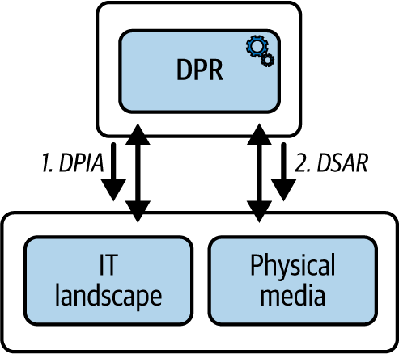

*Figure 5-6. High-level view of a DPR*

Das DPR über zwei Kästen: **IT landscape** und **Physical media**. Die beiden
Handlungspfeile sind **nummeriert** — das ist bei keiner anderen Abbildung des
Buchs so:

- **1. DPIA** — zuerst werden Bewertungen der IT-Landschaft und der physischen
  Medien durchgeführt
- **2. DSAR** — anschliessend wird das Ergebnis genutzt, um Auskunftsersuchen zu
  beantworten

Die Nummerierung ist die Aussage: Das eine ist Voraussetzung des anderen. Wer
keine DPIAs hat, kann keine DSARs beantworten.

Ein DPR ist damit ein **Inventar, das Daten und die Art ihrer Verarbeitung**
listet. Sein Fokus liegt auf der **Sensitivity** von Daten — dem Grad, in dem
Daten **personenbezogen** sind.

### Warum das Prozessbild das Problem ist

Für dieses Buch ist **weder das Ergebnis einer DPIA noch das eines DSAR**
wichtig. Wichtig ist:

> Eine DPIA **konstruiert eine Prozesslandschaft mit Daten darin.** Diese
> Prozesslandschaft **stimmt möglicherweise — wahrscheinlicher aber nicht** — mit
> anderen Prozesskarten der Organisation überein.

In anderen Repositories liegen andere Prozesslandschaften. Stimmen sie nicht mit
der des DPR überein, hat das Unternehmen **mehrere gegensätzliche
Prozesslandschaften** im Spiel — was **grosse Verwirrung** stiftet, bis man es
angeht. Rat dazu in Kapitel 7 und im weiteren Buch.

### Werkzeuglage

> Für diesen Bereich wirst du **keine eigenen Anbieter finden.**

Die meisten ISMSs haben eine **Datenschutzkomponente**, die bei DSGVO und
Ähnlichem hilft. In vielen Organisationen wird das aber **schlicht mit
Spreadsheets und Dokumenten** erledigt.

**Alternative:** ein **PIMS** (Privacy Information Management System), in dem
Nutzer **selbst bestimmen**, wie ihre Daten verwendet werden sollen — eine Art
**DSAR as a Service**.

### Begriffe

**DPR — Data Protection Repository** — Begriff des Autors. Inventar der Daten und
ihrer Verarbeitung, gespeist aus DPIAs.

**DPIA** — Data Protection Impact Assessment. Enthält als Nebenprodukt eine
Prozesskarte des Unternehmens.

**DSAR** — Data Subject Access Request. Auskunfts-, Korrektur- und
Löschungsersuchen einer betroffenen Person. Frist: 28 Tage.

**DPO** — Data Protection Officer, meist juristisch ausgebildet.

**Sensitivity** — Grad des Personenbezugs von Daten. Abzugrenzen von
**Confidentiality** (Geheimhaltungsgrad, siehe 5.1).

**PIMS** — Privacy Information Management System. Alternative zum DPR, bei der
Betroffene selbst über die Verwendung ihrer Daten bestimmen.

**CCPA** — California Consumer Privacy Act, US-Pendant zur DSGVO.

---

## 5.4 Business Process Management System (BPMS)

### Kern

Ein BPMS **formalisiert Geschäftsprozesse**. Geschäftsprozesse beschreiben, **wie
ein Unternehmen seine Aufgaben ausführt**.

Das BPMS erlaubt drei Dinge mit ihnen:

| Verb | Bedeutung |
|---|---|
| **Mined** | sie werden **entdeckt und verständlich gemacht** |
| **Managed** | auf dieser Grundlage bekommt man sie **unter Kontrolle** |
| **Automated** | manuelle Aufgaben lassen sich **strategisch automatisieren** |

Zusammen tragen sie zu einer glatteren und schnelleren Ausführung von
Geschäftsprozessen bei.

### Warum das BPMS ins Information Management gehört

Die Begründung ist der wichtigste konzeptionelle Satz des Abschnitts:

> Geschäftsprozesse sind für Information Management **wirklich wichtig**, weil
> Prozesse **Information als Eingabe** brauchen und Information ebenso oft
> **Ergebnis oder Ausgabe** eines Prozesses ist.

Daraus folgt die Verknüpfung: Geschäftsprozesse sind mit den **Information
Objects** verbunden, die in der **Information Architecture** und den
**Information Models** modelliert werden. Das ist ein wichtiger Teil der
**Business Architecture**.

Und der Punkt, der direkt an Kapitel 4 anschliesst:

> **Data Objects in DCs übersetzen sich sehr direkt in diese** — und die
> Überlappung dieser Technologien **darf im Metadata-Management-Kontext nicht
> ignoriert werden.**

Das ist die Wiederaufnahme der Frage aus 2.7, ob *data object* und *information
object* dasselbe sind. Hier lautet die Antwort: eng verwandt, und die
Überlappung ist zu behandeln.

Ergänzend [Fn. 5-3](#kapitel-5): Das BPMS ist deshalb der Information-Management-
Domäne zugeordnet, weil es — manchmal nicht ausdrücklich — der **ARIS**
(Architecture of Integrated Information Systems) folgt.

### Figure 5-7 — Hochlevelsicht des BPMS

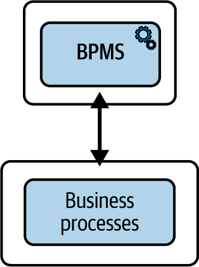

*Figure 5-7. High-level view of a BPMS*

Die schlichteste Abbildung des Kapitels: das BPMS, darunter ein einziger Kasten
**Business processes**, ein Doppelpfeil dazwischen. **Kein Handlungspfeil** — und
vor allem: **keine IT-Landschaft**.

Das ist genau die Aussage des Buchs:

> Das BPMS hat **an sich keine direkte Verbindung zur IT-Landschaft.** Die
> Verbindung besteht erst dann, wenn ein bestimmter Prozess **mithilfe von IT**
> ausgeführt wird — was allerdings fast immer der Fall ist. Dennoch ist das BPMS
> dazu gedacht, **Prozesse abzubilden, nicht die IT-Landschaft.**

### Figure 5-8 — Ein Prozess in BPMN

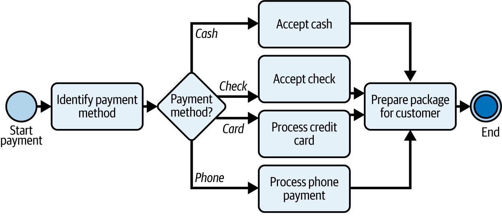

*Figure 5-8. Payment business process modeled in BPMN*

Geschäftsprozesse lassen sich in einer **Standardnotation** modellieren, etwa
**BPMN** (Business Process Model and Notation), veröffentlicht von der **Object
Management Group**.

Das Beispiel: **Start payment** → *Identify payment method* → Verzweigung
**Payment method?** mit vier Zweigen — *Cash* → Accept cash, *Check* → Accept
check, *Card* → Process credit card, *Phone* → Process phone payment — die alle
in *Prepare package for customer* zusammenlaufen → **End**.

Der Detailgrad ist die Aussage: Das sind **konkrete Handlungen**, keine
abstrakten Fähigkeiten.

### Granularität — die Abgrenzung zur Value Chain

Das Buch warnt ausdrücklich vor einer Verwechslung:

> Denk bei Geschäftsprozessen **nicht an den Value Stream oder die Value Chain**
> deines Unternehmens.

| | **Value Stream / Value Chain** | **Business Process** |
|---|---|---|
| **Ebene** | Hochlevelüberblick über die Aktivitäten eines Unternehmens | die **detaillierten Handlungsebenen** |
| **Dringt vor bis** | nicht bis zu den Einzelhandlungen | zu dem, was **Mitarbeitende, Maschinen oder Roboter** konkret tun |

Die Modelle werden vom BPMS **automatisch oder halbautomatisch** als
Visualisierungen erzeugt.

### Was man danach damit tun kann

Sind die Prozesse im BPMS kartiert, lässt es sich nutzen, um:

1. **grosse IT-Transformationen** durchzuführen, etwa eine ERP-Migration
2. **schwache Prozesse** zu erkennen und zu stärken
3. **langsame Prozesse** zu erkennen und zu beschleunigen
4. Prozesse zu **automatisieren** — mit KI, **RPA** (Robotic Process Automation)
   und Ähnlichem

### Figure 5-9 — Das BPMS über die IT-Landschaft hinaus

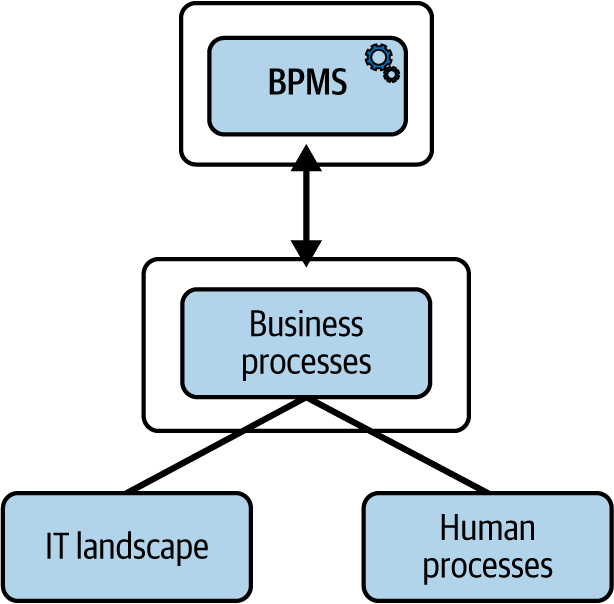

*Figure 5-9. How the BPMS relates to the IT landscape and beyond*

Unter **Business processes** verzweigt sich die Darstellung in zwei gleichrangige
Kästen: **IT landscape** und **Human processes**.

Geschäftsprozesse werden also **sowohl innerhalb der IT-Landschaft als auch als
rein menschliche Prozesse** ausgeführt. Die Gleichrangigkeit der beiden Kästen
ist die Aussage — das BPMS ist das einzige Repository des Buchs, bei dem
menschliche Tätigkeit dem IT-Anteil gleichgestellt gezeichnet ist.

### Organisatorische Sonderstellung

Anders als Records Management, Datenschutz und Informationssicherheit ist
Business Process Management **keine organisatorisch formalisierte Tätigkeit**.
Man kann aber strukturierte Teamaktivitäten dafür aufsetzen, indem man der
allgemeinen Anleitung in **ISO 9000** folgt.

Das BPMS kann zudem **Teil eines grösseren, komplexeren Systems** sein —
typischerweise eines **QMS** (Quality Management System), das meist von einer
Qualitätssicherungsabteilung betrieben wird. Behandlung in Kapitel 6.

Und die letzte Sonderstellung:

> Das BPMS unterscheidet sich seiner Natur nach von den anderen Repositories
> dieses Kapitels, weil es **keinem regulatorischen Zweck dient** und auch nicht
> vorrangig dafür genutzt werden sollte. Allerdings bildet es Prozesse ab —
> **und überschneidet sich dadurch mit dem DPR.**

### Begriffe

**BPMS** — formalisiert Geschäftsprozesse; erlaubt Mining, Management und
Automatisierung.

**Mining / Managing / Automating** — die drei Fähigkeiten des BPMS.

**BPMN** — Business Process Model and Notation, Standardnotation der Object
Management Group.

**Business Process vs. Value Chain** — Detailebene gegen Hochlevelüberblick. Das
BPMS arbeitet auf der Detailebene.

**Information Object** — das in Information Architecture und Information Models
modellierte Gegenstück zum **Data Object** im DC. Die Überlappung ist ausdrücklich
zu behandeln.

**ARIS** — Architecture of Integrated Information Systems. Der Grund, warum das
BPMS im Information Management verortet wird.

**RPA** — Robotic Process Automation.

**QMS** — Quality Management System. Kann ein BPMS enthalten; Kapitel 6.

---

## 5.5 Metadata Repositories for Information Management

### Figure 5-10 — die Gesamtübersicht

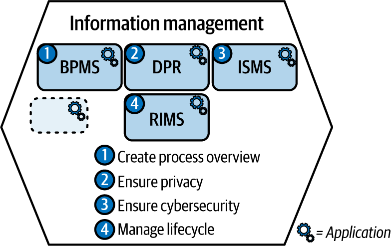

*Figure 5-10. Metadata repositories for information management*

| # | Repository | Core Capability |
|---|---|---|
| 1 | **BPMS** | Create process overview |
| 2 | **DPR** | Ensure privacy |
| 3 | **ISMS** | Ensure cybersecurity |
| 4 | **RIMS** | Manage lifecycle |

Wieder mit Zahnradsymbol (= Application) und einem gestrichelten, leeren Kasten
für weitere Repositories.

### Der Durchgang des Buchs

**BPMS** — bildet Geschäftsprozesse ab: gründliche, detaillierte Beschreibungen
dessen, was **Menschen, Maschinen und Roboter** im Unternehmen tun. Kann eine
**Rationalisierung der IT-Landschaft** leisten, sie transformieren und stärker und
schneller machen. Prozesse werden im BPMS **visualisiert**.

**DPR** — beschreibt, **wie personenbezogene Daten verarbeitet werden**.
Eingerichtet für Regulierung wie DSGVO und CCPA, die Unternehmen verpflichten,
ihre Verarbeitung transparent zu erklären und Änderungsanträge zu verwalten.
Verantwortet vom **DPO**.

**ISMS** — steuert die Informationssicherheit, sowohl für Cybersicherheit als
auch für die Sicherheit **analoger, tangibler und intangibler** Assets. Alle
Risiken müssen gelistet, nach Schwere bewertet und dann gemindert werden.
Verantwortet vom **CISO**.

**RIMS** — steuert den Lebenszyklus der Records. Bildet **alle** physischen und
digitalen Records ab und kann einen **Legal Hold** auf klagerelevante Records
verhängen. Verantwortet von einer **Records-and-Information-Management-
Abteilung**.

### Die gemeinsame Eigenart

Zwei Merkmale, die alle vier von den Repositories der Kapitel 3 und 4 abheben:

> **1.** Alle Metadata Repositories für Information interagieren **weniger direkt
> mit der IT-Landschaft** als die für IT- und Data Management — sie fügen eine
> **Interpretationsschicht** hinzu, die Repositories für Daten nicht brauchen.

> **2.** Sie **blicken über die IT-Landschaft hinaus**: auf **Gespräche** (BPMS),
> **Gerüchte** (ISMS) und **physische Papierdokumente** (DPR und RIMS).

Der zweite Punkt macht die Kapitelreihenfolge des Buchs rückblickend
verständlich: Kapitel 3 → 4 → 5 ist eine Reihe wachsender Distanz zur physischen
Realität und wachsender Interpretation.

### Figure 5-11 — Die überlappenden Peripheral Capabilities

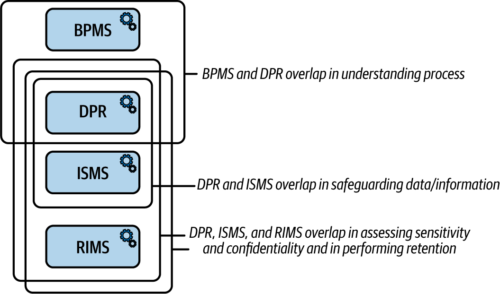

*Figure 5-11. The overlapping peripheral capabilities of information metadata
repositories*

Die Abbildung zeigt drei ineinandergeschachtelte Rahmen, die jeweils eine
Teilmenge der vier Repositories umfassen:

| Rahmen | Umfasst | Überlappung |
|---|---|---|
| äusserster | BPMS + DPR | **im Prozessverständnis** |
| mittlerer | DPR + ISMS | **im Schutz von Daten und Informationen** |
| innerster | DPR + ISMS + RIMS | **in der Bewertung von Sensitivity und Confidentiality sowie in der Durchführung von Retention** |

Der **DPR liegt in allen drei Rahmen** — er ist der Knotenpunkt der
Informationsdomäne.

### Die Mechanik der Überlappung

Das Buch erklärt, **warum** diese Überschneidungen entstehen — und die Begründung
ist jedes Mal eine Fortsetzung des jeweiligen Kernzwecks:

- Technologien für Informationssicherheit bieten eine **Datenschutzkomponente**
  an und umgekehrt, weil sie eine **gemeinsame Methodik** zum Schutz von Daten
  und Informationen teilen.
- Ein technologisch ausgereiftes **RIMS kann seine Peripheral Capabilities in
  Richtung Informationssicherheit und Datenschutz schieben**, weil es
  Vertraulichkeit und Sensibilität ohnehin behandelt — als **natürliche
  Fortsetzung** seines Gesamtzwecks, Retention zu bewerten und zu verwalten.
- Teile der **RIMS-Rolle** kann der **DPR** übernehmen (Retention speziell für
  sensible Daten); einen anderen Zweck das **ISMS** (Bewertung von
  Vertraulichkeit).

Das ist die konkreteste Illustration des Modells aus 2.5 im ganzen Buch: Die
Ausdehnung in Peripheral Capabilities passiert nicht aus Übermut, sondern weil
die Nachbarfähigkeit sachlich naheliegt.

> **Fürs Repository:** Figure 5-11 ist als Vorlage direkt brauchbar. Für die
> eigene Landschaft dieselbe Frage stellen: Wer bewertet Vertraulichkeit, wer
> Sensibilität, wer setzt Aufbewahrungsfristen — und wenn mehrere, welcher ist
> führend? Der DPR als Knotenpunkt aller drei Rahmen ist dabei der wahrscheinlich
> überlasteste Punkt.

---

## 5.6 Summary

Die Zusammenfassung des Buchs — mit dem Hinweis, dass hier nur **Beispiele**
behandelt wurden und im Information Management **zahlreiche weitere**
Repositories existieren.

**Die gemeinsame Eigenart**

- Metadata Repositories für Information interagieren **weniger direkt** mit der
  IT-Landschaft als die für IT- und Data Management, weil sie eine
  **Interpretationsschicht** hinzufügen.
- Sie blicken **über die IT-Landschaft hinaus**, auf physische Medien und
  abstrakte Vorstellungen.
- Die meisten sind durch **Regulierung** motiviert, etwa DSGVO und CCPA.

**Die vier einzeln**

- Ein **BPMS** verschafft einen Überblick über die Geschäftsprozesse.
- Der **DPR** beschreibt, wie personenbezogene sensible Daten verarbeitet werden.
- Im **ISMS** liegt ein **Asset Inventory**, das alle vertraulichen Assets
  listet.
- Das **RIMS** steuert den Lebenszyklus von Records und Informationen — und kann
  **Legal Holds** verhängen.

**Die Überlappungen**

- **DPR und ISMS** finden sich häufig **in derselben Technologie**.
- **DPR, ISMS und RIMS** überschneiden sich rund um die **Verarbeitung von
  Daten**.
- Wie der DPR beschreibt das **RIMS Sensitivity** und handhabt **Retention**.
- Wie das ISMS vergibt das **RIMS Vertraulichkeitsstufen**.

Das nächste Kapitel behandelt Metadata Repositories für **Wissen**.

---

# Fussnoten

## Kapitel 2

Fussnoten 1 bis 3 sind inhaltliche Anmerkungen, keine blossen Belegangaben.

**1** — Svenonius unterscheidet in ihrem Vorwort *„between metadata that are
derived and metadata that is assigned: the former provide the means to find
information, and the latter provide the normalization to organize it."*
Anmerkung des Autors: Diese Unterscheidung wird später im Buch deutlich und ist
im Metadata Management immer im Spiel — die ständige Symbiose aus Suchen und
Ordnen mit Metadata und deren entsprechende Verfeinerung ist der Schlüssel zum
Erfolg.

**2** — Avram beschreibt die mühevolle Aufgabe, in der zweiten Hälfte des 20.
Jahrhunderts die analogen Katalogisierungspraktiken der USA mittels MARC zu
digitalisieren. Sie hebt besonders hervor: *„MARC is an assemblage of formats,
publications, procedures, people, standards, codes, programs, systems,
equipment, etc., that has evolved over the years, stimulating the development of
library automation and information networks."* Anmerkung des Autors: Versteht
man MARC als Beispiel für Metadata Management, dann ist genau dieses
Zusammengesetztsein der Schlüssel dazu, wie sich die Herausforderungen des
Metadata Management bewältigen lassen.

**3** — In diesem aus dem Französischen übersetzten Pamphlet, *„Qu'est-ce que la
documentation?"* (EDIT, 1951), argumentiert die Dokumentalistin Briet, dass
**alles** ein Dokument sein kann — etwa lebende Tiere. Für ihre Zeit provokant,
heute weitgehend akzeptiert. Anmerkung des Autors: Gerade für das Metadata
Management können Praktiker mit klassischem Data-Management-Hintergrund von
dieser Perspektive profitieren, weil sie darauf hinweist, dass technologische
Metadata mehr sind als das, was innerhalb des Data Management üblicherweise
darunter verstanden wird.

**4** — Piethein Strengholt, *Data Management at Scale* (O'Reilly, 2023), S. 264.

**5** — Piethein Strengholt, *Data Management at Scale* (O'Reilly, 2023),
S. 264–265.

**6** — Für tiefere Einblicke siehe *„The Road to Composable Data Systems:
Thoughts on the Last 15 Years and the Future"* von Wes McKinney.

**7** — Das konkrete Metamodel in Figure 2-5 ist vom Metamodel in **LeanIX**
inspiriert.

**8** — Das konkrete Metamodel in Figure 2-6 ist vom Metamodel in **ServiceNow**
und dem zugehörigen E-Book inspiriert.

**9** — Cesar Gonzalez-Perez und Brian Henderson-Sellers, *Metamodelling for
Software Engineering*, Kapitel 1 (Wiley, 2008).

**10** — The Open Group, *„Content Core Metamodel"*, in: *The TOGAF Standard*,
10. Auflage (Van Haren Publishing, 2022).

## Kapitel 3

**1** — Ein noch tieferes Repository zur Ergänzung von **SCCM** ist der **System
Center Operations Manager (SCOM)**.

**2** — Dieses Metamodel ist von SentinelOnes *„What Is Endpoint Management?"*
inspiriert.

**3** — Zum Streaming: Auch wenn Echtzeit das **Ziel** ist, ist sie nicht
zwangsläufig gegeben. Nachrichten können sich in Queues stauen, Consumer können
zurückfallen und so weiter.

**4** — Dieses Metamodel ist von SAPs Integrationsrahmenwerk **ISA-M**
inspiriert.

**5** — Dieses Metamodel ist von Velosis *„The Quick Guide to Your Asset
Management System"* inspiriert.

**6** — Viele Unternehmen entwickeln Applikationen auf Basis von CMDBs, woraus
zahlreiche massgeschneiderte Versionen entstehen, die weit mehr zeigen als das
hier Dargestellte. Dieses konkrete Metamodel ist vom Metamodel in **ServiceNow**
und dem begleitenden E-Book inspiriert.

**7** — Dieses Metamodel ist vom Ardoq-Artikel *„Your Holistic View of People,
Processes, and Technology"* inspiriert.

## Kapitel 4

**1** — Das **Data Dictionary** ist ein einfaches Werkzeug, das die vorhandenen
Datenarten auf generischer Ebene beschreibt — typischerweise, indem es den
Feldnamen auflistet und eine Beschreibung der Art von Daten liefert, die das Feld
enthält. Tiefere Erläuterung im Buch des Autors, *The Enterprise Data Catalog*.

**2** — Dieses Metamodel ist vom DC in der **Actian Data Intelligence Platform**
inspiriert.

**3** — Dieses sehr einfache Metamodel ist von einem Detail (der Erläuterung des
physischen Datenmodells) im Diagramm von **SAP PowerDesigner** inspiriert.

**4** — Andrea Gioia, *Managing Data as a Product* (Packt Publishing, 2024), S. 8.

## Kapitel 5

**1** — Informationssicherheit muss wie eine **interne Nachrichtendienststelle**
arbeiten, weil immaterielle Vermögenswerte ausserordentlich mächtig sein können.
Zu denken ist etwa an **Insiderhandel**.

**2** — **Normen werden zu Regulierung.** Ein Beispiel ist **NIS2**: Wer
innerhalb der Europäischen Union in der Unterhaltungselektronik, etwa der
Telekommunikation, tätig sein will, muss NIS2 erfüllen — und das ist eine
**direkte Durchsetzung der ISO-27000-Reihe**.

**3** — Das BPMS ist deshalb der Information-Management-Domäne zugeordnet, weil
es — manchmal nicht ausdrücklich — der **ARIS** (Architecture of Integrated
Information Systems) folgt.
